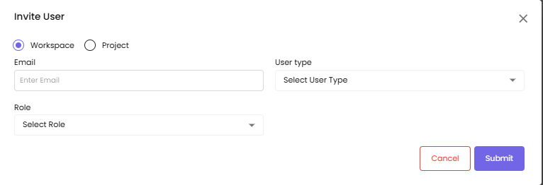

# Admin Settings

Admin Settings in CloudPi provides centralized configuration and management of your workspace, including user management, role-based access control, integrations, service accounts, and billing & subscription.

---

## Overview

The Admin Settings section is accessible from the header navigation and includes the following modules:

- **User Management** - Manage users and their access
- **Roles & Permissions** - View role definitions and permissions
- **Integration** - Connect with ticket providers, SSO, and SMTP
- **Billing & Subscription** - View and manage your subscription
- **Policy Settings** - Configure workspace policies
- **Service Accounts** - Manage cloud provider credentials (MSA & PSA)

---

## User Management

CloudPi provides a structured role-based access control system that ensures users have appropriate permissions for their responsibilities within the workspace and projects.

### User Roles

**Workspace Admin**

**Responsibilities:**
- Comprehensive Management - Workspace Admins manage all aspects of the workspace, including the integration of workflows, management of user roles and permissions, and overall application settings
- User and Access Control - They add users, assign roles, and set permissions tailored to the needs and structure of the organization
- Alert and Subscription Management - Admins configure and manage alert subscriptions to ensure that users are notified about critical events and updates
- Workflow Tools Integration - Admins can set up different workflow tools to connect with CloudPi

**Capabilities:**
- Full administrative access to all settings and features within the workspace
- Ability to integrate CloudPi with other IT management tools and applications to streamline operations
- Oversee the entire CloudPi environment to ensure compliance and efficient operation

**Typical Users:**
- IT administrators tasked with the administration of CloudPi applications and overall cloud environment management

**Workspace User**

**Responsibilities:**
- Executive Oversight - Workspace Users have access to comprehensive reports across all project groups and projects within the workspace. They can create projects and groups
- Delegation of Project Access - They can delegate access to Project Admins and users, ensuring that project management and operations are smoothly executed
- Group Reports Viewing - View and analyze reports generated from different project groups to monitor performance and resource utilization

**Capabilities:**
- Access to high-level dashboards and reports that provide insights into the overall cloud operations
- Ability to delegate project roles and responsibilities to ensure efficient project execution

**Typical Users:**
- Cloud operations managers or executives who oversee cloud strategy and operations

**Project Admin**

**Responsibilities:**
- Project Setup and Management - Responsible for setting up projects within CloudPi, defining project scope, and assigning appropriate roles to team members
- User Management - Can add users to the project, invite new project users, and manage their roles and permissions within the project context
- Role Assignment - Assign roles such as Project User or Viewer based on the operational needs and security policies of the project

**Capabilities:**
- Manage all aspects of a project from inception to completion, including resource allocation and task management
- Control over project-specific settings and user permissions to ensure project security and efficiency

**Typical Users:**
- Engineering leads managing specific cloud projects, responsible for leading project teams and ensuring project objectives are met

**Project User**

**Responsibilities:**
- Operational Tasks - Execute tasks such as adding or updating project components, based on the permissions granted by Project Admins
- Ticket Management - Handle operational tickets, ensuring issues are resolved in a timely and effective manner
- Report Access - View reports related to their project assignments to track progress and performance

**Capabilities:**
- Engage in day-to-day operational activities within their assigned projects
- Access to project-specific data and reports as permitted by their role

**Typical Users:**
- Engineers and technical staff involved in the execution and management of specific tasks within a project

By defining these roles clearly, CloudPi ensures that each member of the organization has the necessary tools and access to perform their duties effectively while maintaining a secure and organized cloud management environment.

### Navigating to User Management

Select **User Management** from Admin Settings in the header.

### User List

The User List displays all registered users along with the following details:

**Name** - Full name of the user

**Role** - The role assigned to the user (Project User, Project Admin, Workspace Admin, or Workspace User)

**Email** - The email address associated with the user

**Project Group** - The project groups the user is associated with (for users invited to specific project groups within workspaces or projects)

**Status** - The user's status (Active or Inactive)

The User List also supports the following management features:

**View User** - Click the eye icon next to the user to expand their details and view their projects, roles, and associations

**Delete User** - Click the delete icon next to the user to remove them from the platform (with a confirmation prompt)

### User Filtering

The User List can be filtered using the following criteria:

**Role** - Filter users based on their role. Available roles include:
- Workspace User
- Workspace Admin
- Project User
- Project Admin

**Status** - Filter users based on their status (Active or Inactive)

These filters can be selected at the top of the user list, allowing admins to quickly view specific sets of users based on their roles, status, and project association.

### Inviting New Users

The Invite User functionality allows admins to invite new users either to a Workspace or a Project. There are two types of invitations based on where the user is being invited: Workspace and Project.

#### 1. Inviting a User to a Workspace

**Select Workspace** - First, you choose whether the user is being invited to a Workspace or a Project. For workspace invitations, you select the Workspace option.

**Assign Role:**

**Workspace Admin** - If the user is assigned the role of Workspace Admin, they will have full administrative rights within the workspace, including the ability to manage users, project groups, and other workspace settings

**Workspace User** - If the user is assigned the role of Workspace User, they will have limited access to the workspace. If the user is assigned the Workspace User role, an additional field will appear to select the Project Group within the workspace to which the user will be assigned. The Workspace User can only access the projects in the selected project groups.

**Avoid Duplicate Invitations** - If the user already exists within the workspace (i.e., they are already registered), they cannot be invited again. This is checked before sending the invitation.

**Save** - Once the necessary details are filled out (name, email, role, and project group), click Save to send an invitation to the user. The user will receive an invite to join the workspace with the assigned role.

#### 2. Inviting a User to a Project

For project invitations, the process is as follows:

**Select Project** - Choose the Project option to invite a user to a project

**Assign Project Group** - Select the project group(s) the user will be associated with. Multiple groups can be selected. After selecting a group, the available projects associated with that project group will be displayed.

**Assign Role:**

**Project Admin** - If the user is assigned the role of Project Admin, they will have full administrative access to the selected projects

**Project User** - If the user is assigned the role of Project User, they will have limited access to the selected projects

**Multiple Roles for Multiple Projects** - If the user is invited to multiple projects, the role can be assigned differently for each project. For instance, the user can be a Project Admin in one project and a Project User in another. You can click the Add Role button to add another pair of Project and Role fields, allowing for the assignment of multiple roles for multiple projects.

When the Add Role button is clicked:
- A new pair of Project and Role fields will appear
- The previously selected projects will not appear in the project selection dropdown to avoid duplication
- The previously selected roles will not appear in the role dropdown for each project

**Save** - After selecting the Project Groups, Projects, and assigning the Roles, click Save to send the invitation. The user will receive an invite to join the selected projects with their assigned roles.

**Avoid Duplicate Invitations** - If the user already exists and is associated with the selected project(s), they cannot be invited again.

### Editing Existing Users

Find the user in the User List and click the edit icon to view and modify user permissions.

**Email** - The user's email address (read-only)

**Role** - The assigned role (read-only)

**Project Groups** - View and modify the project groups the user is associated with

**Cancel** - Discard changes

**Update** - Save changes to user permissions

### Summary of Features

**User List:**
- Displays Name, Role, Email, Project Group, and Status for each user
- Allows for filtering by Role, Status, and Project Group
- Provides View, Edit, and Delete actions for each user
- Supports toggling user Status between Active and Inactive

**Invite User Functionality:**
- **Workspace Invitation** - Choose Workspace Admin or Workspace User roles, assign the user to specific Project Groups, and send an invite. Workspace admins have full access to the workspace, while users have limited access
- **Project Invitation** - Choose the Project Admin or Project User roles, select the Project Groups, and assign the user to specific Projects. Multiple roles can be assigned for multiple projects
- **Avoid Duplicate Invitations** - The system checks if the user is already part of the workspace or project and prevents duplicate invitations

---

## Roles & Permissions

### Overview

The Roles and Permissions module in CloudPi provides visibility into the various roles defined within the workspace and their corresponding access levels. This page serves as a centralized view for understanding what permissions are granted to each role, ensuring transparency and compliance in access management.

While role creation or modification is managed at the administrative level, this interface enables users to review the permissions matrix for different roles to maintain operational clarity and accountability.

### Key Highlights

**Role Visibility** - Gain a consolidated view of all predefined roles within the workspace, such as Workspace User, Project Admin, and Project User

**Permission Transparency** - Understand the specific actions and access privileges associated with each role, including which areas of CloudPi they can view or manage

**Security Awareness** - Enhance governance by allowing team members and auditors to verify permission structures without exposing modification controls

### Navigating to Roles and Permissions

To view existing roles and their access scopes:

1. Navigate to **Admin Settings** from the header
2. Select **Roles and Permissions**
3. Review the list of available roles and the detailed permissions associated with each

### Role Definitions

Roles are set to define the access level or permissions a user has within the platform. Common roles include:

**Workspace Admin** - Workspace Admin has full CRUD access across all projects within the workspace. They can manage project groups, integrations, budgeting, workflows, and more with complete administrative control

**Workspace User** - Generally has permissions to manage project-specific settings within their assigned workspace, integrate with third-party tools, and manage optimization and alert settings

**Project Admin** - Responsible for managing project-level settings that directly affect the resources and cost management of specific projects

**Project User** - Has a more focused set of permissions suitable for managing specific aspects of a project, typically without having full administrative rights

### Viewing Role Details

Click on a role name to expand and view detailed permissions:

**Role Name** - The name of the role (e.g., Workspace Admin)

**Description** - Workspace Admin has full CRUD access across all projects within the workspace. They can manage project groups, integrations, budgeting, workflows, and more with complete administrative control.

**Permissions** - A comprehensive list of module-level permissions including:
- Home
- Dashboard
- Cost Assignments
- Task Management
- Ticketing
- Financials
- Project
- Billing Hub
- Recommendations
- Tag Management
- Automations
- Admin Settings

---

## Integration

CloudPi supports integration with ticket providers, SSO, and SMTP for enhanced workflow automation and user management.

For detailed integration documentation, see [Integration](Integrations.md).

### Available Integrations

**Ticket Providers** - Azure DevOps for work item management and ticket creation from recommendations

**SSO (Single Sign-On)** - Enable users to log in using organizational identity providers with PKCE support

**SMTP** - Configure email notifications from your CloudPi environment

### Integration Status

Each integration displays its connection status:

**Active** - Provider is connected and active

**Connected** - Provider is linked to CloudPi

**Not Connected** - Provider needs configuration

---

## Billing & Subscription

View and manage billing details, subscription plans, and payment history. Monitor usage, update payments.

### Navigating to Billing & Subscription

Navigate to **Admin Settings** > **Billing & Subscription** to access subscription management.

### Account Subscription

**Active Subscription** - Displays the current status of your subscription

To manage your subscription, you can login to **subscription portal** where you can:

- View your current subscription
- Update your payment method
- Update your billing information
- Cancel your subscription

### Active Subscription Details

**Plan** - Your current subscription tier (e.g., Premium)

**Start date** - When your subscription period began (e.g., 2026-01-06)

**End date** - When your subscription period ends (e.g., 2026-01-21)

**Subscription Id** - Unique identifier for your subscription (e.g., SUB-123456789)

**Subscription Status** - Current status of the subscription (e.g., Active)

**Company Name** - The company name associated with the subscription (e.g., PurpleData Inc)

**Version** - The current CloudPi version (e.g., Beta V1.0.0)

**Database Version** - The database version in use (e.g., 1.15)

By effectively utilizing the Billing & Subscription features, you can ensure that your cloud cost optimization efforts are well supported by an appropriate and up-to-date subscription plan.

---

## Policy Settings

Configure workspace-level policies for automation and governance.

For detailed policy documentation, see [Automations](Automations.md).

---

## Service Accounts

Service Accounts enable secure connectivity between CloudPi and your cloud providers (AWS, Azure, GCP).

For detailed service account documentation, see [Service Accounts](ServiceAccounts.md).

### Account Types

**Master Service Account (MSA)** - Domain-level credentials shared across multiple projects within an organization

**Project Service Account (PSA)** - Project-level credentials with own credentials or inherited from an MSA

### Service Types

**Collector** - Standard data collection and resource inventory

**Billing** - Billing and cost data collection

**Metrics** - Performance metrics collection

**Remediation** - Write operations for automated actions

---

## Permissions Summary

| Feature | Workspace Admin | Workspace User | Project Admin | Project User |
|---------|-----------------|----------------|---------------|--------------|
| User Management | Full Access | View Only | Project Users | View Only |
| Roles & Permissions | View All | View Assigned | View Assigned | View Assigned |
| Integration | Full Access | View Only | View Only | Use Only |
| Billing & Subscription | Full Access | View Only | No Access | No Access |
| Policy Settings | Full Access | View Only | View Only | No Access |
| Service Accounts | Full Access | View Only | Project PSAs | View Only |
