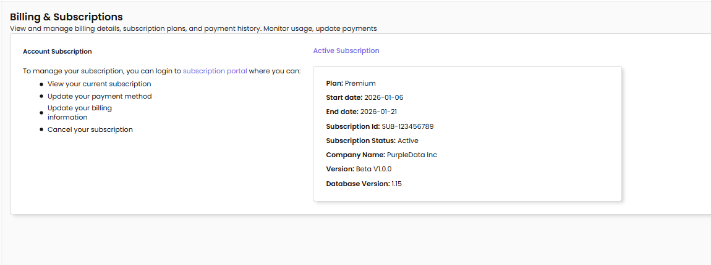

# Admin Settings

Admin Settings in CloudPi provides centralized configuration and management of your workspace, including user management, role-based access control, integrations, service accounts, and billing & subscription.

---

## Overview

The Admin Settings section is accessible from the header navigation and includes the following modules:

- **User Management** - Manage users and their access
- **Roles & Permissions** - View role definitions and permissions
- **Integration** - Connect with ticket providers, SSO, and SMTP
- **Billing & Subscription** - View and manage your subscription
- **Policy Settings** - Configure workspace policies
- **Service Accounts** - Manage cloud provider credentials (MSA & PSA)

---

## User Management

The User Management module lets workspace administrators invite, view, edit, and remove users.

For the full lifecycle (invite → activate → edit → remove), the new Invite User dialog, edit-permission rules, and the Local vs SSO authentication choice, see the dedicated **[User Management](UserManagement.md)** page.

---

## Roles & Permissions

The Roles & Permissions module shows the role definitions and the capability matrix for each role in the workspace.

For the six CloudPi roles, what each role can see and do, the per-page screenshots, and the editing authorisation matrix, see **[Role-Based Access Control](rbac.md)**.

---

## Integration

CloudPi supports integration with ticket providers, SSO, and SMTP for enhanced workflow automation and user management.

For detailed integration documentation, see [Integration](Integrations.md).

### Available Integrations

**Ticket Providers** - Azure DevOps for work item management and ticket creation from recommendations

**SSO (Single Sign-On)** - Enable users to log in using organizational identity providers with PKCE support

**SMTP** - Configure email notifications from your CloudPi environment

### Integration Status

Each integration displays its connection status:

**Active** - Provider is connected and active

**Connected** - Provider is linked to CloudPi

**Not Connected** - Provider needs configuration

---

## Billing & Subscription

View and manage billing details, subscription plans, and payment history. Monitor usage, update payments.

### Navigating to Billing & Subscription

Navigate to **Admin Settings** > **Billing & Subscription** to access subscription management.

### Account Subscription

**Active Subscription** - Displays the current status of your subscription

To manage your subscription, you can login to **subscription portal** where you can:

- View your current subscription
- Update your payment method
- Update your billing information
- Cancel your subscription

### Active Subscription Details

**Plan** - Your current subscription tier (e.g., Premium)

**Start date** - When your subscription period began (e.g., 2026-01-06)

**End date** - When your subscription period ends (e.g., 2026-01-21)

**Subscription Id** - Unique identifier for your subscription (e.g., SUB-123456789)

**Subscription Status** - Current status of the subscription (e.g., Active)

**Company Name** - The company name associated with the subscription (e.g., PurpleData Inc DBA Cloudpi)

**Version** - The current CloudPi version (e.g., Beta V1.0.0)

**Database Version** - The database version in use (e.g., 1.15)

By effectively utilizing the Billing & Subscription features, you can ensure that your cloud cost optimization efforts are well supported by an appropriate and up-to-date subscription plan.

---

## Policy Settings

Configure workspace-level policies for automation and governance.

For detailed policy documentation, see [Automations](Automations.md).

---

## Service Accounts

Service Accounts enable secure connectivity between CloudPi and your cloud providers (AWS, Azure, GCP).

For detailed service account documentation, see [Service Accounts](ServiceAccounts.md).

### Account Types

**Master Service Account (MSA)** - Domain-level credentials shared across multiple projects within an organization

**Project Service Account (PSA)** - Project-level credentials with own credentials or inherited from an MSA

### Service Types

**Collector** - Standard data collection and resource inventory

**Billing** - Billing and cost data collection

**Metrics** - Performance metrics collection

**Remediation** - Write operations for automated actions

---

## Permissions Summary

| Feature | Workspace Admin | Workspace User | Project Admin | Project User |
|---------|-----------------|----------------|---------------|--------------|
| User Management | Full Access | View Only | Project Users | View Only |
| Roles & Permissions | View All | View Assigned | View Assigned | View Assigned |
| Integration | Full Access | View Only | View Only | Use Only |
| Billing & Subscription | Full Access | View Only | No Access | No Access |
| Policy Settings | Full Access | View Only | View Only | No Access |
| Service Accounts | Full Access | View Only | Project PSAs | View Only |
