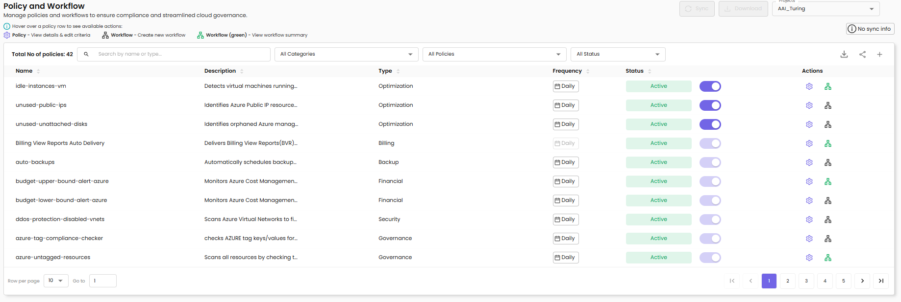
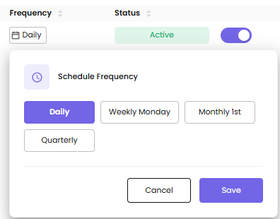
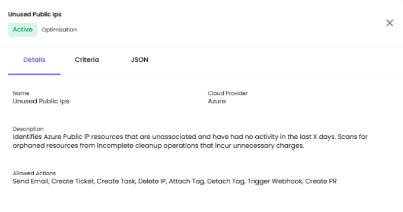
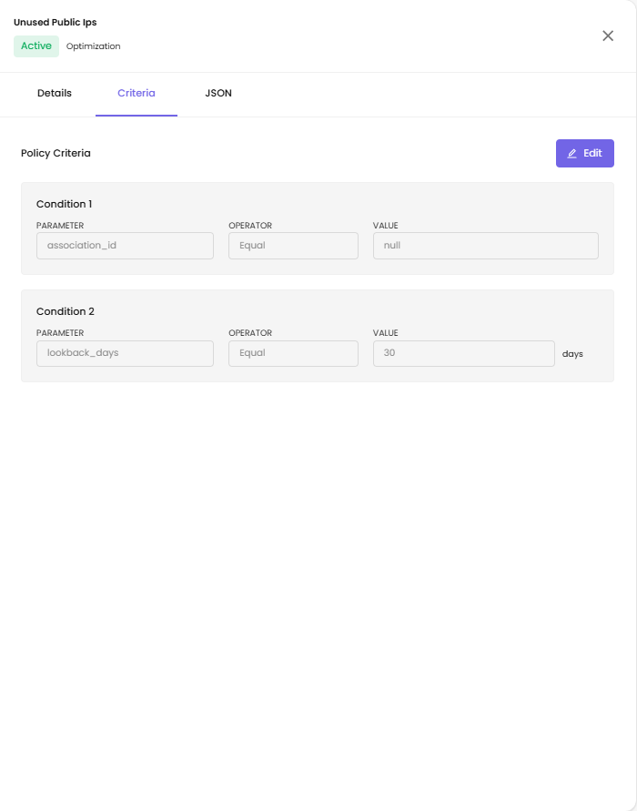
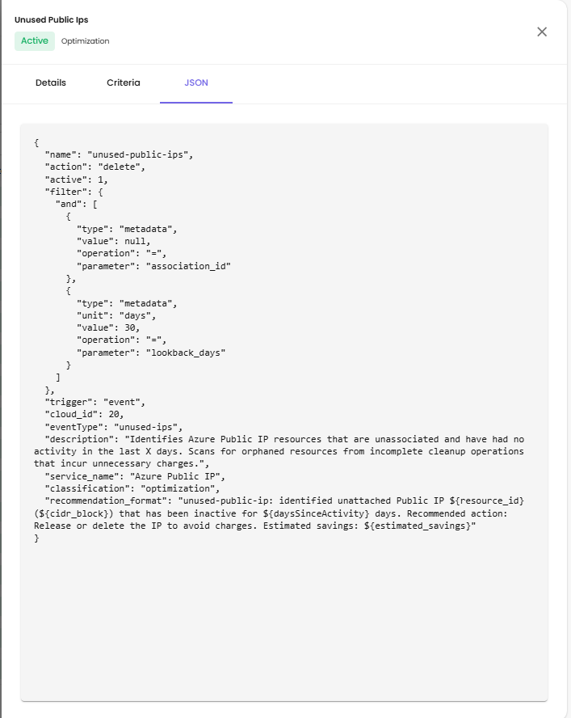
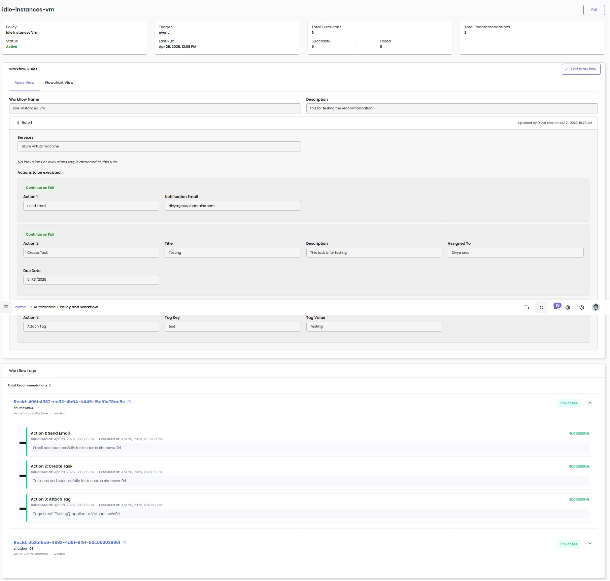
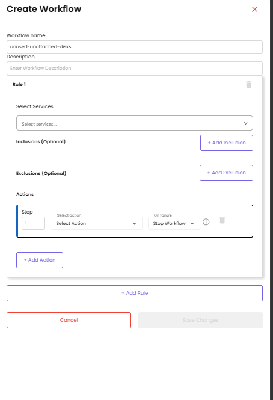
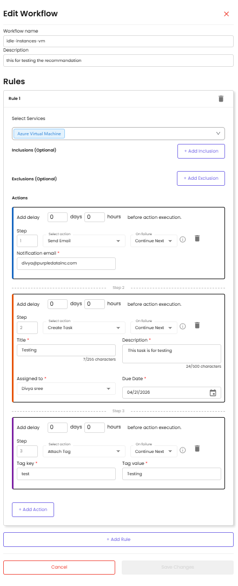

# Policies & Workflows

Manage project-level policies and workflows to ensure compliance and streamlined cloud governance. The Policy and Workflow page provides a centralized location to monitor, configure, and automate responses to cloud events within your projects.

## Overview

In CloudPi, Policies and Workflows work together to help you monitor your cloud environment and automate responses to events.

**Policy** — A Policy defines the conditions and thresholds you want to monitor, such as resource usage, cost limits, security compliance, or specific service-level events.

**Workflow** — When a Policy condition is met, a Workflow is automatically triggered. A workflow is a set of automated actions configured to respond to the policy event. These actions can include sending email alerts, creating backups, generating snapshots, creating tickets, or executing other predefined tasks to manage the situation.

By combining Policies and Workflows, CloudPi enables proactive monitoring and automation, helping you maintain complete control over your cloud infrastructure with minimal manual intervention.

## Prerequisites

- Project Admin or Workspace Admin role (see [RBAC](rbac.md))
- Access to at least one project
- For external workflow actions: configured integrations (see [Integrations](Integrations.md))

## Accessing Policies & Workflows

1. Select a project from the project selector.
2. Navigate to **Automation** from the main menu.
3. Select **Policy and Workflow**.
4. The page lists every policy available for the selected project.

A hint above the table shows what each row icon does:

| Icon | Tooltip | What it does |
|------|---------|--------------|
| **Policy** (gear) | View details & edit criteria | Opens the [policy details panel](#viewing-policy-details) |
| **Workflow** | Create new workflow | Opens the [Create Workflow drawer](#creating-a-workflow) for this policy |
| **Workflow** (green) | View workflow summary | Opens the [Workflow detail page](#workflow-detail-page) for this policy |

The policies you see include both Mandatory policies (enforced organization-wide) and Optional policies (enabled at the project level). To configure organization-wide settings, see [Global Policy Settings](GlobalPolicies.md).

## Understanding Policy Types

### Mandatory Policies
Mandatory policies are set at the organization level by Workspace Admins and automatically apply to all projects. These policies:

- Cannot be disabled at the project level
- Appear with an Active status that cannot be toggled off
- Require workflows to be configured for automated actions

### Optional Policies
Optional policies can be enabled or disabled by Project Admins for their specific projects. These policies:

- Are inactive by default
- Can be toggled on or off based on project needs
- Allow project-level customization of governance rules

To learn more about how policies are configured organization-wide, see [Global Policy Settings](GlobalPolicies.md).

## Policy Page Layout

### Header

| Element | Description |
|---------|-------------|
| **Total No of policies** | Count of all policies in the project (e.g., *Total No of policies: 42*) |
| **Search** | Search by name or type |
| **All Categories** | Filter by category — Optimization, Billing, Backup, Financial, Security, Governance |
| **All Policies** | Filter to all policies or a specific subset |
| **All Status** | Filter by status — Active or Inactive |
| **Sync** | Pull the latest policy definitions from source. A *No sync info* badge appears when no sync has been recorded yet |
| **Download** | Export the policy list |

### Policy List Columns

| Column | Description |
|--------|-------------|
| **Name** | Policy identifier (e.g., `idle-instances-vm`, `unused-public-ips`, `azure-tag-compliance-checker`) |
| **Description** | Brief summary of what the policy detects or enforces |
| **Type** | Category — Optimization, Billing, Backup, Financial, Security, Governance |
| **Frequency** | Execution schedule for the policy (e.g., *Daily*, *Weekly Monday*, *Monthly 1st*, *Quarterly*). Click the cell to open the [Schedule Frequency popover](#configuring-policy-frequency) and change it |
| **Status** | Whether the policy is currently Active (green badge) |
| **Toggle** | Enable or disable optional policies. Mandatory policies cannot be toggled off |
| **Actions** | Two icons per row — **Policy** (gear) and **Workflow** (network diagram). Hover the row to reveal them |

### Available Actions per Row

The Workflow icon's colour reflects whether a workflow already exists for that policy:

- **Default colour** — no workflow has been set up. Click to open the Create Workflow drawer.
- **Green** — a workflow exists. Click to open the workflow detail page.

The Create Workflow icon is only visible to Workspace Administrators. It is disabled when:

- A workflow already exists for that policy (tooltip: *Workflow already exists*)
- The policy itself is inactive

## Configuring Policy Frequency

Each policy runs on a schedule shown in the **Frequency** column (the default is *Daily*). Click the Frequency cell on any policy row to open the **Schedule Frequency** popover and pick a different schedule.

The popover offers four preset options:

| Preset | Runs |
|--------|------|
| **Daily** (default) | Every day |
| **Weekly Monday** | Every Monday |
| **Monthly 1st** | On the 1st of every month |
| **Quarterly** | Once every quarter |

Click a preset to select it (highlighted in purple), then **Save** to apply or **Cancel** to discard.

## Viewing Policy Details

Click the **Policy** (gear) icon on any row to open the policy details panel, which has three tabs.

### Details Tab

| Field | Description |
|-------|-------------|
| **Name** | Display name of the policy (e.g., *Unused Public Ips*) |
| **Cloud Provider** | Cloud platform the policy applies to (e.g., Azure) |
| **Description** | Full description of what the policy detects or enforces |
| **Allowed Actions** | List of actions available when configuring a workflow for this policy — for example: Send Email, Create Ticket, Create Task, Delete IP, Attach Tag, Detach Tag, Trigger Webhook, Create PR |

### Criteria Tab

The Criteria tab shows the conditions that determine when the policy fires. Click **Edit** to modify them. Each criterion has three parts:

- **Parameter** — the field being evaluated
- **Operator** — the comparison (e.g., Equal, Not Equal)
- **Value** — the value to compare against

The editor enforces different rules for tag-based and non-tag parameters.

**Tag-prefixed parameters** (parameter starts with `tag:` or `tags.`):

- The `tag:` or `tags.` prefix is locked — you can edit the text after the prefix but cannot delete the prefix itself.
- The text after the prefix is required; saving with no tag name shows *"Tag name required"*.
- The **Value** field can be left empty (matches resources with the tag regardless of its value).

**Non-tag parameters:**

- The **Parameter** field is read-only — only the **Value** can be edited.
- A non-empty **Value** is required; saving with an empty value shows *"Required"*.

### JSON Tab

The JSON tab shows the complete policy configuration in raw JSON, including:

- **name** — policy identifier
- **action** — default action type
- **active** — policy status
- **filter** — conditions with `"and"` logic
- **trigger** — event-based or scheduled
- **cloud_id** — cloud provider identifier
- **eventType** — type of event monitored
- **description** — full policy description
- **service_name** — target cloud service
- **classification** — policy category
- **recommendation_format** — template for recommendation messages

This view is read-only and useful for confirming exactly how the policy is stored.

## Workflows

A workflow is the set of automated actions that run when a policy fires. Each workflow contains one or more rules; each rule applies to a service and runs a sequence of actions.

### Workflow Detail Page

Click the green **Workflow** icon on a policy row to open the workflow detail page.

The page has three sections — KPI cards at the top, the Workflow Rules editor in the middle, and the Workflow Logs at the bottom.

**KPI Cards.** Four cards summarize recent activity:

- **Policy** — name and current status (Active / Inactive)
- **Trigger** — how the workflow runs (`event` or `time`) plus the **Last Run** timestamp
- **Total Executions** — total runs, broken down into Successful and Failed counts
- **Total Recommendations** — how many recommendations the workflow has produced

**Workflow Rules.** Lists each rule with two view modes:

- **Rules View** — flat list of rules with their services, inclusions/exclusions, and configured actions
- **Flowchart View** — visual diagram of the action chain

Each rule shows the matched **Services**, any inclusions or exclusions (or *"No inclusions or exclusions tag is attached to this rule"* when none), the **Actions to be executed** in order, a **Continue on Fail** badge on each action whose on-failure mode is *Continue Next*, and an **Updated by [user] on [date]** timestamp.

Click **Edit Workflow** in the top-right of the section to modify rules and actions.

**Workflow Logs.** Lists each execution of the workflow grouped by recommendation. For every recommendation the workflow processed, you'll see:

- **RecId** — unique recommendation identifier (clickable; opens the full record)
- **Resource** — name, type, and region (e.g., *shutsown04 · Azure Virtual Machine · westus*)
- **Success counter** — e.g., *"3 Success"* when all actions completed successfully
- A list of every action that ran, each with:
    - **Initialized at** — when the action was queued
    - **Executed at** — when the action actually ran
    - A status badge — **SUCCESSFUL**, **FAILED**, or **PENDING**
    - A short result message (e.g., *"Email sent successfully for resource shutsown04"*, *"Tags `{'test': 'Testing'}` applied to VM shutsown04"*)

Workflow Logs help confirm remediation actually completed, troubleshoot failures, and provide an audit trail for FinOps reporting.

### Creating a Workflow

To create a workflow for a policy that doesn't have one yet, click the (default-colour) **Workflow** icon on the policy row. A drawer opens.

Provide the workflow's basic details, then configure at least one rule.

| Field | Description |
|-------|-------------|
| **Workflow name** | A clear name (e.g., `unused-unattached-disks`) |
| **Description** | Optional — what the workflow does |

### Editing a Workflow

To edit an existing workflow, open its detail page and click **Edit Workflow** in the top-right of the Workflow Rules section.

The drawer has the same structure as Create Workflow, pre-populated with existing values. Each rule can be deleted with the trash icon.

### Set Up Workflow Rules

Each rule narrows down which resources the workflow acts on and defines what to do.

| Field | Description |
|-------|-------------|
| **Select Services** | Choose the cloud service this rule applies to (e.g., Azure Virtual Machine) |
| **Inclusions (Optional)** | Click **+ Add Inclusion** to limit the rule to specific resources or tags |
| **Exclusions (Optional)** | Click **+ Add Exclusion** to skip specific resources or tags |

To add another rule to the same workflow, click **+ Add Rule**.

### Configure Actions

Inside each rule, configure the actions that should run when the rule matches. Each action is a numbered **Step**.

| Field | Description |
|-------|-------------|
| **Add delay** | Optional delay before the action runs, expressed in *days* and *hours*. Set both to `0` to run immediately |
| **Step** | Auto-numbered position in the action chain (Step 1, Step 2, …) |
| **Select action** | Choose the action from the dropdown — e.g., Send Email, Create Task, Attach Tag, Create Ticket, Trigger Webhook |
| **On failure** | What to do if this action fails — **Continue Next** (run the next action anyway) or **Stop Workflow** (abort the entire workflow). New actions default to *Stop Workflow*; switch to *Continue Next* for non-critical steps such as notifications |
| **Action parameters** | Fields specific to the chosen action — for example *Notification email* for Send Email; *Title*, *Description*, *Assigned to*, *Due Date* for Create Task; *Tag key* and *Tag value* for Attach Tag |

Click **+ Add Action** to chain another step inside the same rule.

### Save the Workflow

Once rules and actions are configured:

- Click **Save Changes** to finalize the workflow
- Click **Cancel** to discard your changes

After saving, return to the workflow detail page to see the new rules and the next execution result in the Workflow Logs.

## Common Policy Examples

This section provides real-world examples of commonly used policies and workflows to help you get started quickly.

### Billing View Report Delivery Policy

Billing view delivery policy is a built-in policy that automates the process of generating invoices every month based on data usage. This ensures timely billing and reduces the need for manual intervention.

**Use case:** Managed service providers or IT departments that need to bill customers or internal teams monthly based on cloud usage.

**How to set up a time-based workflow for auto invoicing:**

1. **Workflow Name** — Give your workflow a name that clearly indicates its purpose, such as `auto-invoicing`.
2. **Description (Optional)** — Add a short description to explain what the workflow does (e.g., "Automatically generates invoices based on usage every month").
3. **Schedule:**
    - **Start Date** — Date when the workflow should begin
    - **Frequency** — How often the workflow runs (e.g., Monthly)
4. **Billing Details:**
    - **Billing View** — The billing view that contains usage data
    - **Customer** — The customer who should be billed
    - Click **Add Billing** to add multiple billing configurations
5. **Actions:** In the Actions section, select **Schedule Auto Invoicing** from the dropdown.
6. **Save** — Click **Create Workflow** to activate it.

### Idle Instance Detection

**Use case:** Automatically identify and alert on virtual machines with low CPU utilization to reduce waste.

**How to configure:**

1. Enable the `idle-instances-vm` or `idle-instances-ec2` policy.
2. Configure a workflow with the action **Send Email** to notify the resource owner.
3. Optionally add **Create Task** or **Create Ticket** to track remediation.

### Untagged Resource Compliance

**Use case:** Enforce tagging standards by identifying resources missing required tags.

**How to configure:**

1. Enable the `untagged-instances` or `azure-untagged-resources` policy.
2. Configure a workflow with the action **Attach Tag** to automatically apply default tags.
3. Add **Send Email** to notify the resource owner about tagging requirements.

### Cost Anomaly Alerts

**Use case:** Get notified when project spending exceeds normal patterns or budget thresholds.

**How to configure:**

1. Enable budget-related policies like `budget-upper-bound-alert-azure`.
2. Configure a workflow with **Send Email** and **Create Ticket** actions.
3. Set up thresholds in the policy criteria to match your budget limits.
