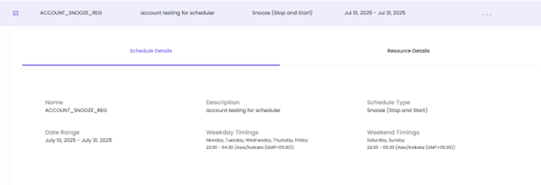
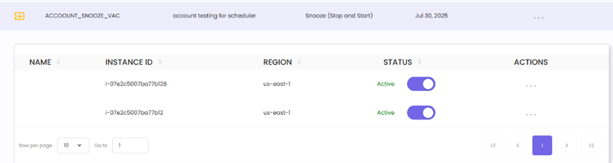
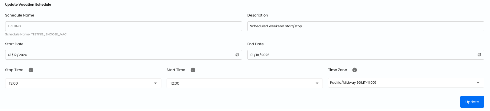
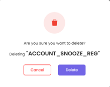
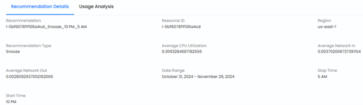

# Virtual Machine Scheduler

The Virtual Machine Scheduler feature in CloudPi offers powerful automation for managing the start and stop operations of virtual machines. By scheduling VMs to run only when needed, organizations can **dramatically reduce cloud costs**—often achieving **40-70% savings** on compute resources, especially in non-production environments like development, testing, and staging.

## Overview

Running virtual machines 24/7 when they're only needed during business hours results in significant wasted spend. The VM Scheduler eliminates this waste by automatically starting and stopping VMs based on predefined schedules.

### Cost Savings Potential

**Development and Test Environments** - Non-production VMs typically run only during business hours (8-10 hours per day, 5 days per week). Scheduling these resources can reduce runtime from 168 hours/week to 50 hours/week, **saving up to 70% on compute costs**.

**Staging and QA Environments** - Pre-production environments often sit idle outside of testing windows. Scheduling these VMs to stop during nights, weekends, and holidays can **reduce costs by 50-60%**.

**Training and Demo Systems** - Resources used for training, demonstrations, or sporadic testing can be scheduled to run on-demand only, **eliminating 80-90% of unnecessary runtime**.

### How VM Scheduling Works

The VM Scheduler provides a streamlined approach to managing resource availability:

- **Custom Schedules** - Define specific start and stop times for weekdays and weekends
- **Vacation Schedules** - Configure extended shutdown periods for holidays and planned downtime
- **Multi-Region Support** - Manage schedules across different cloud regions with timezone awareness
- **Manual Overrides** - Temporarily pause or activate schedules for individual instances without modifying the schedule

## Key Features

### Comprehensive Schedule Management

**Automated Operations** - Enable automatic start and stop of virtual machines during specified time periods, optimizing resource availability and cost-efficiency

**Vacation and Custom Schedules** - Create schedules tailored for holidays, weekends, or specific organizational needs

**Multi-Region Support** - Manage schedules for resources across different cloud regions seamlessly

## Accessing the Scheduler

1. Navigate to **Automation** from the main menu
2. Select **Scheduler**
3. Explore the main screens:
   - **Dashboard** - Overview of scheduling compliance and performance metrics
   - **Schedules** - Manage and review all active schedules
   - **Instances** - View and manage compute instances and their scheduling status

## Scheduler Dashboard

The Scheduler Dashboard provides a comprehensive overview of scheduling compliance and performance metrics across all projects, helping you monitor resource utilization and cost optimization at a glance.

### Project/Group Selector

Use the dropdown selector in the top-right corner to filter the dashboard view:

**View Toggle** - Switch between **Groups** and **Projects** views using the radio buttons

**Hierarchical Selection** - Navigate through your organizational structure:

- **Groups** - Select organizational groups to view aggregated metrics across multiple projects
- **Projects** - Select individual projects to view project-specific scheduling metrics

The selected project or group name appears in the dropdown, and all dashboard metrics update to reflect the selection. This allows you to focus on specific areas of your infrastructure or view scheduling performance at different organizational levels.

### Key Metrics

The dashboard displays four primary metric cards:

**Total Scheduled**

- Shows the percentage and count of instances with active schedules
- Format: Percentage (e.g., 50%) with count breakdown (e.g., 1 of 2 instances)
- Helps identify scheduling coverage across your infrastructure

**Hours Off-Duty**

- Displays total hours that scheduled instances are powered off
- Measured on a weekly basis
- Indicates the extent of automated resource optimization

**Estimated Savings**

- Shows projected cost savings from scheduled resource optimization
- Default view: 3 months
- Helps quantify the financial impact of VM scheduling

**Optimization Gaps**

- Identifies running instances without schedules
- Count of unscheduled instances
- Alerts you to resources that could benefit from scheduling

### Project Scheduling Performance

The Project Scheduling Performance table provides detailed metrics for each project:

**Project Name** - Name of the project

**Scheduled / Total** - Visual progress bar showing the ratio of scheduled instances to total instances (e.g., 1 of 2)

**Weekly Off-Hours** - Total hours per week that instances are scheduled to be off

**Monthly Savings** - Projected monthly cost savings for the project

**Compliance** - Percentage indicating scheduling compliance rate (e.g., 50%)

This dashboard helps you quickly identify projects with low scheduling compliance or optimization opportunities, enabling data-driven decisions about resource management.

## Managing Schedules

### Schedules Screen

The Schedules screen provides a central location to manage all VM schedules.

#### Screen Controls

**Project Selector** - Dropdown in the top-right corner to select the project or group view

**Select Region** - Filter schedules by cloud region

**Select Schedule Type** - Filter by schedule type (e.g., Snooze, Start, Stop)

**Resource ID** - Search field to find schedules by entering a specific resource ID

**Create Schedule** - Button to create a new schedule

#### Schedule List Table

The table displays all schedules with the following columns:

**Schedule name** - Name of the schedule

**Description** - Brief description of the schedule purpose

**Type** - Schedule type (e.g., Snooze)

**Date range** - Start and end dates for the schedule

**Resources** - Count of resources assigned to this schedule

**Status** - Current status (Active in orange, Running in green)

**Actions** - Action menu with icons for View, Edit, Logs, Manual Override, and Delete

### Schedule Actions

#### View Schedule Details

The View action allows users to examine the details of a specific schedule without making changes.

1. Click the **View icon (eye)** from the Actions column
2. An inline panel expands below the selected schedule with two tabs: **Schedule Details** and **Resource Details**
3. Action icons remain available in the panel header for quick access to Edit, Logs, Manual Override, and Delete

**Schedule Details Tab:**

Displays comprehensive schedule configuration:

- **Name** - Schedule identifier (e.g., CUSTOMONE_SNOOZE_REG)
- **Description** - Purpose or usage
- **Schedule Type** - Type of schedule (e.g., Snooze (Stop and Start))
- **Date Range** - Period when the schedule is active (e.g., January 8, 2026 - January 17, 2026)
- **Weekday Timings** - Days and specific times for weekday operations with timezone (e.g., Monday-Friday 08:00 - 20:00)
- **Weekend Timings** - Days and times for weekend operations with timezone (e.g., Saturday-Sunday 11:00 - 10:00)

**Resource Details Tab:**

Shows the list of compute instances associated with this schedule:

- **Name** - Resource name
- **Resource ID** - Full resource identifier path
- **Region** - Cloud region (e.g., eastus2)
- **Status** - Current status (e.g., Active)

Additional actions available in the Resource Details tab:
- **Download** - Export resource details
- **Share** - Share resource information
- **Add Columns** - Customize visible columns

Click **Close View** to collapse the panel and return to the schedule list.

#### Manual Override

The Manual Override feature provides temporary control over individual instances without modifying the schedule.

1. **Accessing Manual Override:**
   - Click the **Manual Override** icon in the Actions menu for a specific schedule
   - This opens a detailed list of instances associated with the schedule

2. **Pausing or Activating an Instance:**
   - **Paused** - Use the toggle switch to pause an instance, preventing it from being affected by the VM Snooze schedule. This ensures the resource remains operational, regardless of the scheduled start and stop times
   - **Active** - Use the toggle switch to activate an instance, ensuring it adheres to the VM Snooze schedule

3. **Instance Details:**
   - **Resource Name** - Name of the instance
   - **Instance ID** - Unique identifier for the instance
   - **Region** - The cloud region where the resource is deployed
   - **Status** - Reflects whether the instance is currently subject to the schedule (Active) or excluded (Paused)

4. **Closing Manual Override:**
   - Click **Close Manual Override** to return to the main Schedules view
   - Overrides take effect immediately but do not alter the underlying schedule configuration

#### Edit Schedule

The Edit feature allows users to modify an existing schedule configuration.

1. **Accessing Edit Mode:**
   - Click the **Edit** icon from the Actions menu
   - The schedule opens in an editable form

2. **Editable Fields:**
   - **Schedule Name** - Update the schedule identifier
   - **Description** - Modify the description to better reflect the schedule's purpose
   - **Start Date** - Update the start date
   - **Start Time** - Change when the schedule activates
   - **Stop Time** - Change when the schedule deactivates
   - **Time Zone** - Select the appropriate time zone (e.g., Asia/Kolkata (GMT+05:30))

3. **Saving Changes:**
   - Click **Update** to save changes
   - The schedule is updated in real time and reflected in the Schedules screen

4. **Closing Edit Mode:**
   - Click **Close Edit** to exit without modifying the schedule

#### Schedule Logs

The Schedule Logs feature provides detailed insights into the execution history of a schedule.

1. **Accessing Schedule Logs:**
   - Click the **Schedule Logs** icon in the Actions menu
   - A log view displays the execution history

2. **Log Details:**
   - **Started At** - The timestamp when the schedule action began
   - **Completed At** - The timestamp when the action finished
   - **Status** - Indicates success or failure of the action (green "Success" label)
   - **Message** - Details about the action performed (e.g., instance IDs started/stopped)

3. **Troubleshooting Support:**
   - Failed actions include error messages or status details
   - Use these to identify and resolve issues

4. **Closing Logs:**
   - Click **Close Logs** to return to the main Schedules view

#### Delete Schedule

The Delete Schedule feature permanently removes a schedule from the system.

1. **Accessing Delete Option:**
   - Click the **Delete** icon in the Actions menu
   - This initiates the schedule deletion process

2. **Confirmation Prompt:**
   - A confirmation dialog appears to prevent accidental deletions
   - Confirm or cancel the deletion

3. **Impact on Resources:**
   - Deleting a schedule does not impact the current state of associated resources
   - It only removes the automation tied to the schedule

#### Export Instance Details

Export a detailed spreadsheet (.csv) of all active schedules, instances, and configurations.

1. **Accessing the Export Feature:**
   - Click the **Export Instance Details** button in the top-right corner

2. **Spreadsheet Contents:**
   - Instance ID, Region, Instance Status
   - Schedule Name, Status, Type
   - Weekdays, Weekends, Action Type
   - Description, Start/End Dates, Time zone
   - Weekday/Weekend Start/Stop Times
   - Tag

3. **Uses:**
   - Monitor schedule execution for each instance
   - Identify instances and schedules based on region, type, or tags
   - Audit or analyze resource utilization and scheduling effectiveness

## Instances

The Instances screen allows you to view and manage compute instances across your projects. You can identify unscheduled instances and create or attach schedules to optimize resource utilization.

### Creating Schedules from Instances

1. **Select Resources:**
   - Check the box for one or more resources to enable the **Create Schedule** button

2. **Create Schedule:**
   - Click **Create Schedule** to define scheduling parameters

**Schedule Configuration:**

- **Select Schedule Type** - Choose between Vacation or Custom
- **Schedule Name** - Enter a name (5-10 letters)
- **Description** - Provide schedule purpose
- **End Date Option** - Choose "No End Date" or set an end date
- **Start Date** - Select when the schedule begins
- **Start Time** - Set the activation time
- **Stop Time** - Set the deactivation time
- **Time Zone** - Select appropriate time zone (e.g., Asia/Kolkata)

3. **View Resource Details:**
   - Use the **View** action in the Actions column to see specific details about a resource

**Resource Details View:**

Shows comprehensive information including:

- Resource ID
- Region
- Environment
- Tags (Name, project, department, etc.)

**Additional Features:**

- **Download** - Export resource details as a spreadsheet
- **Share** - Share resource data via various platforms
- **Add Columns** - Customize the displayed columns for a tailored view of resource data

