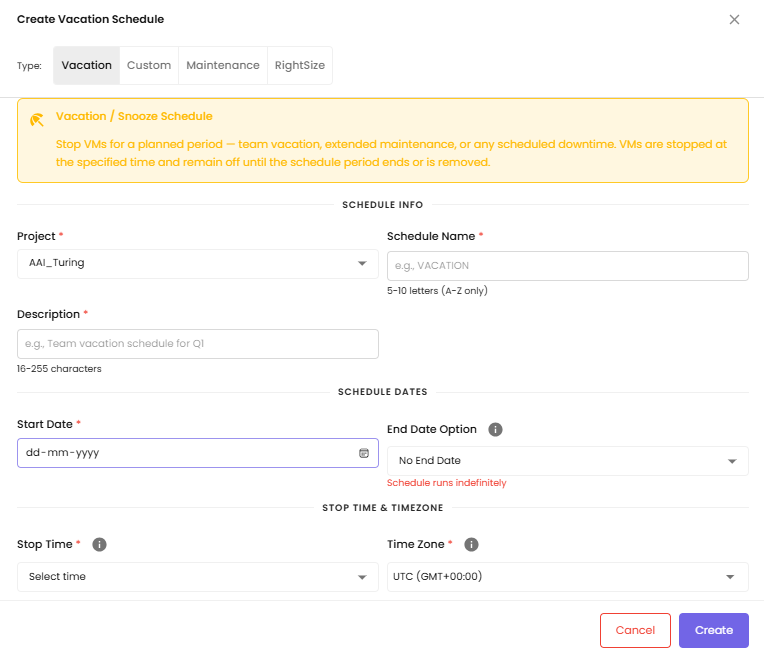
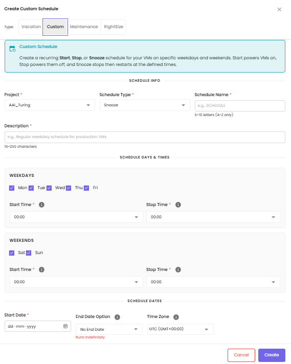
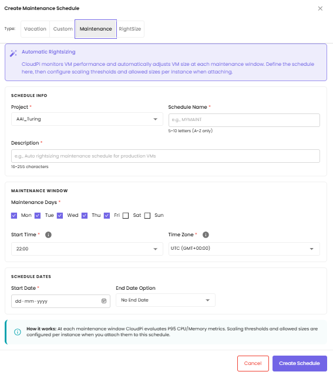
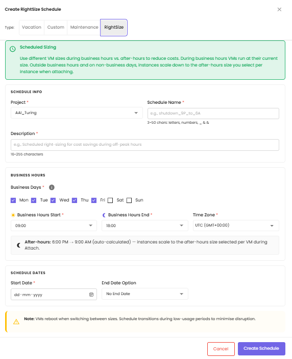
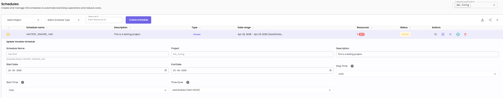
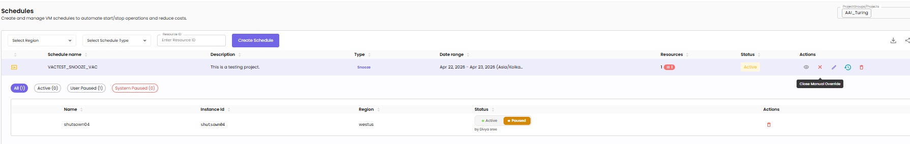
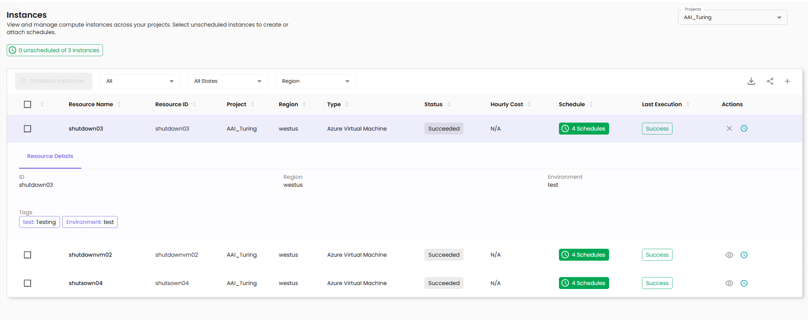
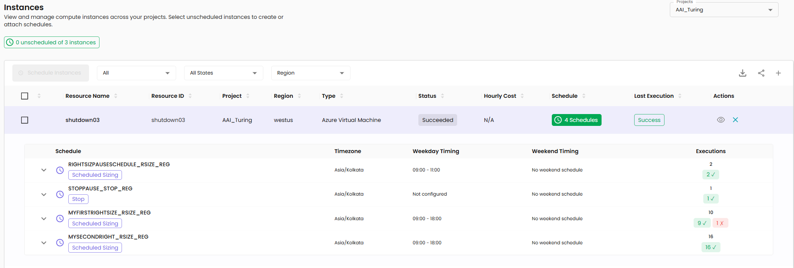

# Virtual Machine Scheduler

The VM Scheduler controls when virtual machines start, stop, and resize. Define a schedule once, attach VMs to it, and CloudPi sends the start, stop, or resize commands to your cloud provider on the schedule's clock. Schedules support multiple cloud regions and apply to projects you have access to.

Use the Scheduler to:

- Stop non-production VMs outside working hours
- Block VM activity during planned downtime (office closures, holidays)
- Run VMs at a smaller size during off-peak hours instead of stopping them
- Apply automatic resizing at recurring maintenance windows based on observed CPU and memory usage

## Supported Services

The Scheduler supports a range of Azure resource types — including **Azure Virtual Machines**, **Azure Service Plans**, **Azure SQL Databases**, and others.

Check with your CloudPi administrator for the complete list of resource types supported in your workspace.

## Schedule Types

When you click **+ Create Schedule** on the Schedules screen, you choose one of four schedule types. Each type targets a different scheduling pattern.

| Type | What it does | Typical use |
|------|--------------|-------------|
| **Vacation** | Snooze VMs for a one-time date range | Office closures, holiday breaks |
| **Custom** | Stops,Snooze and starts VMs on selected days at fixed times | Dev / test environments with predictable hours |
| **Maintenance** | Automatic rightsizing at recurring maintenance windows, based on P95 CPU and Memory metrics | Variable workloads where the right VM size shifts over time |
| **RightSize** | Runs VMs at full size during business hours, scales them down to a smaller size outside those hours | Production workloads with predictable peak / off-peak patterns |

Maintenance and RightSize both adjust VM size, but they decide differently. Maintenance reads metrics at each window and reacts; RightSize follows a fixed business-hours clock.

### Vacation

A Vacation schedule stops VMs for a single date range and restarts them when the range ends. Use it for one-off shutdowns that do not repeat.

Fields in the Create Vacation Schedule form:

- **Project** — project the schedule belongs to
- **Schedule Name** — identifier for the schedule (e.g., `DECEMBER_BREAK`)
- **Description** — purpose of the schedule
- **Start Date** — when the shutdown begins
- **End Date** — when the schedule ends and VMs resume
- **Stop Time** — time of day VMs are stopped
- **Start Time** — time of day VMs are restarted at the end of the range
- **Time Zone** — timezone the times above are interpreted in

### Custom

A Custom schedule starts and stops VMs at fixed times on selected days. Configure separate weekday and weekend timings if the workload pattern differs across the week.

Fields in the Create Custom Schedule form:

- **Project**, **Schedule Name**, **Description**
- **Days** the schedule applies to (weekday and / or weekend selections)
- **Start Time** and **Stop Time** for the configured days
- **Time Zone**
- **Start Date** and **End Date Option** (No End Date or set a date)

### Maintenance

A Maintenance schedule defines a recurring window during which CloudPi evaluates VM performance and adjusts VM size automatically when needed. At each window, CloudPi looks at the **P95 CPU and Memory utilisation** of each VM and resizes it against the per-instance thresholds and allowed sizes you set when attaching VMs to the schedule.

!!! note "What does P95 mean?"
    P95 is the value below which 95% of measurements fall over the observed period. It's a more reliable indicator of typical workload than the average (which gets dragged down by idle periods) or the peak (which gets pulled up by short spikes).

Fields in the Create Maintenance Schedule form:

- **Project** — project the schedule belongs to
- **Schedule Name** — 5–10 letters, A–Z only (e.g., `MYMAINT`)
- **Description** — 16–255 characters
- **Maintenance Days** — days the maintenance window runs on
- **Start Time** — when the maintenance window begins each day
- **Time Zone**
- **Start Date** and **End Date Option**

Per-instance scaling thresholds and allowed sizes are configured separately when attaching VMs to this schedule.

### RightSize

A RightSize schedule (labelled "Scheduled Sizing" in the UI) runs VMs at their current size during defined business hours, and scales them down to a smaller after-hours size outside those hours. The after-hours window is calculated automatically from the business hours you set.

Fields in the Create RightSize Schedule form:

- **Project** — project the schedule belongs to
- **Schedule Name** — 3–50 characters (letters, numbers, `_`, `&`)
- **Description** — 16–255 characters
- **Business Days** — days considered "business"
- **Business Hours Start** and **Business Hours End** — define the full-size window; the after-hours window is the remainder of the day
- **Time Zone**
- **Start Date** and **End Date Option**

The smaller after-hours instance size is selected per VM at attach time, not in this dialog.

!!! warning "Reboot at size changes"
    VMs reboot when switching between sizes. Set the business hours boundaries during low-usage periods to minimise disruption.

## Accessing the Scheduler

1. Navigate to **Automation** from the main menu
2. Select **Scheduler**
3. Explore the main screens:
   - **Dashboard** - Overview of scheduling compliance and performance metrics
   - **Schedules** - Manage and review all active schedules
   - **Instances** - View and manage compute instances and their scheduling status

## Scheduler Dashboard

The Scheduler Dashboard provides a comprehensive overview of scheduling compliance and performance metrics across all projects, helping you monitor resource utilization and cost optimization at a glance.

### Project/Group Selector

Use the dropdown selector in the top-right corner to filter the dashboard view:

**View Toggle** - Switch between **Groups** and **Projects** views using the radio buttons

**Hierarchical Selection** - Navigate through your organizational structure:

- **Groups** - Select organizational groups to view aggregated metrics across multiple projects
- **Projects** - Select individual projects to view project-specific scheduling metrics

The selected project or group name appears in the dropdown, and all dashboard metrics update to reflect the selection. This allows you to focus on specific areas of your infrastructure or view scheduling performance at different organizational levels.

### Key Metrics

The dashboard displays four primary metric cards:

**Total Scheduled**

- Shows the percentage and count of instances with active schedules
- Format: Percentage (e.g., 50%) with count breakdown (e.g., 1 of 2 instances)
- Helps identify scheduling coverage across your infrastructure

**Hours Off-Duty**

- Displays total hours that scheduled instances are powered off
- Measured on a weekly basis
- Indicates the extent of automated resource optimization

**Estimated Savings**

- Shows projected cost savings from scheduled resource optimization
- Default view: 3 months
- Helps quantify the financial impact of VM scheduling

**Optimization Gaps**

- Identifies running instances without schedules
- Count of unscheduled instances
- Alerts you to resources that could benefit from scheduling

### Project Scheduling Performance

The Project Scheduling Performance table provides detailed metrics for each project:

**Project Name** - Name of the project

**Scheduled / Total** - Visual progress bar showing the ratio of scheduled instances to total instances (e.g., 1 of 2)

**Weekly Off-Hours** - Total hours per week that instances are scheduled to be off

**Monthly Savings** - Projected monthly cost savings for the project

**Compliance** - Percentage indicating scheduling compliance rate (e.g., 50%)

This dashboard helps you quickly identify projects with low scheduling compliance or optimization opportunities, enabling data-driven decisions about resource management.

## Managing Schedules

### Schedules Screen

The Schedules screen provides a central location to manage all VM schedules.

#### Screen Controls

**Project Selector** - Dropdown in the top-right corner to select the project or group view

**Select Region** - Filter schedules by cloud region

**Select Schedule Type** - Filter by schedule type (e.g., Snooze, Start, Stop)

**Resource ID** - Search field to find schedules by entering a specific resource ID

**Create Schedule** - Button to create a new schedule

#### Schedule List Table

The table displays all schedules with the following columns:

**Schedule name** - Name of the schedule

**Description** - Brief description of the schedule purpose

**Type** - Schedule type (e.g., Snooze)

**Date range** - Start and end dates for the schedule

**Resources** - Count of resources assigned to this schedule

**Status** - Current status (Active in orange, Running in green)

**Actions** - Action menu with icons for View, Edit, Logs, Manual Override, and Delete

### Schedule Actions

#### View Schedule Details

The View action allows users to examine the details of a specific schedule without making changes.

1. Click the **View icon (eye)** from the Actions column.
2. An inline panel expands below the selected schedule, showing the schedule's configuration and the list of assigned resources.
3. Action icons remain available in the panel header for quick access to Manual Override, Edit, Logs, and Delete.

**Schedule details displayed at the top of the panel:**

- **Schedule Type** badge — e.g., *Snooze (Stop and Start)*
- **Description** — purpose or usage of the schedule
- **Date Range** — period when the schedule is active (e.g., April 22, 2026 – April 23, 2026, with timezone)
- **Stop Time** — time of day VMs are stopped (e.g., 12:00 Asia/Kolkata (GMT+05:30))
- **Start Time** — time of day VMs are started (e.g., 13:00 Asia/Kolkata (GMT+05:30))

**Resources section** (below the schedule details):

Lists all compute instances assigned to this schedule with the following columns:

- **Name** — Resource name
- **Resource ID** — Full resource identifier
- **Region** — Cloud region (e.g., westus, eastus2)
- **Status** — Current status (Active or Paused)

Additional controls above the Resources table:

- **Download** — Export the resource list
- **Share** — Share resource information
- **Add Columns** (+) — Customize visible columns

Click the **Close View** icon (X) in the actions row to collapse the panel and return to the schedule list.

#### Manual Override

The Manual Override feature provides temporary control over individual instances without modifying the schedule.

1. **Accessing Manual Override:**
   - Click the **Manual Override** icon in the Actions menu for a specific schedule
   - This opens an inline panel listing all instances associated with the schedule

2. **Filter tabs at the top of the panel:**

   The panel groups instances so you can quickly find what you're looking for:

   | Tab | Shows |
   |-----|-------|
   | **All** | Every instance assigned to this schedule |
   | **Active** | Instances currently following the schedule |
   | **User Paused** | Instances paused manually by a user (the user's name is displayed under the status) |
   | **System Paused** | Instances paused automatically by CloudPi (e.g., if a resource was unreachable) |

   Each tab header shows a count, e.g., *All (1)* or *User Paused (1)*.

3. **Pausing or Activating an Instance:**
   - **Active** — Use the toggle switch to activate an instance, ensuring it adheres to the schedule
   - **Paused** — Use the toggle switch to pause an instance, preventing it from being affected by the schedule. The resource remains in its current state regardless of the scheduled start/stop times. The username of whoever paused it appears beneath the status badge (e.g., *by divya sree*)

4. **Instance Details Displayed:**
   - **Name** — Name of the instance
   - **Instance ID** — Unique identifier
   - **Region** — Cloud region
   - **Status** — Active or Paused
   - **Actions** — Per-row action menu (e.g., remove instance from schedule)

5. **Closing Manual Override:**
   - Click the **Close Manual Override** icon (X) in the actions row to return to the main Schedules view
   - Overrides take effect immediately but do not alter the underlying schedule configuration

#### Edit Schedule

The Edit feature allows users to modify an existing schedule configuration. The form title reflects the schedule type (e.g., "Update Vacation Schedule" for a Vacation-type schedule).

1. **Accessing Edit Mode:**
   - Click the **Edit (pencil)** icon from the Actions menu
   - The schedule opens in an editable form below the row

2. **Editable Fields:**
   - **Schedule Name** — Update the schedule identifier (full schedule name is shown beneath, e.g., *VACTEST_SNOOZE_VAC*)
   - **Project** — The project this schedule belongs to (read-only display)
   - **Description** — Modify the description to better reflect the schedule's purpose
   - **Start Date** — Update the date when the schedule begins
   - **End Date** — Update the date when the schedule ends (for Vacation-type schedules and date-bounded schedules)
   - **Stop Time** — Time of day the schedule deactivates (stops VMs)
   - **Start Time** — Time of day the schedule activates (starts VMs)
   - **Time Zone** — Select the appropriate timezone (e.g., Asia/Kolkata (GMT+05:30))

3. **Saving Changes:**
   - Click **Update** (bottom right) to save changes
   - The schedule is updated in real time and reflected in the Schedules screen

4. **Closing Edit Mode:**
   - Click the **Close Edit** icon (X) in the actions row to exit without saving

#### Schedule Logs

The Schedule Logs feature provides detailed insights into the execution history of a schedule.

1. **Accessing Schedule Logs:**
   - Click the **Schedule Logs** icon in the Actions menu
   - A log view displays the execution history

2. **Log Details:**
   - **Started At** - The timestamp when the schedule action began
   - **Completed At** - The timestamp when the action finished
   - **Status** - Indicates success or failure of the action (green "Success" label)
   - **Message** - Details about the action performed (e.g., instance IDs started/stopped)

3. **Troubleshooting Support:**
   - Failed actions include error messages or status details
   - Use these to identify and resolve issues

4. **Closing Logs:**
   - Click **Close Logs** to return to the main Schedules view

#### Delete Schedule

The Delete Schedule feature permanently removes a schedule from the system.

1. **Accessing Delete Option:**
   - Click the **Delete** icon in the Actions menu
   - This initiates the schedule deletion process

2. **Confirmation Prompt:**
   - A confirmation dialog appears to prevent accidental deletions
   - Confirm or cancel the deletion

3. **Impact on Resources:**
   - Deleting a schedule does not impact the current state of associated resources
   - It only removes the automation tied to the schedule

#### Export Instance Details

Export a detailed spreadsheet (.csv) of all active schedules, instances, and configurations.

1. **Accessing the Export Feature:**
   - Click the **Export Instance Details** button in the top-right corner

2. **Spreadsheet Contents:**
   - Instance ID, Region, Instance Status
   - Schedule Name, Status, Type
   - Weekdays, Weekends, Action Type
   - Description, Start/End Dates, Time zone
   - Weekday/Weekend Start/Stop Times
   - Tag

3. **Uses:**
   - Monitor schedule execution for each instance
   - Identify instances and schedules based on region, type, or tags
   - Audit or analyze resource utilization and scheduling effectiveness

## Instances

The Instances screen lists every compute instance across the projects you have access to. Use it to find unscheduled instances, attach them to a schedule, look at per-instance details, and review the execution history of the schedules attached to an instance.

A status badge near the top of the page shows scheduling coverage, e.g., *0 unscheduled of 3 instances*.

### Filters and controls

- **Project selector** (top right) — switch between projects or groups
- **All / All States / Region** dropdowns — narrow the list
- **Schedule Instances** button (top left) — enabled once you select one or more unscheduled instances; opens the popup to attach the selected VMs to a new or existing schedule
- **Download / Share / Add Columns (+)** — toolbar buttons in the top-right for exporting the list, sharing it, or customising visible columns

### Columns

| Column | Description |
|--------|-------------|
| **Resource Name** | Name of the instance |
| **Resource ID** | Cloud-provider resource identifier |
| **Project** | Project the instance belongs to |
| **Region** | Cloud region |
| **Type** | Resource type (e.g., Azure Virtual Machine) |
| **Status** | Last action status (Succeeded / Failed) |
| **Hourly Cost** | Per-hour cost from the cloud provider when available |
| **Schedule** | Count of schedules attached to the instance (e.g., *4 Schedules*) |
| **Last Execution** | Outcome of the most recent schedule execution (Success or Failed) |
| **Actions** | Per-row action icons — see below |

### Per-instance actions

Two actions are available for each row.

#### View instance

Click the **eye icon** in the Actions column. The row expands inline to show a **Resource Details** tab with:

- **ID** — instance identifier
- **Region** — cloud region (e.g., westus)
- **Environment** — environment label (e.g., test)
- **Tags** — all tags applied to the instance

#### View logs

Click the **clock icon** in the Actions column. The row expands inline to show every schedule currently attached to the instance. Each schedule entry includes:

- **Schedule name** and the type badge (e.g., Scheduled Sizing, Stop)
- **Timezone** the schedule runs in
- **Weekday Timing** — start and stop times for weekday operations (or *Not configured*)
- **Weekend Timing** — weekend operations (or *No weekend schedule*)
- **Executions** — count of past executions with a success/failure tally (e.g., *10 — 9 ✓ 1 ✗*)

#### Closing an expansion

Click the **X (close) icon** in the Actions column of an expanded row to collapse the inline panel and return to the instance list.
