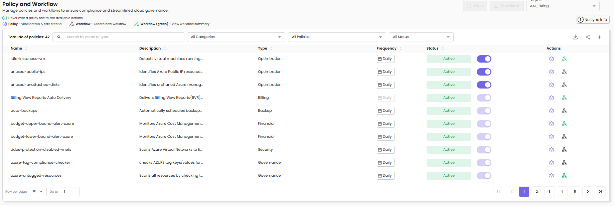
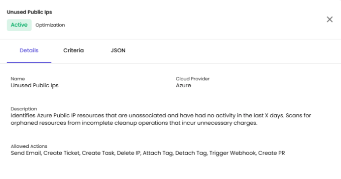
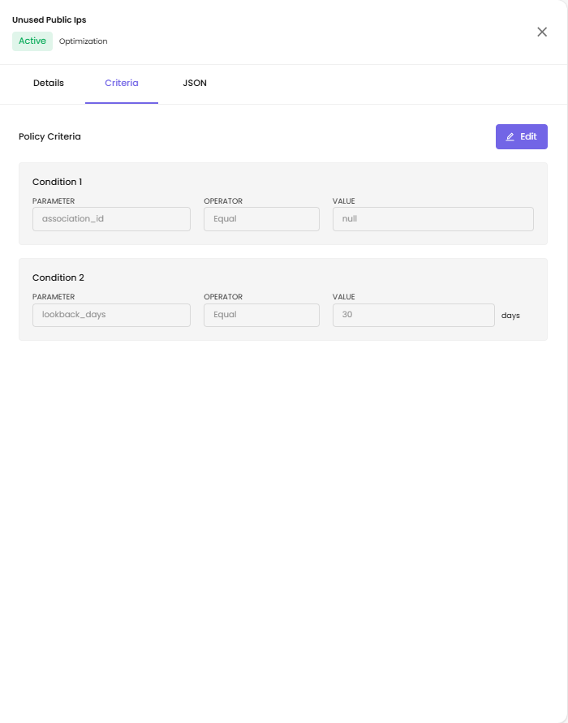
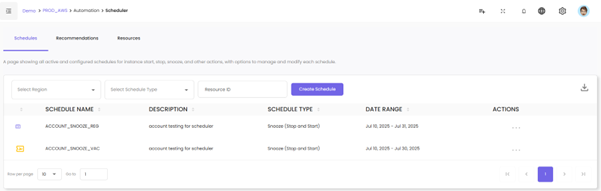
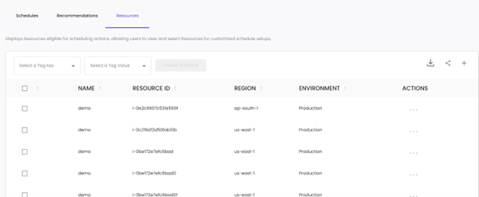

# Automation

## 1. Policy Management and Workflows

### Overview

Manage policies and workflows to ensure compliance and streamlined cloud governance. The Policy and Workflow page provides a centralized location to monitor, configure, and automate responses to cloud events.

### Global Policies

The Global Policies section provides a centralized location where all predefined policies across multiple cloud providers—AWS, Azure, and GCP—are listed and managed. This page helps organizations apply standardized governance rules across their cloud environments, ensuring compliance, cost efficiency, and operational consistency.

**Policy Settings** - View and manage cloud governance policies. You can mark policies as Mandatory or Optional.

#### Filters

**Filter By Cloud Providers** - Filter policies by cloud provider (AWS, Azure, GCP)

**Filter By Policy Groups** - Filter by policy group category

**Filter By Resources** - Filter by specific resource types

#### Policy List Columns

**Name** - Policy identifier (e.g., idle-instances-ec2, untagged-instances-ec2, unattached-volumes-ebs)

**Description** - Brief description of what the policy monitors or enforces

**Cloud Provider** - The cloud platform (AWS, Azure, GCP)

**Status** - Policy enforcement status:
- **Mandatory** (green badge with toggle ON) - Policy is enforced across all projects
- **Optional** (grey badge with toggle OFF) - Policy can be enabled at project level

**Actions** - Menu for additional policy options

#### What You'll Find on the Global Policies Page

- A comprehensive list of built-in policies, categorized by cloud provider (AWS, Azure, GCP)
- Each policy includes metadata like name, classification (e.g., cost, security), and a description of what it enforces

### Controlling Policy Behavior: Mandatory vs. Optional

From the Global Policies page, users can decide how each policy should behave across the organization:

**Mandatory** - These policies are enforced by default and cannot be overridden at the project level. They apply to all relevant resources without exception.

**Optional** - These policies are available for project-level users to adopt but are not enforced unless explicitly enabled for a given project.

This flexibility allows teams to strike a balance between organization-wide controls and project-level customization.

### Policy Management and Workflow

In CloudPi, Policies and Workflows work together to help you monitor your cloud environment and automate responses to events.

**Policy** - A Policy defines the conditions and thresholds you want to monitor, such as resource usage, cost limits, security compliance, or specific service-level events.

**Workflow** - When a Policy condition is met, a Workflow is automatically triggered. A Workflow is a set of automated actions configured to respond to the policy event. These actions can include sending email alerts, creating backups, generating snapshots, or executing other predefined tasks to manage the situation.

By combining Policies and Workflows, CloudPi enables proactive monitoring and automation, helping you maintain complete control over your cloud infrastructure with minimal manual intervention.

---

### Policy Management

#### Navigate to Policies

1. In the Project menu, click on the **Automation** tab
2. Select **Policy and Workflow**
3. Here, you will see a list of all existing policies associated with the selected project

#### Policy Page Features

**Total No of policies** - Displays the count of all policies in the project

**Search** - Search by name or type to find specific policies

**All Categories** - Filter policies by category (Optimization, Billing, Backup, Financial, Security, Governance)

**All Policies** - Filter to show all policies or specific subsets

**Sync** - Synchronize policy data

**Download** - Export policy list

#### Policy List Columns

**Name** - Policy identifier (e.g., idle-instances-vm, unused-public-ips, unused-unattached-disks, auto-invoicing, auto-backups)

**Description** - Brief description of what the policy detects or enforces (e.g., "Detects virtual machines running...", "Identifies Azure Public IP resource...", "Identifies orphaned Azure manag...")

**Type** - Category of policy (Optimization, Billing, Backup, Financial, Security, Governance)

**Status** - Shows if policy is Active (green badge) with toggle switch to enable/disable

**Workflow Status** - Indicates if a workflow is configured (Active in green or No Workflow)

**Actions** - Menu to view/edit policy details and configure workflows

#### Available Actions

Hover over a policy row to see available actions:

- **Policy** - View details & edit criteria
- **Workflow** - Create new workflow
- **Workflow (green)** - View workflow summary

---

### Viewing Policy Details

Click on a policy row or the settings icon to open a sidebar with three tabs:

#### 1. Details Tab

**Name** - Policy name (e.g., Unused Public Ips)

**Cloud Provider** - Cloud platform (e.g., Azure)

**Description** - Full description of the policy's purpose (e.g., "Identifies Azure Public IP resources that are unassociated and have had no activity in the last X days. Scans for orphaned resources from incomplete cleanup operations that incur unnecessary charges.")

**Allowed Actions** - List of actions available for this policy:
- Send Email
- Create Ticket
- Create Task
- Delete IP
- Attach Tag
- Detach Tag
- Trigger Webhook
- Create PR

#### 2. Criteria Tab

Shows the policy criteria with editable conditions. Click the **Edit** button to modify criteria.

**Policy Criteria:**

**Condition 1**
- **Parameter** - The field being evaluated (e.g., association_id)
- **Operator** - The comparison type (e.g., Equal)
- **Value** - The comparison value (e.g., null)

**Condition 2**
- **Parameter** - The field being evaluated (e.g., lookback_days)
- **Operator** - The comparison type (e.g., Equal)
- **Value** - The comparison value with unit (e.g., 30 days)

#### 3. JSON Tab

Displays the complete policy configuration in JSON format, including:

- **name** - Policy identifier
- **action** - Default action type
- **active** - Policy status
- **filter** - Conditions with "and" logic
- **trigger** - Event-based or scheduled
- **cloud_id** - Cloud provider identifier
- **eventType** - Type of event monitored
- **description** - Full policy description
- **service_name** - Target cloud service
- **classification** - Policy category
- **recommendation_format** - Template for recommendation messages

---

### Workflows

#### Cloning Workflows

You can clone existing workflows to quickly create new policies with similar automation steps. This helps you avoid repetitive setup and ensures consistency across policies.

#### Configure a Workflow

After configuring your policy, you can create or edit workflows:

1. Click the **Workflow icon** (next to the Settings icon) for a specific policy
2. A sidebar opens showing the workflow configuration options

#### Workflow Logs

Workflow Logs are captured during the execution of a policy. These logs help you:

- Track the execution status of each workflow
- Monitor actions performed
- Identify any errors or failures during automated processes

#### Define Workflow Details

When creating a workflow, you need to provide:

**Workflow Name** - Enter a name for your workflow (e.g., untagged-instances-ec2)

**Description** - Provide a clear description of the workflow's purpose

#### Set Up Workflow Rules

Each workflow contains rules that define how and when the actions are executed:

**Select Services** - Choose the cloud service this rule applies to (e.g., EC2, S3, etc.)

**Inclusions (Optional)** - Click **+ Add Inclusion** to specify any resources or conditions that should be explicitly included in this rule

**Exclusions (Optional)** - Click **+ Add Exclusion** to define any resources or conditions that should be excluded from this rule

#### Configure Actions

Actions define what CloudPi should do when the policy conditions are met:

1. **Select Action** - Choose the action from the dropdown (e.g., Send Email, Create Snapshot, etc.)

2. **Action Parameters:**
   - For actions like Send Email, enter the recipient's email address
   - For actions like Create Snapshot, select the target resource

3. **Add Additional Actions** - Click **+ Add Action** to define multiple actions within the same rule

4. **Set Delay (Optional)** - You can optionally specify a delay in days or hours before the action is executed

#### Add More Rules (Optional)

To add multiple rules within the same workflow, click **+ Add Rule**.

#### Save the Workflow

Once all rules and actions are configured:

- Click **Save Changes** to finalize the workflow
- Click **Cancel** if you want to discard the changes

#### View Workflow Details

After saving the workflow, go to the Workflow list and click on the Workflow Name to view its full configuration, including all rules and actions.

---

### Auto Invoicing Policy

Auto Invoicing is a built-in policy that automates the process of generating invoices every month based on data usage. This ensures timely billing and reduces the need for manual intervention.

#### How to Set Up a Time-Based Workflow for Auto Invoicing

To automate invoice generation, users can create a Time-Based Workflow by following these steps:

1. **Workflow Name** - Give your workflow a name that clearly indicates its purpose, such as `auto-invoicing`

2. **Description (Optional)** - Add a short description to explain what the workflow does—e.g., "Automatically generates invoices based on usage every month"

3. **Schedule:**
   - **Start Date** - Select the date when the workflow should begin
   - **Frequency** - Choose how often the workflow runs (e.g., Monthly)

4. **Billing Details:**
   - **Billing View** - Select the billing view that contains usage data
   - **Customer** - Choose the customer who should be billed
   - You can add multiple billing configurations using the **Add Billing** option if needed

5. **Actions:**
   - In the Actions section, select the action **Schedule Auto Invoicing** from the dropdown menu
   - You can add additional actions if your workflow needs to perform multiple tasks

6. **Save Workflow** - Once all the information is filled out, click on the **Create Workflow** button to activate it

---

## 2. Virtual Machine Scheduler

### Overview

The Virtual Machine Scheduler feature in CloudPi offers powerful automation for managing the start and stop operations of virtual machines. By configuring schedules, organizations can optimize resource utilization, reduce cloud costs, and ensure efficient cloud infrastructure management. This feature provides a streamlined approach to managing resource availability based on predefined schedules or real-time needs.

### Key Features

#### Comprehensive Schedule Management

**Automated Operations** - Enable automatic start and stop of virtual machines during specified time periods, optimizing resource availability and cost-efficiency

**Vacation and Custom Schedules** - Create schedules tailored for holidays, weekends, or specific organizational needs

**Multi-Region Support** - Manage schedules for resources across different cloud regions seamlessly

#### Centralized Schedule Overview

**Detailed Schedule View** - Access all active schedules, including their type (Snooze, Start, or Stop), associated resources, and timing details

**Actionable Controls** - Modify, delete, or manually override schedules directly from the Schedules screen

**Execution Logs** - Monitor schedule activities and execution statuses for accountability and troubleshooting

#### Data-Driven Recommendations

**Optimized Scheduling Suggestions** - Receive schedule recommendations based on usage patterns to reduce resource idling

**Streamlined Implementation** - Apply recommendations with minimal configuration through the Recommendations screen

---

### Setup and Configuration

#### Accessing the Scheduler Feature

1. Navigate to **Automation** - Log into CloudPi and access the Scheduler feature under the Automation section in the main menu
2. Explore the Three Main Screens:
   - **Schedules** - Manage and review all active schedules
   - **Recommendations** - View and apply usage-based schedule suggestions
   - **Resources** - Identify eligible resources and create custom schedules

---

### Navigating Schedules

#### Schedules Screen

**View All Schedules** - Review the list of schedules with details such as schedule name, type, description, and associated resources

**Edit and Delete** - Modify schedules or remove outdated configurations directly from the Actions menu

**Manual Override** - Enable or disable specific resources for temporary overrides without altering the main schedule

---

### Actions

#### View

The View action allows users to examine the details of a specific schedule without making changes. By selecting this option from the Actions Menu, the system displays a detailed breakdown of the schedule, including key information such as:

**Name** - Schedule identifier (e.g., ACCOUNT_SNOOZE_REG)

**Description** - Purpose or usage (e.g., "account testing for scheduler")

**Schedule Type** - Type of schedule (e.g., Snooze (Stop and Start))

**Date Range** - Period when the schedule is active

**Weekday Timings** - Days and times for weekday operations

**Weekend Timings** - Days and times for weekend operations

The View feature is particularly useful for verifying schedule configurations or sharing information with team members. Users can close the detailed view by selecting the **Close View** option.

**Resource Details Tab:**

Shows the list of resources associated with this schedule:

**NAME** - Resource name

**INSTANCE ID** - Unique resource identifier

**REGION** - Cloud region

**STATUS** - Active/Paused status with toggle

**ACTIONS** - Additional options menu

#### Manual Override

The Manual Override feature provides users with the ability to temporarily pause or activate the application of the VM Snooze schedule for individual instances. This allows for greater flexibility in managing resources without permanently modifying the primary schedule.

**How It Works:**

1. **Accessing Manual Override:**
   - Click the **Manual Override** icon in the Actions menu for a specific schedule
   - This will open a detailed list of instances associated with the schedule

2. **Pausing or Activating an Instance:**
   - **Paused** - Use the toggle switch to pause an instance, preventing it from being affected by the VM Snooze schedule. This ensures the resource remains operational, regardless of the scheduled start and stop times
   - **Active** - Use the toggle switch to activate an instance, ensuring it adheres to the VM Snooze schedule

3. **Instance Details:**
   - The manual override panel displays key details for each instance:
     - **Resource Name** - Name of the instance
     - **Instance ID** - Unique identifier for the instance
     - **Region** - The cloud region where the resource is deployed
     - **Status** - Reflects whether the instance is currently subject to the schedule (Active) or excluded (Paused)

4. **Closing Manual Override:**
   - Once the desired overrides are set, click **Close Manual Override** to return to the main Schedules view
   - Overrides take effect immediately but do not alter the underlying schedule configuration

#### Edit Action

The Edit feature allows users to modify the configuration of an existing schedule. This ensures flexibility for adapting schedules to changing requirements without the need to create a new schedule from scratch.

**How It Works:**

1. **Accessing Edit Mode:**
   - Click the **Edit** icon from the Actions menu of the selected schedule
   - This opens the schedule in an editable form

2. **Editable Fields:**

Users can update the following details:

**Schedule Name** - Update the schedule identifier

**Description** - Modify the description to better reflect the schedule's purpose

**Start Date** - Update the start date

**Start Time** - Change when the schedule activates

**Stop Time** - Change when the schedule deactivates

**Time Zone** - Select the appropriate time zone (e.g., Asia/Kolkata (GMT+05:30))

3. **Saving Changes:**
   - Once the updates are complete, click the **Update** button to save the changes
   - The schedule is updated in real time, and the changes are reflected in the Schedules screen

4. **Closing Edit Mode:**
   - If no changes are needed, click **Close Edit** to exit the edit mode without modifying the schedule

#### Schedule Logs

The Schedule Logs feature provides users with detailed insights into the execution history of a schedule. It helps track the status of scheduled actions, ensuring transparency and simplifying troubleshooting when needed.

**How It Works:**

1. **Accessing Schedule Logs:**
   - Click the **Schedule Logs** icon in the Actions menu of a specific schedule
   - This opens a log view displaying the execution history

2. **Log Details:**

Each log entry includes:

**Started At** - The timestamp when the schedule action began

**Completed At** - The timestamp when the action finished

**Status** - Indicates the success or failure of the action (green "Success" label)

**Message** - Details about the action performed (e.g., instance IDs started/stopped)

3. **Troubleshooting Support:**
   - If a schedule action fails, the log entry provides error messages or status details
   - These can be used to identify and resolve issues

4. **Closing Logs:**
   - After reviewing the logs, click **Close Logs** to return to the main Schedules view

#### Delete Schedule

The Delete Schedule feature allows users to permanently remove an existing schedule from the system. This is useful for eliminating outdated or unused schedules, ensuring that only relevant configurations are maintained.

**How It Works:**

1. **Accessing Delete Option:**
   - Click the **Delete** icon in the Actions menu of the selected schedule
   - This action initiates the schedule deletion process

2. **Confirmation Prompt:**
   - A confirmation dialog appears to prevent accidental deletions
   - Users must confirm their intent to delete the schedule
   - **Deletion Outcome:**
     - If confirmed, the schedule is permanently removed from the list, and all associated configurations are erased
     - If canceled, no changes are made, and the schedule remains in place

3. **Impact on Resources:**
   - Deleting a schedule does not impact the current state of associated resources
   - It only removes the automation tied to the schedule

#### Export Instance Details

The Export Instance Details feature allows users to download a detailed spreadsheet (.csv) of all active schedules, instances, and their associated configurations. This enables efficient tracking, reporting, and analysis of virtual machine schedules and their statuses.

**How It Works:**

1. **Accessing the Export Feature:**
   - Click the **Export Instance Details** button located in the top-right corner of the Schedules screen

2. **Downloading the Spreadsheet:**
   - When clicked, the system generates a spreadsheet and prompts you to download it
   - The file contains detailed information for each schedule and associated instance, including:
     - Instance ID
     - Region
     - Instance Status
     - Schedule Name
     - Schedule Status
     - Schedule Type
     - Weekdays
     - Weekends
     - Action Type
     - Description
     - Start Date and End Date
     - Time zone
     - Weekday Start Time and End Time
     - Weekend Start Time and End Time
     - Is Recommended (Yes/No)
     - Tag

3. **Spreadsheet Output:**

The spreadsheet provides a comprehensive, instance-level view of schedules, enabling users to:
- Monitor schedule execution for each instance
- Identify instances and schedules based on region, type, or tags
- Audit or analyze resource utilization and scheduling effectiveness

---

### Recommendations

#### Reviewing Recommendations

The Recommendations Screen displays a list of recommended snooze schedules tailored to optimize resource utilization and cost efficiency. These recommendations are generated based on usage analytics, helping users identify optimal start and stop times for cloud resources.

**How It Works:**

1. **Recommendations Column:**
   - The Recommendation column lists the recommended snooze schedules for each resource
   - Each entry includes:
     - **Instance ID** - Identifies the resource
     - **Snooze Schedule** - Indicates the suggested start and stop times (e.g., Snooze_10 PM_5 AM)

2. **Reviewing Suggested Schedules:**
   - Users can browse the recommendations to understand the proposed snooze schedules
   - The recommendations provide actionable insights for aligning resource schedules with real-world usage patterns

3. **Taking Action:**
   - Check the boxes next to one or more recommendations to activate the **Create Schedule** button
   - Use the Create Schedule feature to customize and apply these recommendations

4. **Additional Actions:**
   - **Download** - Click the Download icon to export the recommendations list
   - **Share** - Click the Share icon to share recommendations via social media, email, or by copying a link
   - **Add Columns** - Click the Add Columns (+) icon to customize visible columns

#### Actions

**View Recommendation Details and Usage Analysis:**

Access recommendation details and analysis by navigating to **Actions → View**. This feature helps users evaluate a recommendation by providing detailed insights and usage analysis, enabling informed decisions about adopting a snooze schedule.

**Recommendation Details:**

Displays key information about the recommendation:
- Resource ID, Name, and Region
- Recommendation Type (e.g., Snooze)
- Date Range and Start/Stop Times
- Average CPU Utilization and Network In/Out metrics

**Usage Analysis:**

- Provides a visual graph of historical metrics (e.g., CPU Utilization) over a configurable lookback period
- Users can select metrics like CPU or network usage to assess resource activity trends

This feature allows users to validate recommendations before creating schedules, ensuring they align with usage patterns.

---

### Resource Scheduling

The Resources section allows you to view and manage resources eligible for scheduling actions.

**Features:**

1. **Select Resources:**
   - Check the box in the row for one or more resources to enable the **Create Schedule** button

2. **Create Schedule:**
   - After selecting resources, click the **Create Schedule** button to define scheduling parameters

**Schedule Configuration:**

**Select Schedule Type** - Choose between Vacation or Custom

**Schedule Name** - Enter a name (5-10 letters)

**Description** - Provide schedule purpose

**End Date Option** - Choose "No End Date" or set an end date

**Start Date** - Select when the schedule begins

**Start Time** - Set the activation time

**Stop Time** - Set the deactivation time

**Time Zone** - Select appropriate time zone (e.g., Asia/Kolkata)

3. **View Resource Details:**
   - Use the **View** action in the Actions column to see specific details about a resource

**Resource Details View:**

Shows comprehensive information including:
- Resource ID
- Region
- Environment
- Tags (Name, project, department, etc.)

**Additional Features:**

- **Download** - Export resource details as a spreadsheet
- **Share** - Share resource data via various platforms
- **Add Columns** - Customize the displayed columns for a tailored view of resource data

