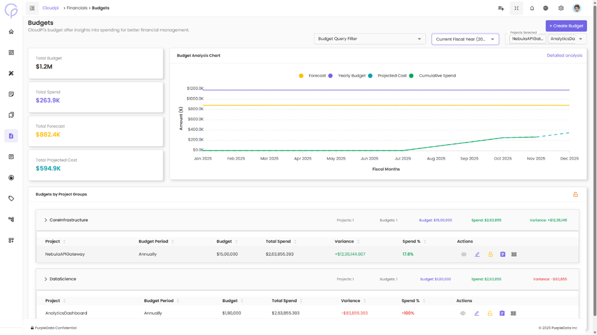
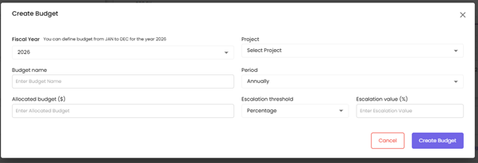

# Budgeting

The Budgeting page lets you create, monitor, and manage cloud spending budgets across projects. Track actual spend against allocated budgets, configure alert thresholds, and lock budgets to prevent unauthorized changes.

## Fiscal Year

All budgets in CloudPi are scoped to a **fiscal year**. The fiscal year start month is a workspace-level setting — every budget you create, every Budget vs. Spend chart, and every fiscal-year selector in the Billing Hub uses this configuration.

- **Where to change it:** **Admin Settings → Workspace** (Workspace Admin only).
- **Format:** A start month between 1 and 12 (e.g., `1` = January for a `Jan–Dec` fiscal year, `4` = April for an `Apr–Mar` fiscal year).
- **Effect:** Changing the fiscal year start month updates how budgets and reports group their monthly buckets going forward; existing budget records are not retroactively re-bucketed.

If you need to change the fiscal year, do it before creating budgets for the upcoming year so allocation periods line up cleanly.

## Budgets Overview

The Budgets page provides an overview of all budget details across your projects.

### Top Cards Overview

At the top of the page, four key cards provide quick insights into the overall financial status:

- **Total Budget** — Total budget across all projects
- **Total Spend** — Total spending for the selected period
- **Total Forecast** — Total forecasted spend across all projects
- **Total Projected Cost** — Total projected cost for the budget

### Budget Summary Line Chart

Below the cards, a line chart displays three series across fiscal months:

- **Spend (green line)** — Actual spend data
- **Forecast (yellow line)** — Forecasted spend data
- **Budget (blue line)** — Allocated budget

The chart provides a visual comparison of actual spend, forecasted spend, and allocated budget for the entire year across all projects.

### Filtering Options

You can filter budget details by:

- **Projects** — Filter by one or more projects
- **Organizations** — Filter based on different organizations
- **Project Groups** — Filter based on specific project groups

These filters let you view budget data at different levels, making it easier to analyze spending patterns across multiple projects or organizations.

### Budget Management Table

Below the chart, a table displays detailed budget information for each project:

| Column | Description |
|--------|-------------|
| **Project Name** | Name of the project |
| **Budget Name** | Identifier for the budget |
| **Budget Period** | Annual or Quarterly |
| **Allocated Budget** | Total budget amount allocated |
| **Threshold** | Percentage threshold set for budget alerts |
| **Actions** | Options to View, Lock, or Unlock the budget |

## Actions

The Actions column provides options for interacting with the budget. The available actions depend on user permissions.

### View

Clicking the **View** icon expands the row to display detailed budget information:

- **Allocated Budget** — Total budget allocated for the project, broken down by month or period
- **Used Budget** — Amount that has been spent so far within the budget period
- **Forecast** — Forecasted spend for the project, including any adjustments made for future periods
- **Threshold** — Alert threshold percentage at which an alert is triggered based on actual spend
- **Alert Notifications** — Email addresses set to receive alerts when the threshold is reached

The expanded view shows a detailed breakdown of used budget and forecasted spend over the budget period, so you can track how close the project is to exceeding its allocated budget.

## Creating a New Budget

To create a new budget, click the **Create** icon. The Create Budget form opens.

### Form Fields

| Field | Description |
|-------|-------------|
| **Budget Name** | A unique, identifiable name (e.g., `Budget_Beta`, `Project_Alpha_Budget`) |
| **Project** | The project this budget is associated with (e.g., `TestProject_Demo`, `Project_Data`) |
| **Period** | The budget cycle — **Annually** or **Quarterly** |
| **Start Date** | The month and year when the budget period begins (e.g., June 2025) |
| **Allocated Budget ($)** | Total amount allocated for the period (e.g., $120,000) |
| **Escalation Type** | Defines how forecast approvals are escalated — by **percentage** of total forecast, or by **absolute amount** |
| **Escalation Value ($ or %)** | Threshold up to which a forecast request can be auto-approved without manual intervention |

**Escalation examples:**

- A `70%` escalation value auto-approves requests within 70% of the approved forecast.
- A `$50,000` escalation value auto-approves any request within that amount.

This mechanism streamlines approvals, reduces delays, and ensures faster processing of routine forecast changes within acceptable risk limits.

Once all fields are filled, click **Create Budget**. The new budget is added to the system and made available for tracking.

## Editing a Budget

After creating a budget, you can update it by clicking the **Edit** icon. The form opens pre-filled with existing values, letting you modify:

- **Budget Name** — e.g., change `Budget_Beta` to `Updated_Budget_Beta`
- **Period** — e.g., switch from Annual to Quarterly
- **Escalation Type and Value** — e.g., change to *Amount* with a value of `$100,000`

Click **Update** to save the changes.

## Lock / Unlock Budgets

The lock/unlock feature ensures budget integrity:

- **Lock** — Prevents any changes to the budget or forecast. Use this for finalized budgets.
- **Unlock** — Allows editing, available to authorized users.

## Related

- [Financials overview](Financials.md)
- [Forecast](Forecast.md)
- [Multi-Cloud Billing Hub](MultiCloudBillingHub.md)
- [Cost Types](CostTypes.md)
