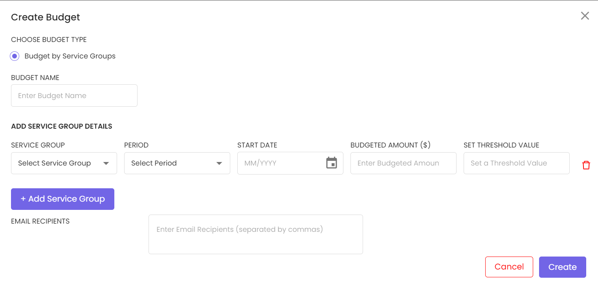
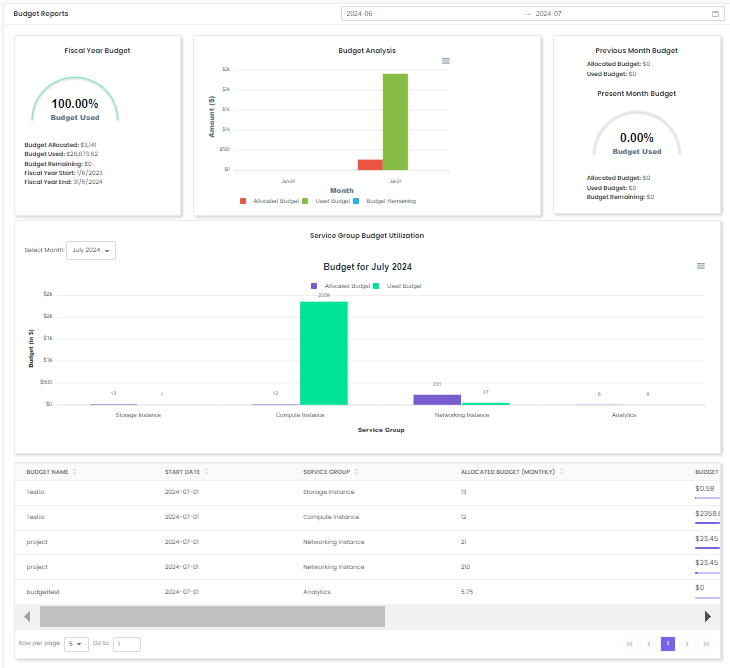

The Budget Management feature in CloudPi is designed to empower organizations with 
comprehensive control over their cloud spending. This tool enables precise budgeting at the 
project and service group levels, with customizable alerts, and robust reporting capabilities 
to ensure financial efficiency and accountability

## Key Features 
### Project and Service Group Budgets              
Customization: Set specific budgets for individual projects and service groups able to 
allocate funds monthly, quarterly, or yearly. This allows for precise financial management 
aligned with project timelines and business cycles.

Adaptability: Adjust budget allocations as needed based on project demands and financial 
forecasting, ensuring resources are utilized effectively.

### Budget Alerts                                                                 
Percentage-Based Alerts: Configure alerts to trigger when spending reaches a predefined 
percentage of the budget. This proactive approach helps prevent budget overruns and 
maintains financial control.                       

Immediate Notifications: Receive timely alerts via email to take necessary actions or review 
budget plans. This ensures that stakeholders are always informed and can respond quickly 
to financial developments.

### Email Notification Setup
Automated Delivery: Automate the dispatch of budget alerts and updates to designated 
email recipients, ensuring continuous communication and oversight.

Customizable Recipient Lists: Manage who receives budget notifications, making it easy to 
keep relevant team members and decision-makers in the loop.

### Visual Budget Tracking
Dashboard Insights: Utilize interactive dashboards to visually track and analyze budget 
utilization. These visual tools provide a clear and immediate understanding of financial 
performance against set budgets.

Detailed Analysis: Explore in-depth details on budget spending through various filters and 
dimensions such as time periods, projects, service groups, and more, enhancing decision making capabilities.

### Share and Distribute
Sharing and Distribution: Share budget reports directly from CloudPi with stakeholders and 
team members to ensure everyone is aligned and informed.
Download Options: Download budget reports in various formats for offline review, 
archiving, or to meet compliance requirements.

## Navigating the Budget Management Feature

**Setting and Adjusting Budgets**: Navigate to the 'Budgets' section within CloudPi. Here you 
can set new budgets or adjust existing ones by specifying details such as the budget amount, 
scope, and the period over which it applies.

**Configuring Alerts and Notifications**: Within the budget settings, configure the alert 
thresholds and enter email addresses for alert delivery. This setup helps maintain vigilance 
over budget use.

**Accessing Budget Reports**: From the dashboard, access the reporting tools to generate, 
view, and analyze budget reports. Utilize the built-in functionality to share or download 
these reports directly.

**Visual Monitoring**: Regularly check the interactive dashboards to monitor spending trends 
and adherence to budgets. Use the insights provided to make informed adjustments to 
budget allocations or spending practices.

The Budget Management feature in CloudPi ensures that organizations can maintain strict 
financial control, optimize cloud spending, and enhance overall financial planning and 
management. This tool is crucial for maintaining operational efficiency and achieving long term financial objectives in cloud environments.

## Budget Reports
The budget report dashboard from CloudPi. It includes several panels and charts displaying 
various aspects of budget usage and allocation for cloud services. Here is a detailed 
breakdown:
### Top Section: Budget Reports Overview
- **Fiscal Year Budget (left)**:Shows the budget allocated, used, and remaining for the 
fiscal year.
- **Budget Analysis (middle)**:A line chart intended to display the allocated budget, used 
budget, and budget remaining over time.
- **Previous Month Budget and Present Month Budget (right)**:This section shows the 
budget allocated and used for the previous and present month, respectively.

### Bottom Section: Detailed Budget Utilization
- **Select Month**:Dropdown menu to select the month for viewing the budget report. By 
default the chart will show the present month’s budget utilization by service group.
- **Service Group Budget Utilization**:A bar chart displaying budget allocation and 
usage for different service groups (Storage Instance, Compute Instance, Networking 
Instance, Analytics, etc). Each bar shows the allocated and used budget for the 
selected month.
- **Budget Detail Table**:: The table provides a detailed breakdown of the budget, 
including various categories and their respective amounts. The column includes 
Budget Name, Start Date, Service Group, Allocated Budget, Used Budget, Threshold, 
Variance, Alert, etc.

