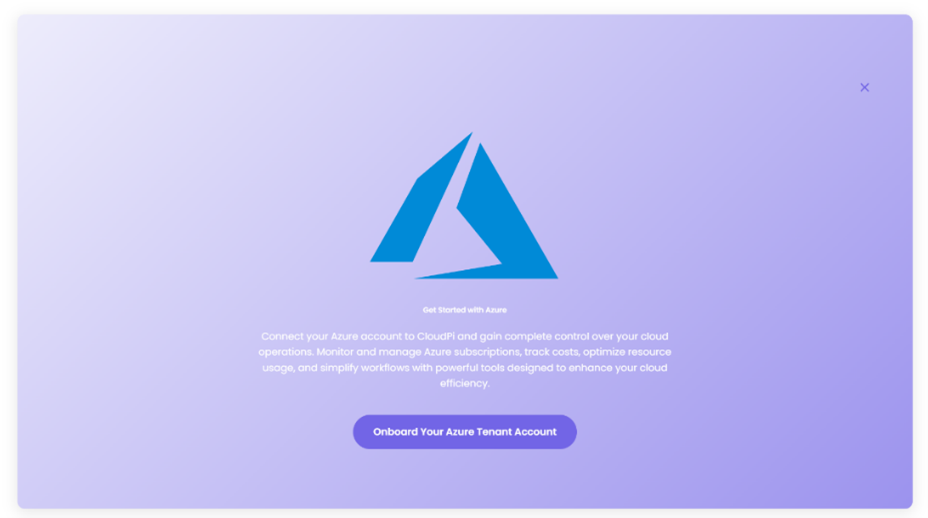
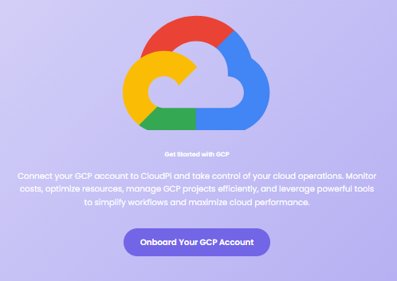

# Cloud Onboarding

Cloud Onboarding in CloudPi allows you to connect your cloud provider accounts (AWS, Azure, GCP) to enable data collection, billing analysis, metrics gathering, and automated remediation actions.

---

## Overview

The onboarding process follows a guided 4-step wizard:

1. **Onboarding Cloud** - Select account type and access configuration
2. **Configuration** - Configure features and billing settings
3. **Credentials** - Provide cloud provider credentials
4. **Data Collection** - Configure data collection settings

---

## AWS Cloud Onboarding

Connect your AWS organization to CloudPi for comprehensive cloud management and cost optimization.

### Prerequisites

Before starting AWS onboarding, ensure you have the following:

- **AWS Billing Access** - Permission to create IAM roles and manage CUR exports
- **CUR Configuration** - Cost and Usage Report enabled with resource IDs and a supported format (Parquet recommended)
- **Cost Allocation Tags** - Tags activated in AWS for proper cost categorization

For detailed setup instructions, see [Provider Connections - AWS](ProviderConnections.md#connect-aws).

### Step 1: Account Type

**Onboard AWS Cloud**

Get started by selecting your AWS account type and access configuration. Provide your organization name to proceed.

**Organization Name** - Provide the name of the organization

**Account Type** - Select the type of account for onboarding:
- **Organization Account** - Manage multiple AWS accounts centrally under a single organization
- **Management Account** - Manage AWS services independently within a standalone account

**Access Type** - Select the access type that matches your use case:
- **Cross Account** - Enable access across multiple AWS accounts via a central account
- **Standard Account** - Manage resources within a single AWS account

Click **Next** to proceed.

### Step 2: Configuration

**Configuration**

Configure Billing, Automation, and Recommendation features with the required credentials and settings.

**Select Features:**

Choose one or more features to enable specific functionalities for your AWS account:

**Billing** - Enable billing-related features & integrations

**Recommendations** - Enable optimization recommendations

**Automation** - Enable automated cloud cost governance

**Billing Configuration:**

**S3 Bucket Name** - Specify the name of the AWS S3 bucket where billing data will be stored

**S3 Bucket Location** - Enter the AWS region where your S3 bucket is located

**Folder Path** - Provide the folder path inside your S3 bucket where CUR files are stored

**CUR Version** - Select the version of the AWS Cost and Usage Report (CUR) format you want to use

**AWS Credentials:**

Provide the necessary credentials to establish secure access with your AWS account.

- No shared credentials (Master Service Accounts) exist for AWS yet. You can create a new MSA to store credentials for reuse, or enter credentials directly for this organization only.

**Create New MSA** - Create a new Master Service Account to store credentials for reuse

or enter credentials below for this organization only

**Upload Credentials File** - Upload a JSON file containing your AWS credentials with fields: accessKey and secretKey

**Download CSV Template** - Download template for credential file

**Role ARN** - Enter the Role ARN for cross-account access

Click **Next** to proceed.

### Step 3: File Selection

**Select Files**

Select the billing data files to import and process.

Click **Next** to proceed to data collection.

### Step 4: Data Collection

**Data Collection**

Configure data collection settings and initiate the import process.

### AWS IAM Requirements

To complete AWS onboarding, you need to create an IAM role or user with the following:

**For Cross-Account Access:**
- Create an IAM role with trust policy allowing CloudPi to assume the role
- Provide Role ARN
- Use external ID for secure cross-account access

**For Standard Account:**
- Create IAM user with programmatic access
- Generate access key and secret key
- Store credentials in JSON format

**Permissions** - Based on enabled features:
- Cost Explorer and CUR access for Billing
- ReadOnlyAccess for Recommendations
- Write permissions for Automation

---

## Azure Cloud Onboarding

Connect your Azure subscriptions to CloudPi for unified cloud management across your Azure environment.

### Prerequisites

Before starting Azure onboarding, ensure you have the following:

- **Azure Billing Access** - Permission to create app registrations and service principals
- **Cost Management Exports** - Ability to create or manage Cost Management exports and storage access
- **Billing Account Type** - Identify your billing account type (CSP, EA, MCA, or standard)

For detailed setup instructions, see [Provider Connections - Azure](ProviderConnections.md#connect-azure).

### Step 1: Account Type

**Onboard Azure Cloud Tenant**

Choose an organization tenant and provide the Organization Name to proceed.

**Organization Name** - Provide the name of the Azure tenant

**Access Type** - Select the type of Azure account for onboarding:
- **Single Tenant Account** - Manage Azure services with a service principal in the same tenant
- **Multi Tenant Account** - Manage multiple Azure tenants with a service principal from a different tenant

Click **Next** to proceed.

### Step 2: Configuration

**Configuration**

Configure Billing, Automation, and Recommendation features with the required credentials and settings.

**Select Features:**

Choose one or more features to enable specific functionalities for your Azure account:

**Billing** - Enable billing-related features & integrations

**Recommendations** - Enable optimization recommendations

**Automation** - Enable automated cloud cost governance

**Billing Configuration:**

**Container Name** - Enter the name of the Azure Blob Storage container where your billing data is stored

**Storage Account Name** - Enter the name of the Azure Storage Account that contains your billing container

**Directory** - Specify the directory path inside the container where the billing files are located

**Export Type** - Select the type of export for your Azure billing data

**File Format** - Choose the file format for the exported billing data

**Azure Credentials:**

Provide the necessary credentials to establish secure access with your Azure account.

- 1 shared credential (Master Service Account) available for Azure. You can use existing credentials or enter new ones.

**Use Existing MSA** - Select from available shared credentials

**Enter New Credentials** - Provide credentials specific to this organization

**Create New MSA** - Create a new Master Service Account

**Upload Credentials File** - Upload a JSON file containing your Azure credentials with fields: clientId, clientSecret, and tenantId

**Download JSON Template** - Download template for credential file

Click **Next** to proceed.

### Step 3: File Selection

**Select Files**

Select the billing data files to import and process.

Click **Next** to proceed to data collection.

### Step 4: Data Collection

**Data Collection**

Configure data collection settings and initiate the import process.

### Azure App Registration Requirements

To complete Azure onboarding, you need to register an application in Azure AD:

**App Registration** - Create a new app registration in Azure Active Directory

**For Single Tenant:**
- Register app in the same Azure AD tenant
- Generate client ID and client secret
- Note the tenant ID

**For Multi Tenant:**
- Register app in a different Azure AD tenant
- Configure multi-tenant support
- Grant appropriate permissions

**API Permissions** - Grant the following permissions based on enabled features:
- Reader role for Recommendations
- Cost Management Reader for Billing
- Contributor or custom role for Automation

**Client Secret** - Generate a client secret for authentication

---

## GCP Cloud Onboarding

Connect your Google Cloud Platform projects to CloudPi for comprehensive GCP management.

### Prerequisites

Before starting GCP onboarding, ensure you have the following:

**BigQuery Billing Export Enabled**

GCP billing export must be enabled to a BigQuery dataset containing detailed billing data.

**IAM Permissions to Configure Access**

Permissions to:

- Create a service account
- Assign IAM roles on the billing project
- Grant access to the BigQuery billing dataset

**GCP Service Account with Credentials**

- A customer-created GCP service account with the required IAM roles assigned
- A service account key file (credentials.json) generated from this account, which will be provided to CloudPi for authentication

For detailed setup instructions, see [Provider Connections - GCP](ProviderConnections.md#connect-gcp).

### Step 1: Onboarding Cloud

**Onboard GCP Cloud**

Get started by selecting your GCP account and access configuration. Provide your organization name to proceed.

**Organization Name** - Provide the name of the organization

Click **Next** to proceed.

### Step 2: Configuration

**Configuration**

Configure Billing, Automation, and Recommendation features with the required credentials and settings.

**Select Features:**

Choose one or more features to enable specific functionalities for your GCP account:

**Billing** - Enable billing-related features & integrations

**Recommendations** - Enable optimization recommendations

**Automation** - Enable automated cloud cost governance

**Billing Configuration:**

**File Type** - Select your billing data source type (e.g., Big Query)

**Dataset ID** - Enter the ID of the dataset where billing data is stored in your GCP project

**Table ID** - Provide the table name within the dataset that contains the billing details

**GCP Project ID** - Enter the GCP Project ID where your billing data is stored

**GCP Credentials:**

Provide the service account credentials to enable access to GCP.

- No shared credentials (Master Service Accounts) exist for GCP yet. You can create a new MSA to store credentials for reuse, or enter credentials directly for this organization only.

**Create New MSA** - Create a new Master Service Account

or enter credentials below for this organization only

**Upload JSON Credential** - Upload your GCP service account key file (.json)

**Download JSON Template** - Download template for service account key

Click **Next** to proceed.

### Step 3: File Selection

**Select Files**

Select the billing data files to import and process.

Click **Next** to proceed to data collection.

### Step 4: Data Collection

**Data Collection**

Configure data collection settings and initiate the import process.

### GCP Service Account Requirements

To complete GCP onboarding, you need to create a service account:

**Service Account** - Create a service account in your GCP project

**IAM Roles** - Assign the following roles based on enabled features:
- Viewer for Recommendations
- Billing Account Viewer for Billing
- Editor or custom role for Automation

**Key File** - Generate and download a JSON key file containing:
- Service account email
- Private key
- Project ID

**BigQuery Setup** - For billing data:
- Enable BigQuery Billing Export
- Create dataset for billing data
- Grant service account access to the dataset

---

