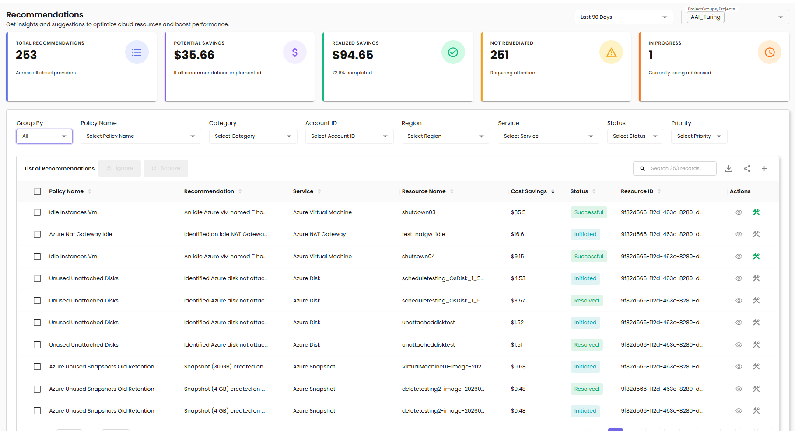
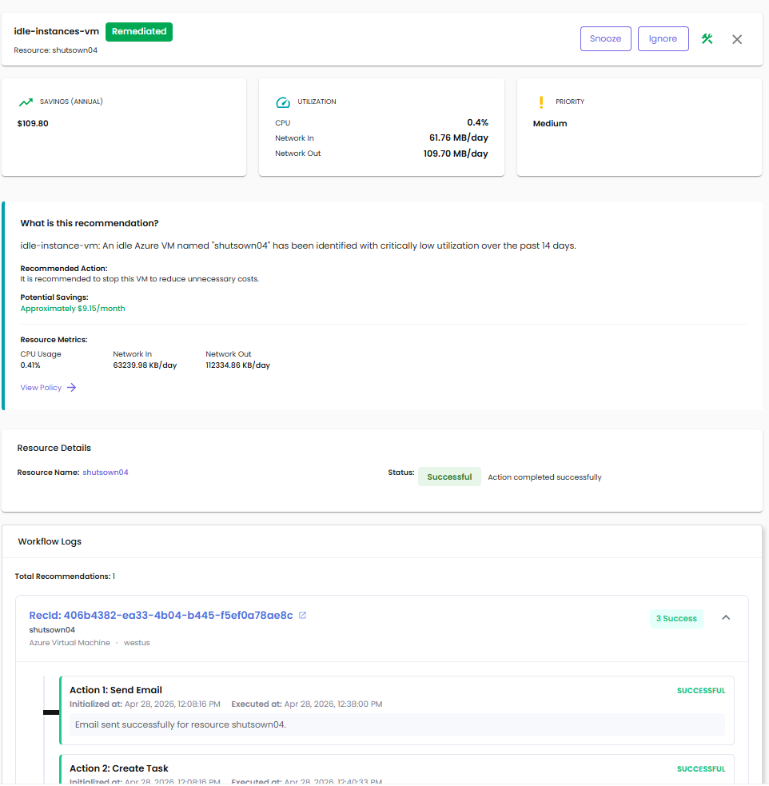

# CloudPi Recommendations

The CloudPi Recommendations Page is designed to streamline the process of identifying and acting on cloud cost optimization recommendations. This comprehensive and interactive feature empowers users to optimize cloud costs through data-driven recommendations.

## Overview

Get insights and suggestions to optimize cloud resources and boost performance. The Recommendations page provides a centralized view of all optimization opportunities across your cloud environment.

---

## Summary Metrics

At the top of the page, CloudPi Recommendations provides a high-level summary of the cost-saving potential:

**Total Recommendations** - Overall number of recommendations across all cloud providers

**Potential Savings** - Total possible cost savings if all recommendations are implemented

**Realized Savings** - Savings already achieved from completed actions (percentage completed)

**Not Remediated** - Recommendations still pending action and requiring attention

**In Progress** - Recommendations currently being addressed

---

## Data Filtering

Once the recommendations data is fetched and processed, users can apply several filters to refine and customize the view:

**Group By** - Allows grouping of recommendations (e.g., All or Policy) for better organization

**Policy Name** - Filter by specific policy name

**Category** - Filters by recommendation type such as Optimization, Governance, Performance, or Security

**Account ID** - Filter recommendations by cloud account

**Region** - View recommendations based on the region of the resource

**Service** - Filter by specific cloud service

**Status** - Filter by current status (Initiated, In Progress, Completed, etc.)

**Priority** - Filter by priority level (High, Medium, Low)

**Time Period** - Enable filtering by a defined period (e.g., Past 3 Months – Till Date)

These filters are applied in real-time, and the displayed recommendations update dynamically.

---

## List of Recommendations

### Table View

Recommendations are displayed in a clear, scrollable table format for quick review:

**Policy Name** - Name of the optimization policy (e.g., Azure Tag Compliance Checker, Azure Untagged Resources)

**Recommendation** - Specific recommendation identifier

**Category** - Type of recommendation (e.g., Governance, Optimization)

**Service** - Cloud service involved (e.g., Azure Load Balancer, Azure Storage Account, Azure SQL Database)

**Resource Name** - Name of the affected resource

**Cost Savings** - Estimated annual cost savings (or N/A if not applicable)

**Status** - Current status of the recommendation

**Actions** - Available actions for the recommendation

### Recommendation Status Types

**Initiated** - Recommendation has been identified and logged

**In Progress** - Action is currently being executed

**Completed** - Remediation has been successfully applied

**Ignored** - User has chosen to ignore this recommendation

**Snoozed** - Action has been temporarily postponed

### Expandable Grouping

When grouped by policy, recommendations can be expanded or collapsed for easier management of multiple related insights.

---

## Taking Actions on Recommendations

The page allows users to take actions based on the status of each recommendation.

### Bulk Actions

1. **Selecting Recommendations** - Use checkboxes to select one or more recommendations from the table
2. **Actions in Table Header** - Once selected, perform bulk actions:
   - **Ignore** - Marks the selected recommendations as ignored
   - **Snooze** - Temporarily postpones action on the recommendations

### Individual Actions

Each row in the Recommendations table has two action icons in the **Actions** column:

| Icon | What it does |
|------|--------------|
| 👁 **View** (eye) | Opens the recommendation detail panel — the same view described in the [Recommendation Details](#recommendation-details) section below |
| 🛠 **Workflow** (wrench / tool) | Either **views the existing workflow** for the recommendation's policy, or **starts creating one** — depending on whether a workflow already exists for that policy |

#### Workflow icon — two states

The wrench icon changes colour based on whether the recommendation's underlying policy has a workflow configured:

- **Green wrench** — A workflow exists for this policy. Hover shows *"View Workflow — Remediate"*. Clicking opens the workflow so you can review or trigger remediation.
- **Grey/black wrench** — No workflow has been configured for this policy yet. Hover shows *"Create Workflow"*. Clicking navigates to the policy on the **Policies & Workflows** page, where you can configure rules and create the workflow.

In the Recommendations table you'll typically see a mix — recently configured policies show the green icon, while newly surfaced policies still show grey until someone sets up automation for them.

For full details on configuring rules, actions, and approvals on a workflow, see [Policies & Workflows](AutomationPolicies.md).

---

## Recommendation Details

Click on a recommendation to view detailed information in a side panel:

### Header Information

**Recommendation Name** - Policy name (e.g., azure-tag-compliance-checker)

**Resource** - Resource identifier (e.g., test-lb-idle-7e6600b4)

**Status Badge** - Current status (e.g., Not Remediated)

**Quick Actions** - Snooze and Ignore buttons

### Metrics Cards

**Savings (Annual)** - Estimated annual cost savings

**Utilization** - Resource utilization percentage

**Priority** - Priority level (High, Medium, Low)

### What is this Recommendation?

This section provides:

**Recommended Action** - Description of the action to take (e.g., "Normalized tag keys to lowercase for consistency")

**View Policy** - Link to view the full policy details

### Resource Details

**Resource Name** - Clickable link to the resource

**Status** - Current status with description (e.g., "In Progress - Action is currently being executed")

### Workflow Status

The detail panel shows different content depending on whether a workflow has been configured for the recommendation's underlying policy.

**If no workflow is configured:**

- A **No Workflow Configured** message is shown
- An option to **Create Workflow for This Policy** links you to the Policies & Workflows page for the relevant policy

**Benefits of configuring a workflow:**

- Automate remediation actions for matching recommendations
- Schedule recurring checks and approvals
- Receive notifications when actions complete
- Track execution history and audit logs
- Reduce manual intervention

### Workflow Logs

If a workflow is already configured and has run for this recommendation, the detail panel includes a **Workflow Logs** section listing each execution.

Each log entry shows:

- **RecId** — unique recommendation identifier (clickable for the full record)
- **Resource name and type** — e.g., `shutsown04 · Azure Virtual Machine · westus`
- **Success counter** — e.g., *"3 Success"* if all configured actions completed successfully
- A list of the **actions** that ran (Send Email, Create Task, Snapshot, Tag, etc.) with each one showing:
  - **Initialized at** — when the action was queued
  - **Executed at** — when the action actually ran
  - A status badge: **SUCCESSFUL** / **FAILED** / **PENDING**
  - A short result message (e.g., *"Email sent successfully for resource shutsown04"*)

Use Workflow Logs to confirm remediation actions actually completed, troubleshoot failures, and provide an audit trail for FinOps reporting.

For full details on configuring the actions and rules that drive these workflows, see [Policies & Workflows](AutomationPolicies.md).

---

