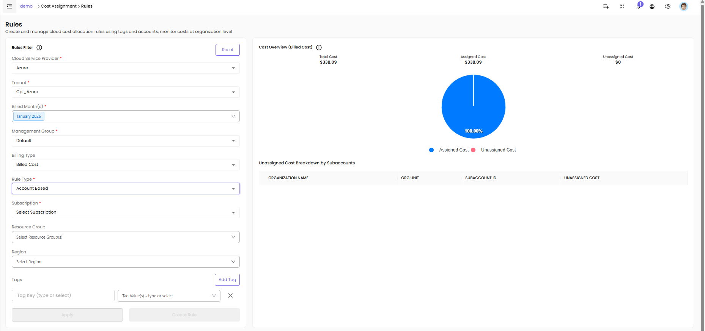
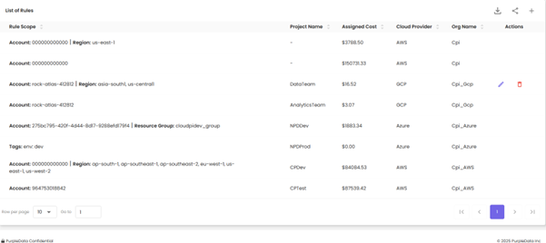

# Cost Assignment

The Cost Assignment module in CloudPi enables users to allocate cloud expenses accurately by applying rules and grouping resources into projects. This ensures each cloud cost is traceable to a specific department, team, or function.

---

## Overview

Cost Assignment helps organizations:

- **Allocate Costs Accurately** – Assign cloud spending to the right teams, departments, or projects
- **Enable Chargeback/Showback** – Provide transparent cost visibility for internal billing
- **Track Cost by Dimensions** – Monitor spending by tags, accounts, regions, or services
- **Identify Unassigned Costs** – Find and address cost leaks in your cloud environment
- **Enforce Accountability** – Make teams responsible for their cloud consumption

---

## Understanding the Rules

Create and manage cloud cost allocation rules using provider-specific metadata like tags and accounts. Monitor costs at both organization and rules levels.

### Navigating to Cost Assignment

1. From the main navigation menu, click on **Cost Assignment**
2. You'll see two main tabs:
   - **Rules** - Define cost allocation rules
   - **Projects** - Manage projects and view allocated costs

### Rules Section Overview

This is the rules section where users define the allocation rule by selecting different filters.

### Creating a Cost Assignment Rule

**Step 1: Select Billed Month**

First, the user selects the **Billed Month** to specify the billing cycle for which the cost assignment rule should apply (for example, June 2025).

**Step 2: Choose Cloud Service Provider**

Then, they choose a **Cloud Service Provider** such as AWS, Azure, or GCP depending on the source of the cloud bill.

**Step 3: Select Organization**

Next, the **Organization Name** is selected to identify which organization the rule applies to.

**Step 4: Choose Organizational Unit (Optional)**

If the organization has different teams or departments, the user can further refine the scope by choosing an **Organizational Unit** like DEV, QA, or FINANCE.

**Step 5: Select Rule Type**

After that, the user selects the **Rule Type**, which defines how the cost should be allocated—whether it's based on:
- Account IDs only (A-type)
- Account IDs + Region (AR-type)
- Account IDs + Tags (AT-type)
- Account IDs + Region + Tags (ART-type)
- Tags only (T-type)

**Step 6: Choose Subaccount (if applicable)**

If the rule type includes accounts, the user will need to choose a **Subaccount** to target the specific cloud account.

**Step 7: Select Region (Optional)**

Optionally, the user can narrow the scope even further by selecting a **Region** (such as us-east-1 or ap-south-1) to apply the rule only to resources running in a specific location.

**Step 8: Define Tags (Optional)**

To assign cost based on resource metadata, the user can define **Tags**. This involves:
- Entering a **Tag Key** (like env, project, or owner)
- Entering one or more **Tag Values** (like production, cloudpi, or teamA)
- Clicking **Add Tag** to include the tag filter in the rule

**Step 9: Apply and Review**

Once all required filters are selected, the user clicks **Apply** to view the cost distribution.

**Step 10: Create Rule**

If the setup is valid and doesn't conflict with existing rules, the user can proceed to click **Create Rule**.

### Cost Overview

This section displays key cost metrics to help you understand the cost distribution:

- **Total Cost** – All cloud spends for selected filters, displayed in a summary card at the top
- **Assigned Cost** – Portion already assigned by other rules, shows what percentage of total cost is allocated
- **Unassigned Cost** – Portion not assigned by any rule, highlights cost leaks that need attention
- **Visual Representation** – A pie chart displays the percentage of assigned vs unassigned cost with color-coded segments
- **Unassigned Cost Breakdown** – Shows which subaccounts have unallocated spending with dollar amounts and percentages

---

## Rule Types

When creating a cost allocation rule, the type of rule generated depends on the filters you select. In CloudPi, the type of rule created depends on the selected filters.

### Rule Type Matrix

- **Account only (A)** – Account-based allocation. Use case: Simple project with single account
- **Account + Region (AR)** – Account and region-based allocation. Use case: Multi-region deployments
- **Account + Tags (AT)** – Account and tag-based allocation. Use case: Tagged resources within account
- **Account + Region + Tags (ART)** – Full dimensional allocation. Use case: Complex multi-region, tagged environments
- **Tags only (T)** – Tag-based allocation. Use case: Cross-account tag-based allocation

**Examples:**

- **A-type rule** - Selecting only an account creates an A-type rule
- **AR-type rule** - Adding a region changes it to AR
- **AT-type rule** - Adding tags changes it to AT
- **ART-type rule** - Adding both region and tags creates ART
- **T-type rule** - If only tags are selected without an account, a T-type rule is generated—ideal for cross-account tag-based allocation

### Rules Table Overview

Once you create rules, they are listed in a table at the bottom of the Rules page. This table gives you a full overview of all defined rules and their properties.

**For each rule, you'll see:**

- **Rule ID** – A unique identifier for the rule
- **Rule Type** – The type (A, AR, AT, ART, or T) based on the filter combination
- **Organization** – The organization the rule is assigned to
- **Filters** – The specific filters used in the rule (like subaccount, region, or tag key-values)
- **Allocated Cost** – Total cost assigned by this rule
- **Status** – Active, Inactive, or Conflict
- **Actions** – Edit, Delete, or View buttons

### Managing Rules

**Edit a Rule:**

1. Click the **Edit** button in the Actions column
2. Modify filters as needed
3. Review the updated cost allocation
4. Click **Update Rule**

**Delete a Rule:**

1. Click the **Delete** button in the Actions column
2. Confirm deletion in the popup
3. Note: Deleting a rule will un-assign costs previously allocated by that rule

**View Rule Details:**

1. Click the **View** button to see comprehensive rule information
2. Review cost allocation breakdown
3. See affected resources and accounts

### Rule Conflicts and Overlaps

This table helps you easily track, review, and manage all the cost assignment rules in one place.

**Important Considerations:**

- Check for any rule conflicts or overlapping conditions
- If you see a warning message about cost overlap, review and resolve the conflict
- CloudPi highlights rules with conflicts in yellow/red
- Overlapping rules can lead to double-counting or incorrect allocations

**Resolving Conflicts:**

1. Identify the conflicting rules (marked with warning icons)
2. Review the filters of each conflicting rule
3. Adjust filters to remove overlap
4. Consider rule priority or specificity
5. Re-validate cost allocation after changes

---

## Projects

The Projects Page under the Cost Assignment module allows users to manage and track cloud costs at a project level. This is where users can view all existing projects, create new ones, and update or delete them as needed.

### Viewing Projects

When you navigate to the Projects page, you'll see a list of all existing **project groups** displayed with:

- **Number of projects** in each group
- **Cost of the group** for the current month
- **Trend indicator** (increasing/decreasing)

**Click on a project group** to expand and view the projects it contains.

**The following details will be shown for each project:**

- **Project ID** – Unique project identifier
- **Project Name** – Name of the project
- **Description** – Brief project description
- **Project Owner** – Team or person responsible
- **Cost** – Total allocated cost for current month
- **Status** – Active, Inactive, or Archived
- **Actions** – View, Edit, Delete options

This table provides an overview of all active projects and their configurations.

### Creating a Project

To create a new project, click the **"Create Project"** button located at the top of the page.

Upon clicking, a form modal will open where the user needs to fill in the required project information.

**The form includes the following fields:**

- **Project Name** (Required) – A unique name to identify the project
- **Project Group** (Required) – Used to group related projects together
- **Description** (Required) – A summary explaining the purpose of the project
- **Cloud Service Provider (CSP)** (Required) – Choose between AWS, Azure, or GCP
- **Organization Name** (Required) – The organizational unit the project belongs to
- **Rules** (Required) – Select one or more existing cost assignment rules to link to this project
- **Project Icon** (Optional) – Optionally, choose an icon to visually represent the project
- **Enable Self Tag** (Optional) – If enabled, all resources with a tag matching the project ID will be automatically associated with this project

**Steps to Create:**

1. Click **Create Project**
2. Fill in all required fields
3. Select one or more cost assignment rules
4. Optionally, enable **Self Tag** for automatic resource association
5. Choose a project icon (optional)
6. Click **Create Project** to finalize

**Once created:**

- The newly created project will appear in the project list
- The project status will reflect its configuration
- Costs will be allocated based on the selected rules

### Managing Existing Projects

Users can manage projects using the action buttons available in the **Actions** column:

**View/Edit:**

- Click the **Edit** icon to update project details such as:
  - Rules
  - Name
  - Description
  - Project group assignment
  - Cloud service provider
  - Self-tag settings

**Delete:**

- Click the **Delete** icon to decommission or remove a project permanently
- **Warning:** Deleting a project will remove cost allocations associated with it
- A confirmation prompt will appear before deletion

---

## Permissions

Access to Cost Assignment is role-based:

**Workspace Admin** - Full access to create, edit, delete rules and projects

**Project Admin** - Can create projects and rules for their organization

**Finance Team** - View-only access to cost allocations and reports

**Project User** - View assigned project costs only

---

Cost Assignment in CloudPi ensures accurate, transparent, and actionable cost allocation across your entire cloud environment, enabling effective financial management and accountability.
