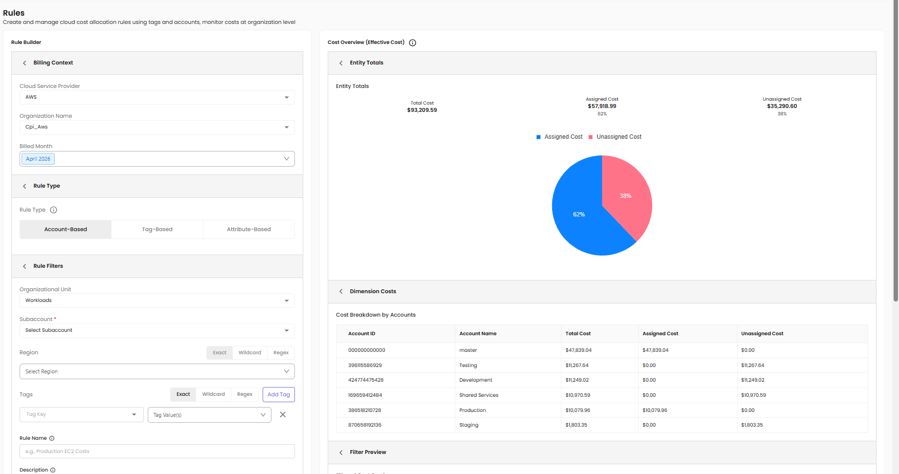
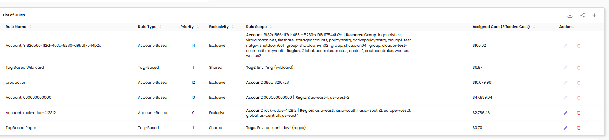
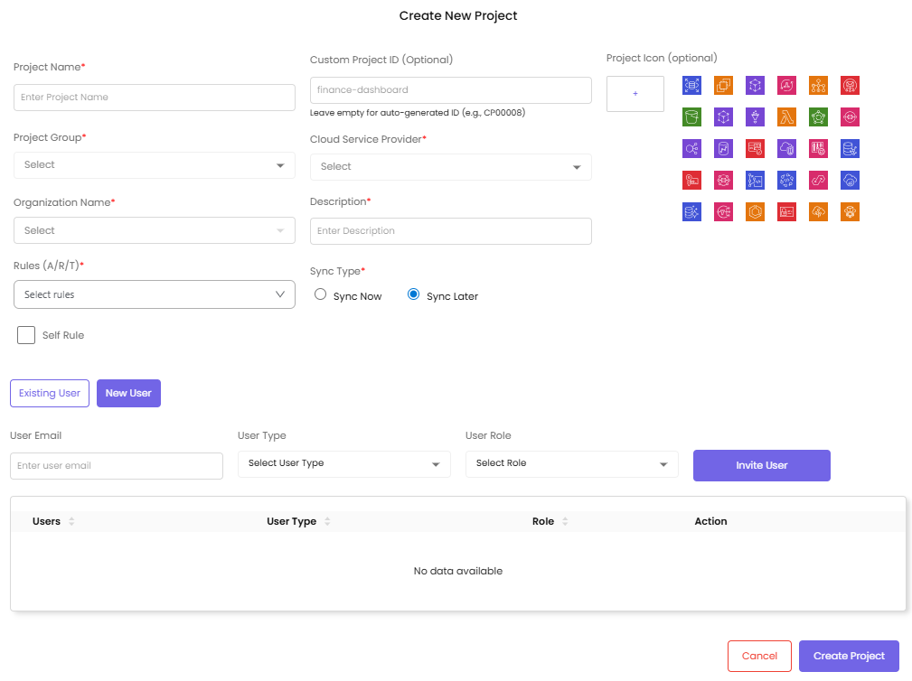
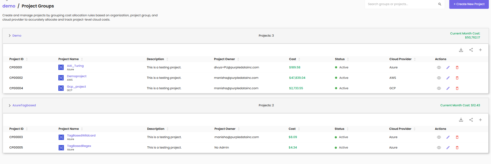
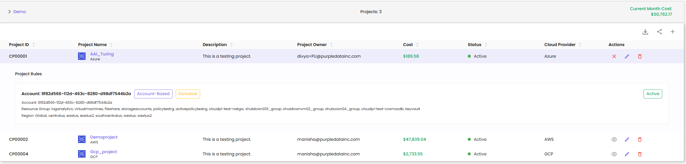
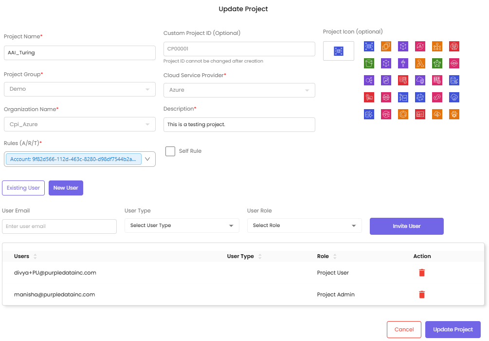

# Cost Assignment

Cloud billing data arrives as a single undivided total. Without Cost Assignment, you cannot tell which team, product, or client is responsible for which part of that spend — making chargeback, budgeting, and accountability impossible.

CloudPi Cost Assignment solves this through a three-layer model:

- **Rules** capture cloud costs by matching resources against criteria you define (account, tags, or attributes)
- **Projects** own those costs — each rule is linked to exactly one project, and a project rolls its rule costs into a single total
- **Groups** organize projects for visibility — a group's cost is the sum of all projects inside it

This hierarchy gives you a clean path from raw cloud spend all the way up to a client organization total.

```text
Cloud Billing Data (AWS / Azure / GCP)
         │
         ▼
    [ Rules ]  ←── match by account, tag, or attribute
         │
         ▼
   [ Projects ]  ←── own the matched costs; linked to a Client Org
         │
         ▼
  [ Project Groups ]  ←── organize projects; sum child costs for display
         │
         ▼
  [ Client Organization ]  ←── top-level billing entity
```


## Understanding Key Concepts

### Rules

A rule is a filter definition that tells CloudPi which cloud resources belong to a project. Every cost that gets assigned starts with a rule.

Rules have three types:

| Type | Name | Matches By |
|------|------|------------|
| **A** | Account-Based | Subaccount, subscription, or GCP project — optionally narrowed by region, resource group, or tags |
| **T** | Tag-Based | Cloud resource tags (key:value pairs) |
| **B** | Attribute-Based | Service name, charge category, resource type, service category, usage type, or commitment discount type |

Each rule also has:

- **Priority** (1–100): when two EXCLUSIVE rules match the same cost, the higher priority wins
- **Exclusivity**: EXCLUSIVE means a cost can only be counted once; SHARED means a cost can appear in multiple rules simultaneously

A rule is always linked to exactly one project. You cannot share a rule across projects.


### Projects

A project is the unit of cost ownership in CloudPi. It represents a logical workload, team, or product line. All costs matched by a project's rules roll up into a single project total.

Key project properties:

| Property | Description |
|----------|-------------|
| Project Name | Unique label within your workspace |
| Project ID | Auto-generated reference (e.g., CP00008) or a custom ID in `cp-xxxxx` format — locked after creation |
| Cloud Provider | AWS, Azure, or GCP — locked after creation |
| Organization | The Client Org this project belongs to — locked after creation |
| Project Group | The group this project is organized under |
| Status | Active (APRV), In Progress (INPR), or Decommissioned |
| Recommendations | Toggle on/off cost optimization recommendations |
| Remediation | Toggle on/off automated remediation actions |

A project's cost = the sum of all costs matched by all rules attached to that project.

Costs not matched by any rule appear as **Unassigned** at the organization level.


### Project Groups

A project group is an organizational container for projects. It has no cost logic of its own — its total is simply the sum of costs from all projects inside it.

Groups exist to let you mirror your internal org structure. For example, you might have a group called `Platform` containing projects for your infrastructure, monitoring, and shared services.

Key group properties:

| Property | Description |
|----------|-------------|
| Group Name | Unique within workspace; alphanumeric and underscores only |
| Projects | One or more projects assigned to this group |
| Group Cost | Automatically calculated as the sum of all child project costs |

Every project must belong to a group. If no group is specified during project creation, a default group is used.


### Client Organization

A client organization is the top-level billing entity — the AWS billing account, Azure tenant, or GCP organization that CloudPi is connected to. Projects are always linked to a specific client org, and all cost reporting flows up to this level.

**Cost rollup summary:**

```text
Rule A  ─┐
Rule B  ──┼─→  Project X  ─┐
Rule C  ─┘                  │
                             ├─→  Group "Platform"  ─┐
Rule D  ─┐                  │                        │
Rule E  ──┼─→  Project Y  ─┘                        ├─→  Client Org Total
Rule F  ─┘                                           │
                                                      │
Rule G  ──→  Project Z  ──→  Group "Data"  ──────────┘
```

### Assigned vs. Unassigned Costs

The **Entity Totals** panel on the Rules screen shows three numbers for your selected organization:

- **Total Cost** — all cloud charges for the selected org and months
- **Assigned Cost** — the portion captured by at least one rule
- **Unassigned Cost** — the remainder not yet matched by any rule

Your goal is to drive Unassigned Cost toward zero. A high unassigned amount usually means some accounts, tags, or resource types are not yet covered by a rule.


## How To

### Prerequisites

- **Rules**: RULES menu access (Read to view, Write to create/edit)
- **Projects**: PROJECTS menu access (Read to view, Write to create/edit)
- At least one cloud organization connected to your workspace
- Billing data available for the months you want to analyze

### Step 1 — Open Cost Assignment

From the left navigation menu, go to **Cost Assignment → Rules**.



### Create a Rule

#### Step 2 — Set Billing Context

Select your **Cloud Provider**, **Organization**, and **Billed Month(s)** at the top of the rule builder. Use the presets (Current Month, Last 3 Months) or pick individual months.

| Field | Description | Editable? |
|-------|-------------|-----------|
| Billing Type | Billed Cost, Effective Cost, or List Cost — set at workspace level | Read-only |
| Cloud Provider | AWS, Azure, or GCP | Locked after save |
| Organization / Billing Entity | Connected billing account | Locked after save |
| Management Group / Folder | (Azure/GCP only) Optional sub-grouping | Optional |
| Billed Month(s) | One or more months | Required |


#### Step 3 — Choose Rule Type

Select Account-Based (A), Tag-Based (T), or Attribute-Based (B).


#### Step 4 — Define Filters

**Account-Based (A):**

- Select a **Subaccount** (required)
- Optionally add **Region**, **Resource Group** (Azure), and up to 3 **Tag** filters

**Tag-Based (T):**

- Add one or more **Tag** key:value pairs — at least one required

**Attribute-Based (B):**

- Select one or more attributes and choose the values to match:
  - Service, Category, Resource Type, Service Category, Usage Type, Commitment Discount


#### Step 5 — Preview Matching Costs

Click **Apply** to refresh the **Filter Preview** in the Cost Overview panel on the right.

| Panel Section | What It Shows |
|---------------|---------------|
| Entity Totals | Org-wide total, assigned, and unassigned costs |
| Dimension Costs | Breakdown by subaccount, tag, or attribute |
| Filter Preview | Costs matched by current filter selections |


#### Step 6 — Set Rule Options (Optional)

| Field | Description | Default |
|-------|-------------|---------|
| Rule Name | Label for this rule | Auto-generated |
| Priority | 1–100, higher evaluated first when rules overlap | 50 |
| Exclusivity | EXCLUSIVE (no overlap) or SHARED (costs counted in multiple rules) | EXCLUSIVE |

#### Step 7 — Create the Rule

Click **Create Rule**, select the **Project** to link it to, and confirm. The rule appears immediately in the Rules table.


### Monitor Rules in the Rules Table

The Rules Table below the rule builder shows all rules in your workspace:

| Column | Description |
|--------|-------------|
| Rule Name | Your label or auto-generated name |
| Rule Type | Account (A), Tag (T), or Attribute (B) |
| Priority | Evaluation order |
| Exclusivity | EXCLUSIVE or SHARED |
| Rule Scope | Summary of filters applied |
| Assigned Cost | Total cost matched by this rule |
| Project Name | The project this rule is linked to |
| Cloud Provider | AWS, Azure, or GCP |
| Organization | Billing entity for this rule |
| Actions | Edit or Delete |



### Create a Project Group

You need at least one group before creating a project. Groups can also be created inline during project creation.

1. Go to **Cost Assignment → Projects**
2. Click **+ Create New Project**
3. In the Project Group field, click **Create New Group**
4. Enter a group name (alphanumeric and underscores only)
5. Save the group — it is now available in the dropdown


### Create a Project

1. Go to **Cost Assignment → Projects**
2. Click **+ Create New Project**
3. Fill in the required fields:

| Field | Notes |
|-------|-------|
| Project Name | 5–30 characters, unique in workspace |
| Project Group | Select existing or create new inline |
| Cloud Provider | AWS, Azure, or GCP — locked after creation |
| Organization | Select from connected orgs — locked after creation |
| Description | 16–255 characters |
| Rules | Select one or more rules from the org (only unassigned rules or rules already on this project are shown) |
| Custom Project ID | Optional — format `cp-xxxxx`, locked after creation |

4. Optionally configure:
   - **Recommendations** — enable cost optimization suggestions (on by default)
   - **Remediation** — enable automated remediation (on by default, requires Recommendations on)
   - **Self Rule** — auto-assigns any resource tagged with this project's ID
   - **Sync Type** — sync cost data now or later
5. Optionally invite users (Project Admin or Project User) and select a project icon
6. Click **Create Project**



The project appears under its group accordion with its current-month cost total.


### View Cost Rollup by Group

1. Go to **Cost Assignment → Projects**
2. Each accordion = one Project Group
3. The accordion header shows: group name, project count, and total group cost (sum of all child project costs for the current month)
4. Expand the accordion to see individual project rows



### View a Project's Rules

1. Go to **Cost Assignment → Projects**
2. Find the project and expand its row
3. The expanded view shows all attached rules with rule name, type, exclusivity, scope summary, and status



### Edit a Rule

1. Find the rule in the Rules Table and click the **Edit** icon
2. Adjust filters, name, priority, or exclusivity
3. Click **Update Rule**

> Cloud Provider and Organization cannot be changed in edit mode.


### Edit a Project

1. Find the project in the Projects table and click the **Edit** action
2. Update description, rules, group, recommendations, or remediation settings
3. Save changes



> Cloud Provider and Organization cannot be changed after project creation.

### Delete a Rule or Project

**Delete a rule**: Click the Delete icon in the Rules Table and confirm. The rule's matched costs return to Unassigned.

**Delete a project**: Click the Delete action in the Projects Table and confirm. All rules linked to that project become unlinked and their costs return to Unassigned.

## FAQ

**Q: What is the difference between a Rule, a Project, and a Group?**

A rule defines the filter that matches cloud resources (which costs belong here). A project owns those costs — it is the destination rules flow into, and it is linked to a client organization. A group organizes projects for display and sums their costs; it has no cost logic of its own. The full chain is: Rules → Project → Group → Client Org.

---

**Q: How is a Project Group's cost calculated?**

A group's cost is the sum of costs from all projects inside it, aggregated at display time. It is not stored separately. If you move a project to a different group, the cost moves with it immediately.

---

**Q: What is the difference between Billed Cost, Effective Cost, and List Cost?**

Billed Cost is what your cloud provider charged you for the period. Effective Cost applies amortized reserved instance or savings plan discounts. List Cost is the on-demand (MSRP) price before discounts. Your workspace administrator sets which type is active — it applies to all rules and cannot be changed per rule.

---

**Q: Can a rule be linked to more than one project?**

No. Each rule links to exactly one project. Create separate rules with appropriate filters if you need to assign similar costs to multiple projects.

---

**Q: Can the same cost appear in two different projects?**

Only if both matching rules are set to **SHARED** exclusivity. If both are EXCLUSIVE, only the higher-priority rule's project receives the cost. Use SHARED deliberately — for example, shared infrastructure that legitimately belongs to multiple teams.

---

**Q: What happens to costs when I delete a rule or project?**

Deleting a rule returns its matched costs to Unassigned. Deleting a project unlinks all its rules — their costs also return to Unassigned. The rules themselves are not deleted, but they are no longer linked to any project.

---

**Q: Why can't I change the Cloud Provider or Organization on an existing rule or project?**

These fields define which billing data source the rule or project reads from. Changing them would silently re-scope all historical cost data, causing inconsistencies in reports. Create a new rule or project for a different provider or org.

---

**Q: What does "Unassigned" cost mean?**

Unassigned cost is the portion of your cloud billing data not captured by any rule. Review the **Dimension Costs** panel to see which subaccounts, tags, or resource types are uncovered, then create rules for each. The goal is to drive Unassigned close to zero.


---

**Q: Why does my Filter Preview show $0?**

- The selected Billed Month(s) may not have ingested data yet — check Dimension Costs to confirm data exists
- Tag-Based rules are case-sensitive — verify tag keys and values match your cloud tags exactly
- For Account-Based rules, confirm the subaccount belongs to the selected organization
- Click **Apply** after any filter change — the preview does not refresh automatically


---

**Q: What is rule Priority and when should I change it?**

Priority determines which EXCLUSIVE rule wins when two rules match the same cost. Higher numbers are evaluated first. The default of 50 works for most cases. Set a specific rule to priority 90 and a broad catch-all rule to priority 30 so the specific rule always wins.

---

**Q: What is the Self Rule option on a project?**

Self Rule automatically assigns any cloud resource tagged with this project's ID to the project, without a separately defined rule. Useful when your team already tags resources with project identifiers at provisioning time.

---

**Q: Can I assign the same project to multiple groups?**

No. Each project belongs to exactly one group. Edit the project and select a different group from the dropdown to reorganize.

---

**Q: How often do cost totals refresh?**

Cost totals update each time CloudPi ingests new billing data from your cloud provider — typically daily. Intra-day changes are not reflected until the next ingestion cycle.

---

**Q: What are wildcard or pattern-based filters?**

Some filter fields support `*` as a wildcard — for example, `prod-*` matches `prod-api`, `prod-db`, and any other value starting with `prod-`. Regex patterns are available in advanced configurations — contact your workspace administrator.

---

**Q: I do not see the Create Rule or Create New Project button. Why?**

Both buttons require **Write** permission for their respective menus (RULES and PROJECTS). If you only have Read access, you can view and preview but not create or edit. Contact your workspace administrator to request Write access.
