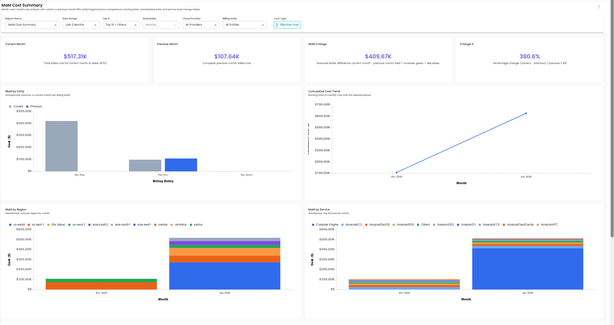
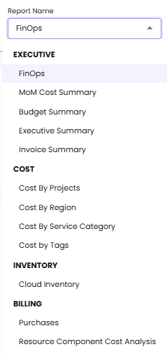
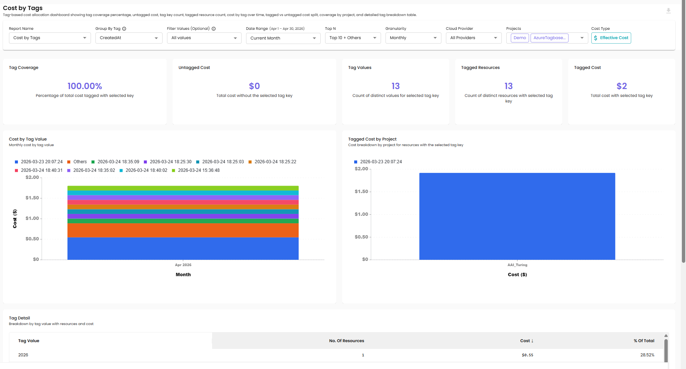

# Dashboards

The Dashboards page shows pre-built executive and cost reports across all of your connected cloud providers. Reports are configured by CloudPi administrators and stored centrally — you select a report, apply filters, and view the rendered charts.

Dashboards is read-only at the user level. To create or modify report configurations, contact your CloudPi administrator.

## Accessing the Dashboards Page

1. Sign in to CloudPi.
2. From the left navigation menu, click **Dashboard**.
3. The page opens with the **Report Name** dropdown and filter controls at the top, followed by the rendered report below.

The selected report's content appears below the filter bar — KPI cards at the top, then charts and tables. Scroll to see additional charts further down the report.

## Selecting a Report

Click the **Report Name** dropdown to choose which report to view. Reports are organized into three categories.

### Executive

| Report | What it shows |
|--------|---------------|
| **FinOps** | FinOps performance metrics — coverage, allocation, optimization rate |
| **MoM Cost Summary** | Month-over-month cost comparison across projects |
| **Budget Summary** | Spend against configured budgets |
| **Executive Summary** | High-level KPIs for cloud spend |
| **Invoice Summary** | Invoice-level cost summary |

### Cost

| Report | What it shows |
|--------|---------------|
| **Cost By Projects** | Spend grouped by project |
| **Cost By Region** | Spend grouped by cloud region |
| **Cost By Service Category** | Spend grouped by service category (Compute, Storage, etc.) |
| **Cost by Tags** | Spend grouped by resource tag — supports tag-key and tag-value filtering (see [Tag Filter](#tag-filter-cost-by-tags-only) below) |

### Inventory

| Report | What it shows |
|--------|---------------|
| **Cloud Inventory** | Inventory of cloud resources across providers |

### Billing

| Report | What it shows |
|--------|---------------|
| **Purchases** | Direct purchases recorded against your billing accounts |
| **Resource Component Cost Analysis** | Cost broken down by individual resource components (compute, storage, networking, etc.) |

## Filters

The filter bar at the top of the page applies to every chart in the selected report.

### Date Range

| Option | Description |
|--------|-------------|
| Preset windows | **Current Month**, plus rolling presets such as 7D / 30D / 60D / 90D |
| **Custom** | Pick a start and end date — maximum range is 120 days |

Selecting a date range outside the 120-day limit is blocked with a validation message.

### Top N

Limits the chart and table to the top items by cost, with the remainder collapsed into an *Others* bucket. Common options are **Top 10 + Others**, **Top 5 + Others**, and **All**.

### Granularity

Controls how time-series data is bucketed. Options are **Daily**, **Weekly**, and **Monthly**. The default is **Monthly**.

### Cloud Provider

| Option | Description |
|--------|-------------|
| **All Providers** | Aggregated data across AWS, Azure, and GCP (default) |
| **AWS** | Only AWS resources |
| **Azure** | Only Azure resources |
| **GCP** | Only GCP resources |

### Billing Entity

Filters the report to a specific billing entity (AWS billing account, Azure tenant, or GCP organization). Use **All Entities** to see data across every connected billing entity.

### Projects

A multi-select dropdown of the projects you have access to. The list reflects your role:

- Workspace Administrators see all projects in the workspace
- Workspace Users see projects in their assigned project groups
- Project-level users see only their assigned projects

Project selections are remembered across sessions.

### Tag Filter (Cost by Tags only)

The tag filter appears only when the **Cost by Tags** report is selected. It is hidden for every other report.

1. Pick a tag key from the **Group By Tag** dropdown (e.g., `Environment`, `CostCenter`).
2. Optionally pick one or more values in **Filter Values (Optional)** to narrow the report (e.g., `production`, `staging`). Leave it empty to see every value for the selected tag key.
3. The charts in the report refresh to group cost by the selected tag and apply the value filter.

## Role-Based Access to Executive Reports

The **Executive** category is restricted by role:

| Role | Can see Executive reports? |
|------|:---:|
| CloudPi Administrator | ✗ (no access to customer data) |
| Workspace Administrator | ✓ |
| Workspace User | ✓ |
| Project Administrator | ✗ |
| Project User | ✗ |
| Viewer | ✗ |

If your role does not include Executive access, the Executive category is hidden from the Report Name dropdown. The Cost and Inventory categories are visible to all roles within the projects they have access to.

For full role definitions, see [Role-Based Access Control](rbac.md).

## Cost Type

The current cost type is shown in the filter bar (e.g., **Effective Cost**) so you can see which cost type the charts are using. The value is set at the **system / client-settings level** by an administrator and cannot be toggled per user from this page.

If your workspace's cost type is changed in client settings, all reports automatically render with the new cost type the next time they are loaded.

## Data Refresh and Empty States

- Charts cache their data for performance. Repeat queries within a short window load instantly from cache.
- If no data matches the current filters, the chart shows an empty state instead of a broken chart.
- If a single chart fails to load, the rest of the report continues to render.
