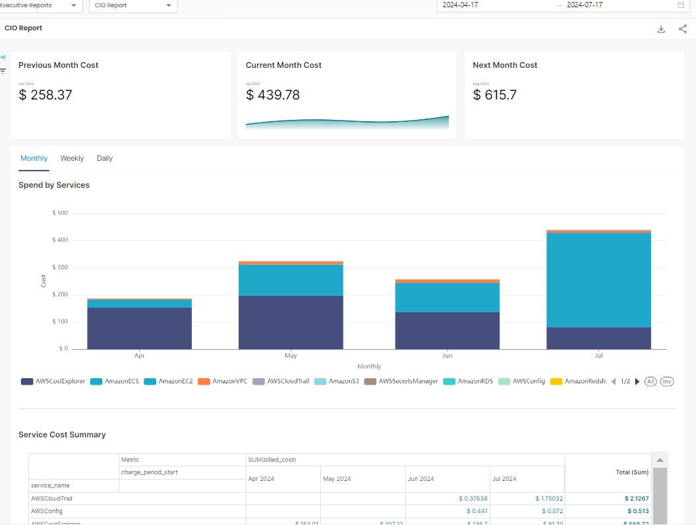

# Dashboards

The CloudPi Dashboard serves as a unified platform for monitoring and managing your cloud environment. It provides rich visualizations and interactive reports that give teams a clear understanding of costs, resources, and project performance across multiple cloud providers.

The dashboard is role-based and project-aware — ensuring every user views insights that are relevant, actionable, and aligned with their responsibilities.

## Key Features of the Dashboard

### Centralized Cloud Insights

The CloudPi Dashboard aggregates data across all projects into a single interface, providing:

- **Cost Reports** - Detailed cost analysis and breakdowns
- **Budget Tracking** - Monitor budget consumption and forecasts
- **Showback Reports** - Allocate costs to departments and teams
- **Executive Reports** - High-level summaries for leadership

After choosing the dashboard type, select a specific dashboard name from a list tailored to your project needs.

### Customizable Data Visualization

**Filters Available:**

- Date Range - Choose time periods (e.g., Last 90 Days, Month to Date, Till Date)
- Top N - Select top items to display (e.g., Top 10 + Others)
- Granularity - Switch between Daily, Monthly, or Quarterly views
- Cloud Provider - Filter by AWS, Azure, GCP, or view combined data (All Providers)
- Projects - Focus on selected projects
- Cost Type - Filter by Billed Cost or other cost types

This allows you to focus on particular areas of interest within your cloud environment.

## Navigating the Dashboard

### Accessing the Dashboard

1. Log in to your CloudPi account.
2. From the left navigation menu, click on the **Dashboard** icon.
3. The main Dashboard page opens, displaying an overview panel with filters and visual reports.

### Selecting Dashboard Types

At the top of the dashboard, you'll find multiple dropdown filters that control what type of data is displayed.

Use the **Dashboard Type** dropdown to choose the desired view — for example:

- **Executive** - High-level cost overview with key metrics
- **FinOps** - Financial operations and cost governance reports
- **Technical** - Resource utilization and performance reports

Dashboard options are dynamically customized based on:

- Your selected project(s)
- Your user role (e.g., Admin, Executive, FinOps Analyst)

This ensures that each user views insights that are relevant to their scope and responsibilities.

### Choosing Specific Reports

After selecting the Dashboard Type, additional dropdowns appear for further customization:

1. In the **Dashboard Name** dropdown, choose the specific report you want to view — for instance, Executive Report, Cost by Projects, Budget Overview, or Resource Utilization.

2. You can also select:

- **Date Range** - Time period for analysis
- **Top N** - Number of top items to display
- **Granularity** - Daily, Monthly, or Quarterly
- **Cloud Provider** - AWS, Azure, GCP, or All Providers
- **Projects** - Specific projects to include

The dashboard then updates automatically, showing relevant charts and tables for your selection.

## Dashboard Components

### Executive Report View

The Executive Report provides a high-level cost overview with key metrics:

**Summary Cards:**

- Total Spend - Total cloud spend across all projects
- Avg Daily Cost - Average daily cloud spend
- Top Project Cost - Cost of highest spending project
- Top Service Cost - Cost of highest spending service

**Visualizations:**

- Cost Trend By Projects - Line chart showing cost trends over time for each project
- Cost Breakdown - Donut chart displaying cost distribution by service (e.g., Azure SQL Database, Virtual Machines, Virtual Network)

## Customizing Data Views

You can refine and personalize your dashboard data using filters located across the top:

- **Date Range Filters** - Analyze cost and usage trends across specific time frames
- **Granularity Filters** - View your data at daily, monthly, or quarterly levels for trend analysis
- **Cloud Provider Filters** - Narrow your view to a particular cloud provider or compare across all
- **Project and Dimension Filters** - Focus on specific projects, services, or custom tags
