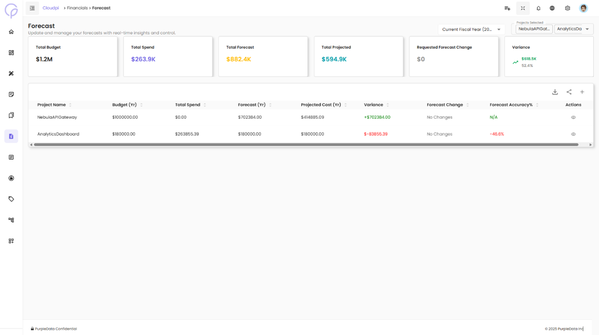
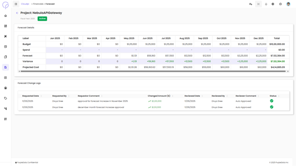

# Forecast

The Forecast module helps you proactively manage cloud budgets by tracking allocated budgets, forecasts, and actual spend across projects. It provides a month-wise breakdown and lets you request and approve forecast changes.

## Forecast Summary Cards

At the top of the Forecast page, high-level metrics give instant visibility into how your organization is tracking against budget:

- **Total Allocated Budget** — Total budget assigned across all projects
- **Total Budget Spend** — Actual cloud spend to date
- **Total Forecast** — Sum of forecasted costs for all projects
- **Total Projected** — Placeholder for projected spend (currently $0)
- **Requested Forecast Change** — Total forecast change currently under review
- **Variance** — Difference between budget and actual spend (negative values indicate overspending)

## Forecast Table Overview

Below the summary cards, a table lists all active projects.

| Column | Description |
|--------|-------------|
| **Project Name** | Name of the cloud project (e.g., `CPDev`, `NPDDev`) |
| **Budget (Yr)** | Total yearly budget allocated |
| **Forecast (Yr)** | Total forecast amount for the year |
| **Forecast Change** | Status indicating whether any forecast modifications were requested |
| **Start Date** | When the budget period begins |
| **Actions** | Options to view detailed monthly forecast data and submit change requests |

You can also use filters and pagination to find specific projects.

## Viewing Forecast Details

Click the ellipsis icon (`···`) under **Actions** for a project and select **View Forecast**. The row expands and displays detailed forecast data for each month.

The detailed forecast section shows:

| Field | Description |
|-------|-------------|
| **Budget** | Monthly allocation based on the total annual budget |
| **Spend** | Actual cloud spend for each month |
| **Forecast** | Current monthly forecast values |
| **Variance** | Difference between forecast and spend. Positive variance is shown in green; overspending is shown in red |
| **Requested Change** | Any pending forecast change requests |
| **New Forecast ($)** | Updated forecast values that will apply once the change is approved |

At the far right, the **Total** column aggregates each row's data for the year.

## Editing Forecasts

A Project Admin can submit a forecast change by editing the **New Forecast ($)** field and providing a reason. After clicking **Save Forecast**, the change request is sent for approval.

## Forecast Approval Workflow

Once a forecast change is submitted:

1. Workspace Admins/Users receive a notification to review the request.
2. They can either **Approve** or **Reject** the change.
3. A comment or reason is required for any approval or rejection.
4. Once approved, the forecast is updated and reflected in both the table and the summary metrics.

## Change Logs Tab

Alongside the **Forecast Changes** tab, the **Change Logs** tab records the entire history of forecast changes.

## Related

- [Financials overview](Financials.md)
- [Budgeting](Budgeting.md)
- [Multi-Cloud Billing Hub](MultiCloudBillingHub.md)
- [Cost Types](CostTypes.md)
