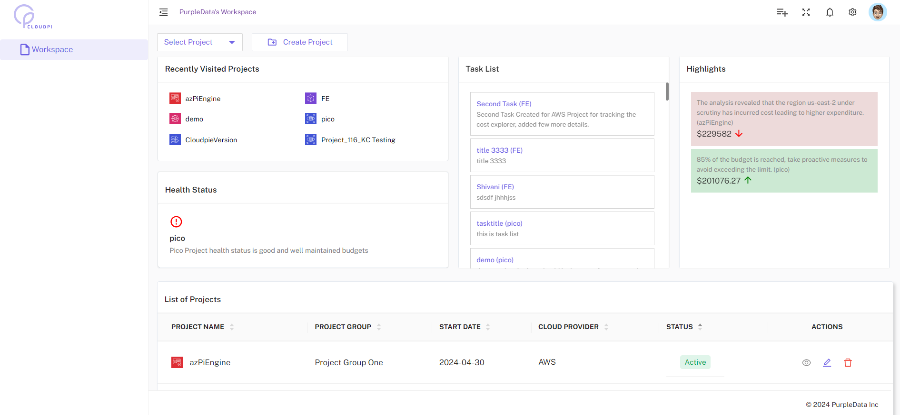

## Getting Started

### Signing In

Navigate to the CloudPi login page provided by PurpleData Inc. You can sign in using one of the following methods:

**Standard Login:**

1. Enter your email address in the **EMAIL ADDRESS** field.
2. Enter your password in the **PASSWORD** field. Click the visibility icon to show or hide your password.
3. Optionally, check **Keep me signed in** to stay logged in on this device.
4. Click the **Login** button.

If you've forgotten your password, click the **Forgot Password?** link to reset it.

**Single Sign-On (SSO):**

Alternatively, you can sign in using your organization's identity provider:

- Click **Sign in with Azure Entra ID** to authenticate using Microsoft Azure Entra ID.
- Click **Sign in with Okta** to authenticate using Okta.

Contact your system administrator if you need assistance with your login credentials or SSO configuration.

## Landing Page

Welcome to CloudPi! After signing in, you'll see the main dashboard with quick access to all key features. The landing page includes the following sections:

**Top Row:**

- **Home Page** - Access your workspace home with projects and tasks overview.
- **My Reports** - View and manage your generated reports.
- **Onboarding** - Get started with guided setup and configuration.
- **Cost Assignment** - Manage cost allocation and assignments.
- **Admin Settings** - Configure workspace and system settings (admin access required).

**Bottom Row:**

- **User Guide** - Access documentation and help resources.
- **Videos** - Watch tutorial videos and walkthroughs.
- **Blogs** - Read the latest updates and articles.

## Home Page

The home page of each CloudPi workspace is designed to give you a comprehensive overview at a glance, facilitating efficient management and monitoring of your cloud environment. It serves as a central dashboard that highlights crucial information, tasks, and project health to streamline your workflow.

## Navigating Home Page

The CloudPi home page serves as a one-stop-shop for essential workspace information. Here's what you'll find:

### Cloud Cost KPIs

These tiles at the top of the page present a breakdown of cloud spending:

- **Total Cloud Spend** - Displays the combined total cost incurred across all cloud providers for the selected period.
- **AWS** - Displays the total cost incurred for AWS services during the selected period.
- **Azure** - Displays the total cost incurred for Azure services during the selected period.
- **GCP** - Displays the total cost incurred for Google Cloud Platform (GCP) services during the selected period.

### FinOps KPIs

Displays key financial operations metrics that track cost governance and forecasting accuracy. It helps teams monitor whether their financial goals are aligned with real-time spend, ensuring effective budget management and forecasting discipline.

### Optimization KPIs

Displays the total savings impact including:

- **Potential Savings** - Identified cost optimization opportunities.
- **Realized Savings** - Actual savings achieved from optimizations.

### Cost By Project

Displays the cost trends for each project over the selected period. Toggle between Line and Bar chart views.

### Budget Summary

Visualizes the budget consumption for selected projects over multiple months, showing forecast, yearly budget, projected cost, and cumulative spend.

### Cost By Category

Displays the breakdown of cost by category (Database, Compute, Storage, Analytics, etc.), indicating their contribution to the total cloud cost.

### Recommendations Summary

Displays system-generated recommendations for cost and resource optimization. These insights are based on usage patterns and identify opportunities to reduce waste or improve efficiency.

### Health Status

Provides a quick operational overview across multiple performance areas:

- **Infrastructure Health** - Monitors system uptime and performance stability.
- **Security Compliance** - Evaluates adherence to security policies and detects vulnerabilities.
- **Cost Optimization** - Tracks the progress of active optimization initiatives.
- **Performance Metrics** - Highlights overall application and system performance trends.
- **Resource Utilization** - Indicates how efficiently resources are being consumed.
- **Backup & Recovery** - Reflects the status of backup and disaster recovery processes.

