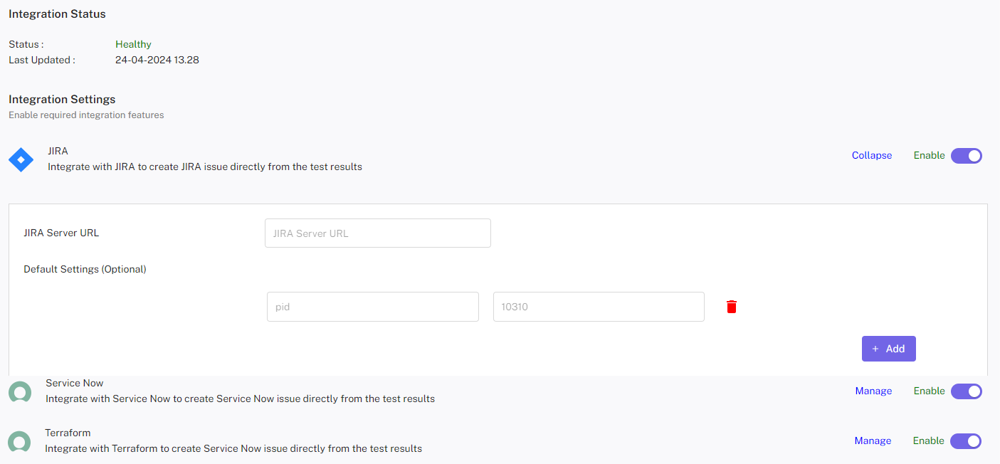

# Integration in CloudPi 

### Integration Capabilities

• ServiceNow

• Jira

• SSO (Single Sign-On)

• SMTP (Simple Mail Transfer Protocol)

## ServiceNow Integration

 Enable seamless IT service management and workflow automation by integrating your ServiceNow instance. This integration facilitates handling incidents, change requests, and IT operations efficiently.
 
### Steps to Configure
1.	Open ServiceNow Integration Dialog

    a.	Navigate to the integration section in the settings menu.

    b.	Select ServiceNow from the list of integrations.

2.	Provide Required Details

  	a.	Service URL: Enter the URL of your ServiceNow instance (e.g., https://yourcompany.service-now.com).
  	
  	b.	API Client ID: Provide the client ID for authentication.
  	
  	c.	API Client Secret: Provide the secret key associated with the client ID.
  	
  	d.	Username: Enter the username of your ServiceNow account.
  	
  	e.	Password: Enter the password for the account.

3.	Save or Update

    a.	If ServiceNow is not configured, click Save to set up the integration.
  	
    b.	If ServiceNow is already configured, click Edit, update the fields, and click Update to apply changes.

4.	Confirmation

    a.	Upon successful configuration, you will receive a confirmation message.
  	

 
### Error Handling
If any errors occur during configuration, they will be displayed as alerts with appropriate messages (e.g., "Invalid credentials" or "Service URL not reachable").
 
## Jira Integration
Integrate Jira to streamline project workflows, issue tracking, and task automation. This integration supports seamless management of project activities within your environment. 
 
### Benefits 
- Enhanced Operational Efficiency: Streamline your cloud management processes by 
integrating CloudPi with your existing workflow tools, reducing manual efforts and 
improving response times. 
- Improved Team Collaboration: Facilitate better communication and collaboration among 
team members by using a unified system for managing tasks and issues related to cloud 
operations. 
- Increased Accountability: With clear tracking and assignment of tasks, team members are 
more accountable for their work, leading to higher productivity and more efficient problem 
resolution. 
 
### Navigating the Integration 
 
- Accessing Integration Settings: Log into CloudPi, navigate to the workspace settings, and 
select the 'Integrations' tab. Here, you can link your CloudPi environment with ServiceNow 
and Jira. 
- Configuring the Tools: Follow the prompts to enter the necessary configuration details 
such as API keys, user credentials, and project or workspace IDs. This setup ensures that 
CloudPi can communicate effectively with ServiceNow and Jira. 
- Using the Integration: Once set up, users can start raising tickets directly from within 
CloudPi. These tickets will automatically populate in the linked ServiceNow or Jira project, 
where they can be managed according to the usual workflow processes. 
- Monitoring and Adjustments: Regularly check the integration status and performance 
within CloudPi. Make adjustments to configurations as needed to adapt to new workflows 
or changes in team structure. 
 
 
CloudPi’s integration with workflow tools like ServiceNow and Jira empowers organizations 
to leverage their existing IT service management frameworks to enhance cloud operations, 
ensuring tasks are handled efficiently and effectively, thus driving better cloud governance 
and operational agility.

