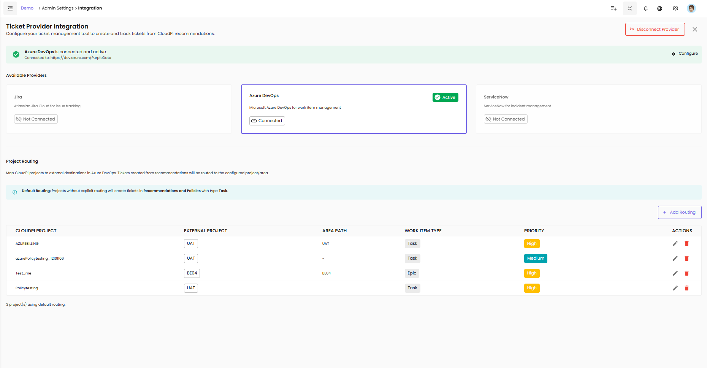

# Integration in CloudPi

CloudPi offers robust integration capabilities with leading workflow management tools and authentication providers. These integrations are designed to streamline cloud management processes, enhance team collaboration, and improve the tracking and resolution of cloud-related tasks and issues.

---

## Integration Capabilities

CloudPi supports the following integrations:

- **Ticket Providers** (Azure DevOps, Jira, ServiceNow)
- **SSO** (Single Sign-On)
- **SMTP** (Simple Mail Transfer Protocol)

---

## Ticket Provider Integration

Configure your ticket management tool to create and track tickets from CloudPi recommendations. This integration facilitates handling incidents, work items, and IT operations efficiently.

### Available Providers

**Jira** - Atlassian Jira Cloud for issue tracking

**Azure DevOps** - Microsoft Azure DevOps for work item management

**ServiceNow** - ServiceNow for incident management

### Connection Status

Each provider displays its connection status:

- **Active** (green badge) - Provider is connected and active
- **Connected** - Provider is linked to CloudPi
- **Not Connected** - Provider needs to be configured

---

## Azure DevOps Integration

Enable seamless work item management and workflow automation by integrating your Azure DevOps instance. This integration facilitates handling tasks, epics, and project operations efficiently.

### Steps to Configure

**1. Open Azure DevOps Integration Dialog**

- Navigate to **Admin Settings** → **Integration**
- Select **Azure DevOps** from the Available Providers

**2. Provide Required Details**

**Organization URL** - Enter the URL of your Azure DevOps organization (e.g., https://dev.azure.com/your-organization)

**Personal Access Token (PAT)** - Provide the personal access token generated from Azure DevOps with appropriate permissions

**3. Connect**

- Click **Connect** to establish the connection
- Upon successful configuration, you will see "Azure DevOps is connected and active" with a green checkmark

**4. Configure Button**

- Click **Configure** to access additional settings and project routing options

### Disconnecting Provider

To disconnect Azure DevOps:

- Click the **Disconnect Provider** button in the top-right corner
- Confirm the disconnection when prompted

---

## SSO (Single Sign-On) Integration

Enable Single Sign-On to allow users to log in to your system using their organization's identity provider. This supports PKCE (Proof Key for Code Exchange) for enhanced security.

### Steps to Configure

**1. Open SSO Configuration**

- Navigate to **Admin Settings** → **Integration**
- Select **SSO** from the options

**2. Provide Required Details**

**Client ID** - Enter the client ID provided by the identity provider

**Client Secret** - Enter the secret associated with the client ID

**SSO Enabled** - Toggle this option to enable SSO

**3. Save or Update**

- If SSO is not configured, click **Save** to set up the integration
- If SSO is already configured, click **Edit**, update the fields, and click **Update** to apply changes

**4. Confirmation**

A success message confirms the successful setup of the SSO integration.

### Error Handling

Alerts will display error messages if the configuration is invalid (e.g., "Invalid Client ID" or "Authorization endpoint unreachable").

---

## SMTP Integration

Set up SMTP to enable email notifications from your environment. Configure the required settings to send alerts and notifications to users.

### Steps to Configure

**1. Open SMTP Integration Dialog**

- Navigate to **Admin Settings** → **Integration**
- Select **SMTP** from the integration options

**2. Provide Required Details**

**SMTP Host** - Enter the hostname of your SMTP server (e.g., smtp.gmail.com)

**SMTP Port** - Specify the port number (e.g., 587 for secure connections)

**Email Address** - Provide the sender's email address

**Password** - Enter the password for the email account

**3. Save or Update**

- If SMTP is not configured, click **Save** to set up the integration
- If SMTP is already configured, click **Edit**, update the fields, and click **Update** to apply changes

**4. Confirmation**

A success message confirms the SMTP integration is configured successfully.

### Error Handling

Error messages will indicate issues such as "Unable to connect to SMTP server" or "Invalid email credentials."

---

CloudPi's integration with workflow tools like Azure DevOps empowers organizations to leverage their existing IT service management frameworks to enhance cloud operations, ensuring tasks are handled efficiently and effectively, thus driving better cloud governance and operational agility.
