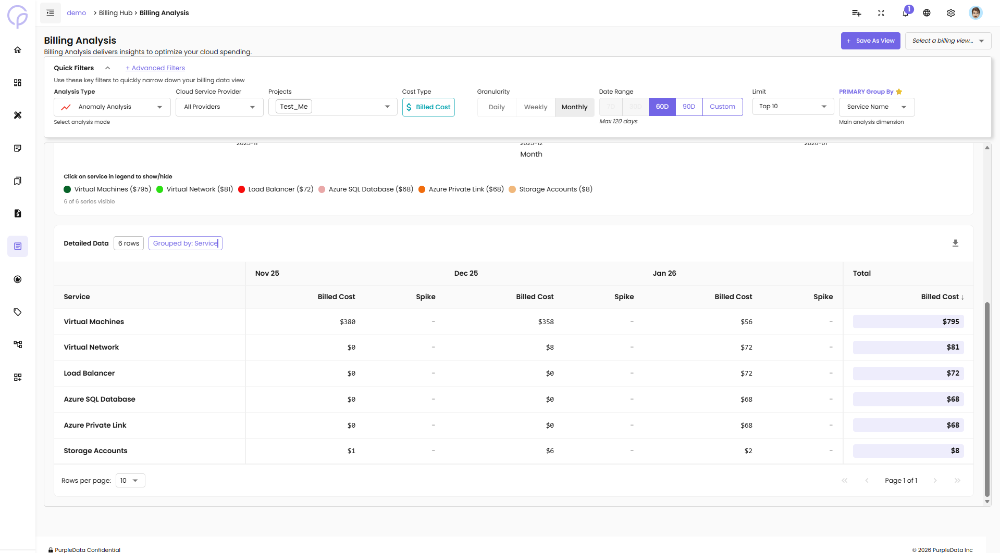
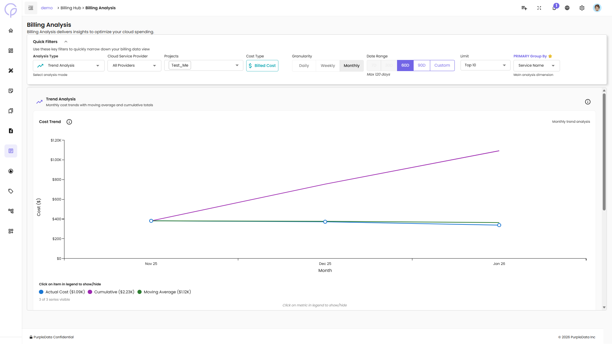
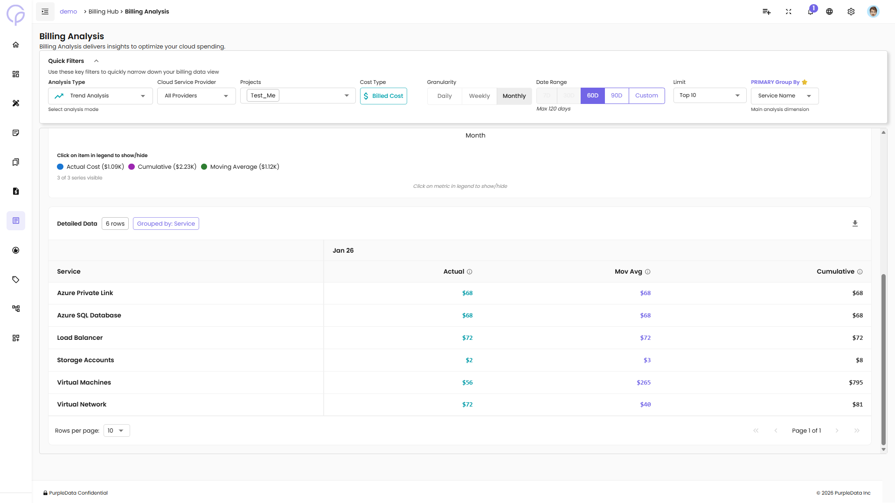
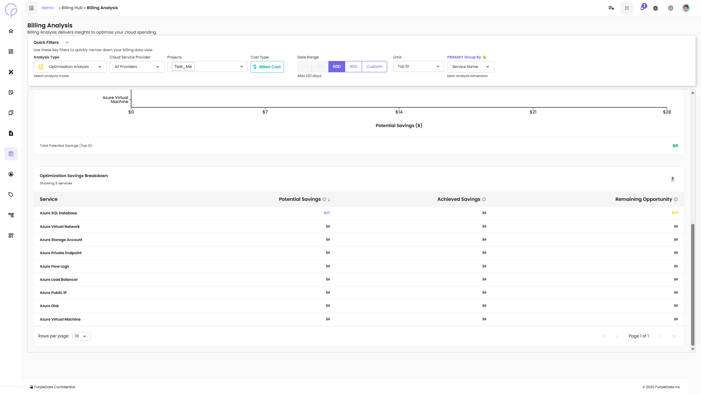
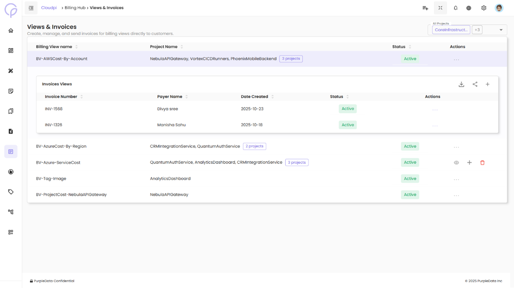

# Multi Cloud Billing Hub

Welcome to your central billing command center! The CloudPi Multi-Cloud Billing Hub offers a comprehensive solution for managing and analyzing billing data across various Cloud Service Providers (CSPs). This hub allows you to create tailored billing views to monitor expenditures based on different dimensions like services, service groups, and user-defined cost tags.

---

## Key Features

**Billing Analysis** - Delivers insights to optimize your cloud spending with multiple analysis types

**Customizable Billing Views** - Easily configure views based on specific dimensions to better understand your cloud expenses

**Invoice Customization and Delivery** - Customize and automatically generate invoices tailored to your organizational needs

**Managed Cloud Services Provider Support** - Receive specialized billing services designed for Managed Cloud Service Providers

**Savings Plans Management** - Efficiently manage your commitments and savings plans to optimize financial performance

---

## Billing Analysis

Billing Analysis delivers insights to optimize your cloud spending. It provides powerful visualization and tabular views to help teams understand cost patterns, detect anomalies, and identify optimization opportunities.

### Accessing Billing Analysis

1. From the left navigation menu, click on **Billing Hub**
2. Select **Billing Analysis**
3. The Billing Analysis page opens with Quick Filters and visualization options

### Quick Filters

Use these key filters to quickly narrow down your billing data view:

**Analysis Type** - Select the type of analysis (Anomaly Analysis, Trend Analysis, Comparative Analysis, Budget Analysis, Optimization Analysis)

**Cloud Service Provider** - Filter by AWS, Azure, GCP, or All Providers

**Projects** - Select specific projects to analyze

**Cost Type** - Choose Billed Cost or other cost types

**Granularity** - Switch between Daily, Weekly, or Monthly views

**Date Range** - Select time period (60D, 90D, or Custom) with max 120 days

**Limit** - Choose Top 10 or other limits for data display

**PRIMARY Group By** - Select the main analysis dimension (e.g., Service Name)

Click **+ Advanced Filters** to access additional filtering options for more granular analysis.

### Analysis Types

The Analysis Type dropdown provides five different views for analyzing your billing data:

#### 1. Anomaly Analysis

Detect unusual spending patterns and cost spikes across your cloud environment.

**Features:**

**Cost Trend: Service** - Area chart showing monthly cost breakdown by service (Top 10)
- Displays Billed Cost over time with color-coded services
- Interactive legend - click on service names to show/hide specific services
- Services include: Virtual Machines, Virtual Network, Load Balancer, Azure SQL Database, Azure Private Link, Storage Accounts, etc.

**Detailed Data Table:**

Below the chart, a detailed table shows:

**Service** - Name of the cloud service

**Billed Cost (by month)** - Cost for each month

**Spike** - Indicates if there was a cost spike

**Total** - Total billed cost for the service

#### 2. Trend Analysis

Monthly cost trends with moving average and cumulative totals to understand spending patterns over time.

**Features:**

**Cost Trend Chart** - Line chart showing monthly trend analysis

**Actual Cost** - Real spending for each period

**Cumulative** - Running total of costs over time

**Moving Average** - Smoothed trend line to identify patterns

**Detailed Data Table:**

**Service** - Name of the cloud service

**Actual** - Actual cost for the period

**Mov Avg** - Moving average cost

**Cumulative** - Cumulative total cost

#### 3. Comparative Analysis

Compare costs across multiple time periods to identify changes and growth patterns.

**Features:**

**3-Month Comparison** - Compare costs across three consecutive months (e.g., Nov 2025 → Dec 2025 → Jan 2026)

**Comparative Analysis Chart** - Grouped bar chart showing period comparison for top dimensions

**Interactive legend** - Show/hide specific months

**Detailed Data Table:**

**Service** - Name of the cloud service

**Month 1 Cost** - Cost for first comparison month

**Month 2 Cost** - Cost for second comparison month

**Difference ($)** - Dollar difference between periods

**Change (%)** - Percentage change (highlighted in red for increases, green for decreases)

**Month 3 Cost** - Cost for third comparison month

The table highlights significant changes:
- **Red badges** indicate cost increases (e.g., +411.62%)
- **Green badges** indicate cost decreases (e.g., -85.04%)

#### 4. Budget Analysis

Track budget consumption and compare actual spending against allocated budgets.

**Features:**

- Budget vs. actual cost comparison
- Budget utilization percentage
- Forecast vs. actual spending trends

#### 5. Optimization Analysis

Identify cost optimization opportunities and track realized savings.

**Features:**

**Optimization Savings Summary Cards:**

**Potential Savings** - Total opportunity identified for cost reduction

**Realized Savings** - Amount captured through automation (with "Achieved" badge)

**Remaining Opportunity** - Available savings still to capture

**Realization Rate** - Percentage of potential savings achieved (with Fair/Good/Excellent rating)

**Alert Banner:**
When significant optimization opportunities are available, an alert displays: "You have $X in remaining optimization opportunities. Your current realization rate is X%. Implementing these recommendations could significantly reduce your cloud costs."

**Top Savings Opportunities:**
- Horizontal bar chart showing top 9 dimensions with highest potential savings
- Services ranked by potential savings amount

**Optimization Savings Breakdown Table:**

**Service** - Name of the cloud service

**Potential Savings** - Identified savings opportunity

**Achieved Savings** - Savings already realized

**Remaining Opportunity** - Savings still available to capture

### Managing Billing Views

#### Save As View

To save your current filter configuration:

1. Configure your desired filters (Analysis Type, Projects, Date Range, etc.)
2. Click the **+ Save As View** button in the top right
3. Enter a name for your billing view
4. Click **Save**

#### Select a Billing View

To load a previously saved view:

1. Click the **Select a billing view...** dropdown in the top right
2. Choose from your saved billing views
3. The page updates with the saved filter configuration

### Understanding the Interface

**Chart Interactions:**

**Legend Toggle** - Click on items in the legend to show/hide specific data series

**Hover** - Hover over chart elements to see detailed values

**Pagination** - Use pagination controls in tables (Rows per page, Page navigation)

**Data Export:**

- Click the download icon in the Detailed Data section to export table data

---

## Shared Costs Management

The Shared Costs page allows you to view and manage shared cost allocations between projects. This ensures that expenses related to shared services (e.g., infrastructure, regions) are fairly distributed across relevant projects.

### Create a Shared Cost

Use this flow to create a new shared cost allocation between projects.

**Steps:**

1. Click on **+ Create Shared Cost** - Opens the Add Shared Cost form

2. **Select Billing View** - Choose the billing view you want to apply the shared cost to

3. **Select Time Period** - Choose from available options such as Yearly, Monthly, etc.

4. **Add Target Projects:**
   - Select the Project that will share the cost
   - Specify the Percentage (%) of cost to allocate
   - Click the **+** icon to add multiple projects if needed

5. **Enter Note** - Provide context or reasons for the shared cost (e.g., shared infrastructure, cross-team usage)

6. Click **Save** - Finalize the shared cost entry. The status will be set to **Pending** until accepted

### Key Actions

**Project Filter:**
- Use the **Select Project** dropdown to filter shared costs related to a specific project

**Shared Cost List:**

View the list of shared cost entries with details such as:

**Billing Name** - The service or resource category being shared (e.g., Service name, Regions)

**Shared Projects** - Shows the allocation direction (e.g., NPDDDev → CPDev)

**Note** - Additional information (e.g., "This resource is part of a shared infrastructure and is utilized by multiple teams")

**Status** - Indicates if the shared cost is **Accepted** (green) or **Pending** (yellow)

**Time Period** - The duration the shared cost is active (start and end dates)

**Actions** - Options to view more details or perform actions like edit or delete

### View Shared Cost Details

Allows users to view specific details of an existing shared cost allocation.

**Steps:**

1. In the Shared Costs Page, locate the shared cost entry
2. Click on the **Actions menu** (three dots) next to the entry
3. Select **View** to see detailed information like:
   - Billing View and Service Name
   - Allocated Projects and their share percentages
   - Notes explaining the purpose of sharing
   - Time Period and Status (Accepted / Pending)

**Additional Action for Pending Status:**

If the status is **Pending**, the user will have the option to:
- **Accept** the shared cost
- **Reject** the shared cost

---

## Views and Invoices

The Views and Invoices page in CloudPi centralizes and streamlines the invoicing process, making it easier for users to generate, manage, and review invoices based on comprehensive and customizable billing views.

**Key Features:**

**Invoicing Based on Billing Views** - Create invoices that reflect specific cost structures and categories

**Invoicing History** - Access a detailed list of all past invoices

**Invoicing Automation** - Automate the invoicing process with customizable schedules

**Invoice Customer/Cost Center Details** - Maintain detailed records for each customer or cost center

---

### Navigating Invoicing Page

The main invoicing dashboard provides an overview of all billing views and their associated invoices.

**Page Components:**

**Invoice Summary** - Displays total invoice count and key metrics

**Billing View List** - Shows all configured billing views with invoice status

**Quick Actions** - Access to view invoices, add customers, and create new invoices

**Filter Options** - Filter by billing view, date range, or invoice status

---

### View Invoices

View invoices that have been generated under each billing view. You can resend, edit, and download invoices.

**Steps to View Invoices:**

1. Locate the desired billing view in the list
2. Click the **View Invoices** icon in the Actions column
3. Review all invoices generated for that billing view
4. Use available actions: Resend, Edit, Download

**Invoice Actions:**

**Resend** - Send the invoice to the customer again via email

**Edit** - Modify invoice details before sending

**Download** - Export invoice as PDF

---

### Add Customer

Click on the add customer icon under actions. A popup appears where you can choose an existing customer or create new customer details.

**Steps to Add Customer:**

1. Navigate to the billing view you want to associate with a customer
2. Click the **Add Customer** icon in the Actions column
3. Choose between:
   - **Select Existing Customer** - Link an already registered customer
   - **Create New Customer** - Add a new customer profile

---

### Create Customer Details

Enter comprehensive customer information to enable invoice generation and delivery.

**Required Customer Information:**

**First Name** - Customer's first name

**Last Name** - Customer's last name

**Email** - Primary email address for invoice delivery

**Phone Number** - Contact number

**Address** - Street address

**City** - City name

**State** - State or province

**Cost Center** - Associated cost center code

**Project Name** - Linked project identifier

**Department Name** - Department or business unit

Click **Save** to create the customer profile.

---

### Creating and Sending Invoices

Once a customer is associated with a billing view, you can generate and send invoices.

**Invoice Generation Process:**

1. Ensure customer details are configured for the billing view
2. Select the billing period for invoice generation
3. Review the invoice preview showing all costs and line items
4. Customize invoice details if needed
5. Click **Send Invoice** to deliver via email

**Invoice Customization Options:**

**Invoice Number** - Auto-generated or manually specified

**Invoice Date** - Date of invoice creation

**Due Date** - Payment deadline

**Notes** - Additional terms or messages

**Line Items** - Detailed cost breakdown by service or category

---

### Auto Invoicing

Automate the invoicing process with scheduled delivery to customers.

**To Enable Auto Invoicing:**

1. Click the **Auto Invoicing** icon under actions
2. Select the customer from the dropdown menu
3. Enter the customer's email ID
4. Set a schedule for the invoicing (Daily, Weekly, Monthly)
5. Specify delivery details and end date
6. Click **Save** to enable auto invoicing

**Auto Invoicing Features:**

**Scheduled Delivery** - Automatic invoice generation and sending based on schedule

**Email Notifications** - Customers receive invoices directly in their inbox

**End Date Control** - Set when automated invoicing should stop

**Template Consistency** - Ensures uniform invoice format across all deliveries

---
