# Multi Cloud Billing Hub

Welcome to your central billing command center! The CloudPi Multi-Cloud Billing Hub offers a comprehensive solution for managing and analyzing billing data across various Cloud Service Providers (CSPs). This hub allows you to create tailored billing views to monitor expenditures based on different dimensions like services, service groups, and user-defined cost tags.

---

## Key Features

**Billing Analysis** - Delivers insights to optimize your cloud spending with multiple analysis types

**Customizable Billing Views** - Easily configure views based on specific dimensions to better understand your cloud expenses

**Invoice Customization and Delivery** - Customize and automatically generate invoices tailored to your organizational needs

**Managed Cloud Services Provider Support** - Receive specialized billing services designed for Managed Cloud Service Providers

---

## Billing Analysis

Billing Analysis delivers insights to optimize your cloud spending. It provides powerful visualization and tabular views to help teams understand cost patterns, detect anomalies, and identify optimization opportunities.

### Accessing Billing Analysis

1. From the left navigation menu, click on **Billing Hub**
2. Select **Billing Analysis**
3. The Billing Analysis page opens with Quick Filters and visualization options

### Quick Filters

The Quick Filters bar at the top of the page covers the most-used controls. You set them once, click **Apply**, and the chart and table refresh.

| Filter | Options | Notes |
|--------|---------|-------|
| **Analysis Type** | Cost / Anomaly / Trend / Comparative / Budget / Optimization / Preset | See [Analysis Types](#analysis-types) below for what each does |
| **Cloud Service Provider** | All Providers / AWS / Azure / GCP | Filters resources to one provider or shows all |
| **Projects** | Multi-select from your assigned projects | At least one project is required |
| **Cost Type** | Billed Cost / Effective Cost / List Cost | Defaults to your workspace setting; can be overridden here |
| **Granularity** | Daily / Weekly / Monthly | How time-series data is bucketed |
| **Date Range** | 7d / 30d / 60d / 90d / Custom | Maximum range is 120 days |
| **Limit** | 5 / 10 / All | Top N items by cost; remaining items rolled up under "Others" |
| **PRIMARY Group By** | Service Name, Account, Region, etc. | Main grouping dimension. Marked with a star icon since it drives the chart |

**Auto-hide on Apply** — A toggle on the right of the Quick Filters bar. When on, the filter panel collapses after you click Apply, freeing up screen space for the chart and table.

Filter selections persist as you move between pages within the same session, so you do not lose your setup if you navigate away and come back.

Click **Advanced Filters** in the sidebar (left) to access additional dimension-specific filters — see [Advanced Filters](#advanced-filters).

### Analysis Types

The Analysis Type dropdown provides seven different ways to look at your billing data. Each type drives a different chart, a different default set of dimensions, and (for some types) a different summary panel.

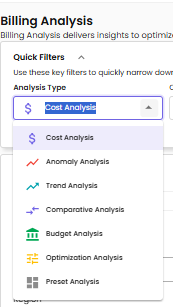

#### 1. Cost Analysis

Resource-level cost detail with time-series visualization. This is the everyday workhorse view: pick a primary dimension (Service Name, Account, Region, etc.) and you get a chart of costs over the date range, plus a detailed table grouped by that dimension.

**What's on the page:**

- **Chart** — Bar / Stacked / Area / Line. Click the chart-type buttons in the top-right corner of the chart to switch between them. Each series corresponds to one value of the Primary Group By (e.g., one bar per service).
- **Detailed Data** table — one row per dimension value, plus a Grand Total row. The columns visible are configurable via the **Columns** dropdown above the table; you can add Region, Account, or any other dimension as additional columns.
- **Search this page** — quick filter inside the table.
- **Pagination** — Rows per page (default 10) and standard page navigation.

**Use Cost Analysis when** you want to break down spend by an arbitrary dimension over a time window — what services cost most this month, which accounts grew the most, where is regional cost concentrated, and so on.

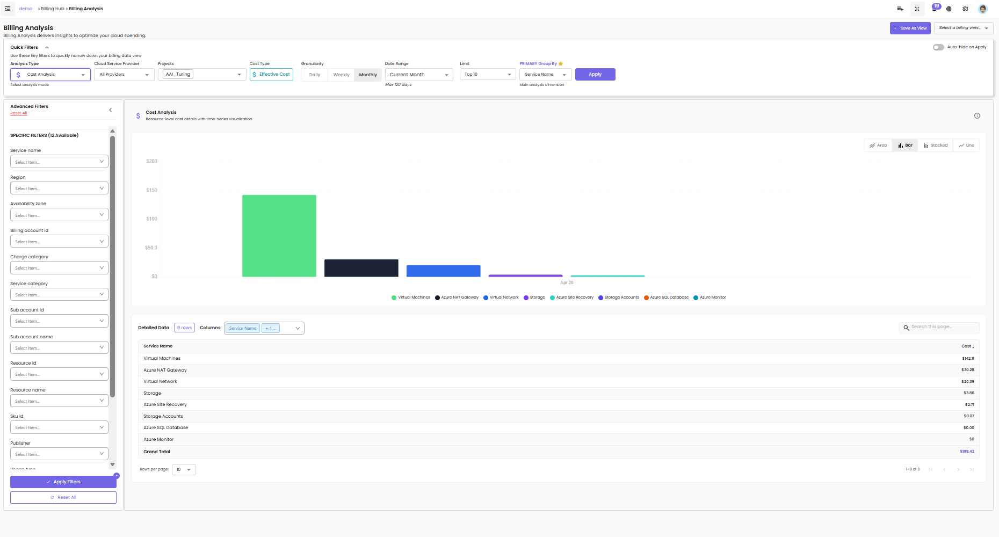

#### 2. Anomaly Analysis

Detect unusual spending patterns and cost spikes across your cloud environment.

**Features:**

**Cost Trend: Service** - Area chart showing monthly cost breakdown by service (Top 10) 

- Displays Billed Cost over time with color-coded services
- Interactive legend - click on service names to show/hide specific services
- Services include: Virtual Machines, Virtual Network, Load Balancer, Azure SQL Database, Azure Private Link, Storage Accounts, etc.

**Detailed Data Table:**

Below the chart, a detailed table shows:

**Service** - Name of the cloud service

**Billed Cost (by month)** - Cost for each month

**Spike** - Indicates if there was a cost spike

**Total** - Total billed cost for the service

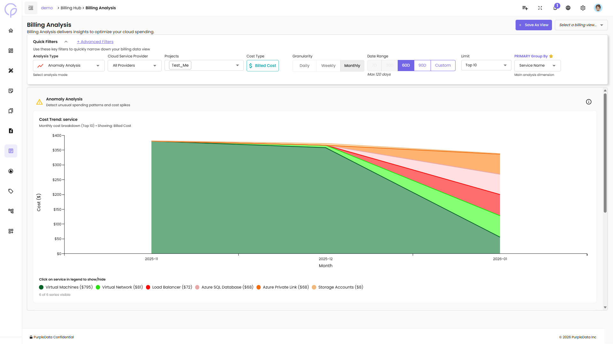

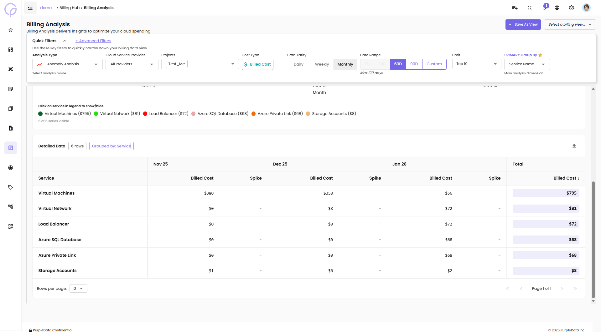

#### 3. Trend Analysis

Monthly cost trends with moving average and cumulative totals to understand spending patterns over time.

**Features:**

**Cost Trend Chart** - Line chart showing monthly trend analysis

**Actual Cost** - Real spending for each period

**Cumulative** - Running total of costs over time

**Moving Average** - Smoothed trend line to identify patterns

**Detailed Data Table:**

**Service** - Name of the cloud service

**Actual** - Actual cost for the period

**Mov Avg** - Moving average cost

**Cumulative** - Cumulative total cost

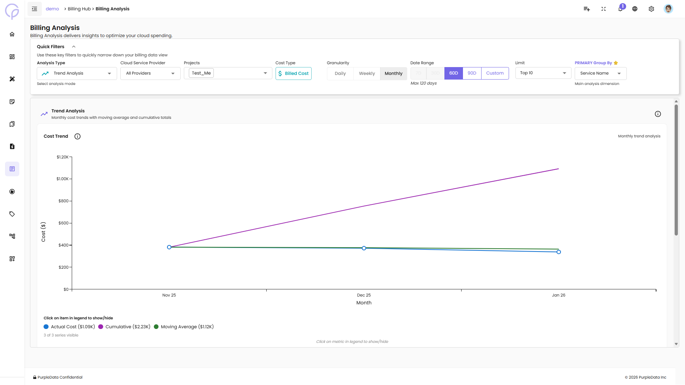

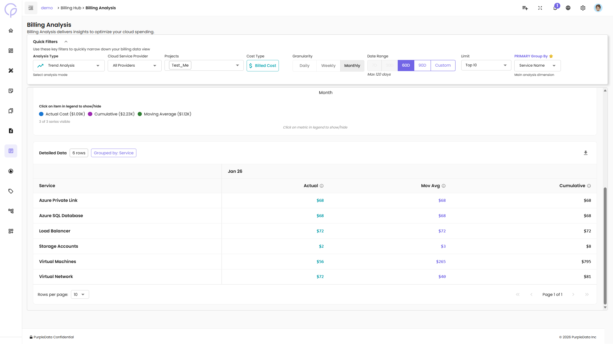

#### 4. Comparative Analysis

Compare costs across multiple time periods to identify changes and growth patterns.

**Features:**

**3-Month Comparison** - Compare costs across three consecutive months (e.g., Nov 2025 → Dec 2025 → Jan 2026)

**Comparative Analysis Chart** - Grouped bar chart showing period comparison for top dimensions

**Interactive legend** - Show/hide specific months

**Detailed Data Table:**

**Service** - Name of the cloud service

**Month 1 Cost** - Cost for first comparison month

**Month 2 Cost** - Cost for second comparison month

**Difference ($)** - Dollar difference between periods

**Change (%)** - Percentage change (highlighted in red for increases, green for decreases)

**Month 3 Cost** - Cost for third comparison month

The table highlights significant changes:
- **Red badges** indicate cost increases (e.g., +411.62%)
- **Green badges** indicate cost decreases (e.g., -85.04%)

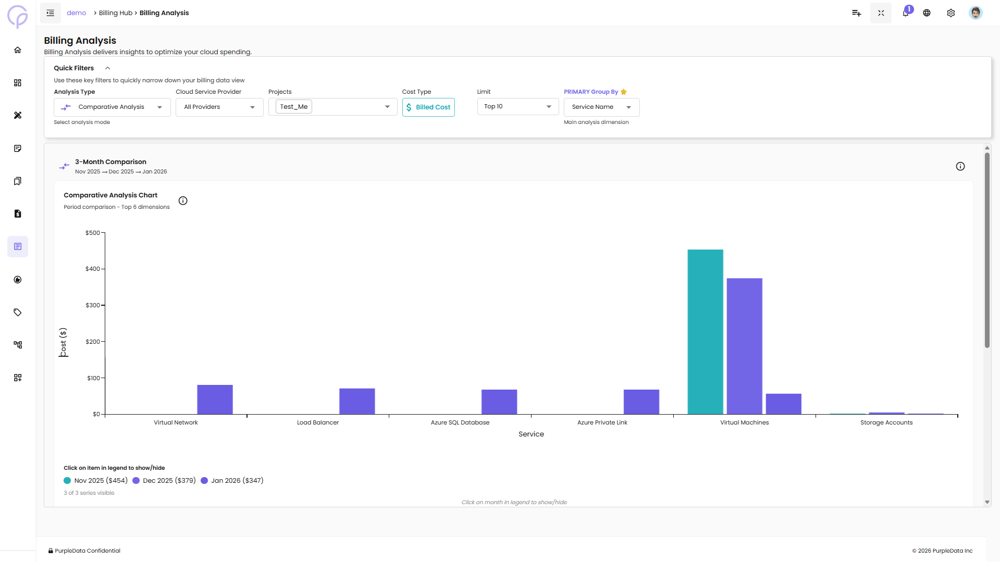

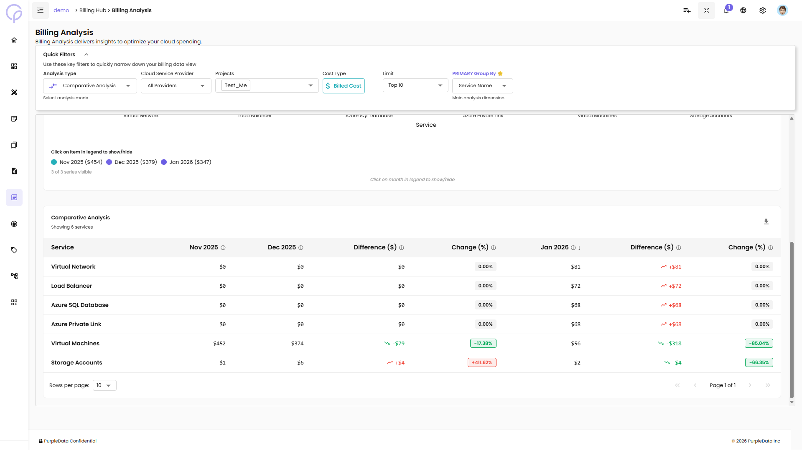

#### 5. Budget Analysis

Track budget consumption and compare actual spending against allocated budgets. Use this view to see at a glance whether projects are on track, where forecasted spend will land, and which periods are over or under budget.

!!! note "Requires configured budgets"
    Budget Analysis only works if budgets have been set up for your projects. If no budgets are configured, the page shows a message prompting you to configure them first. See your administrator if you have permission to create budgets.

**What's on the page:**

A fiscal-year selector (e.g., **FY 2026 (Jan–Dec)**) in the top-right scopes everything below to that fiscal period.

**Budget Performance Overview** — four KPI cards:

| Card | Shows |
|------|-------|
| **Total Budget** | Total allocated budget for the period |
| **Total Cost** | Current actual spend, with an **On Track** / **Off Track** badge based on pace vs. budget |
| **Total Forecast** | Forecasted spend for the remainder of the period |
| **Projected Cost** | Total expected spend for the full period (current + forecast). A warning icon appears if the projection exceeds the budget |

**Budget Utilization** — progress bar showing spend as a percentage of budget (e.g., *$336.8 / $500.0 (67%)* with *$163.28 remaining*).

**Budget vs Spend chart** — a multi-series line chart spanning the fiscal year. Four series:

- **Budget** — the allocated monthly budget line
- **Spend** — actual spend per month (already incurred)
- **Forecast** — predicted spend for upcoming months
- **Projected** — total trajectory line combining actual and forecast

Click any series in the legend to show or hide it.

**Budget Variance Details** — table at the bottom showing one row per budget period (or per project, depending on the budget definition):

| Column | Description |
|--------|-------------|
| **Period** | Project or period name |
| **Budget Allocated** | Budget assigned to this period |
| **Spend** | Actual spend so far |
| **Forecast** | Predicted remaining spend |
| **Projected Cost** | Total projected spend |
| **Variance Amount ($)** | Dollar difference between budget and projected cost |
| **Variance Percentage (%)** | Percentage difference |
| **Remaining Budget** | Budget left if projection holds |
| **Status** | **Under Budget** / **On Track** / **Over Budget** badge |

The **All Statuses** filter above the table lets you narrow to only Over Budget rows when reviewing problem areas.

**Use Budget Analysis when** you want to monitor financial performance against allocated budgets, identify projects trending over budget before they breach, and review month-by-month variance for FinOps reporting.

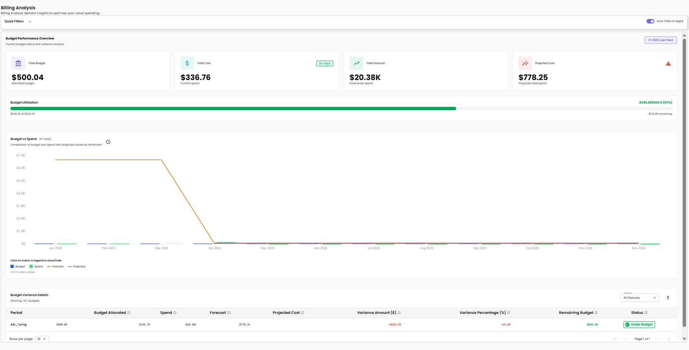

#### 6. Optimization Analysis

Identify cost optimization opportunities and track realized savings.

**Features:**

**Optimization Savings Summary Cards:**

**Potential Savings** - Total opportunity identified for cost reduction

**Realized Savings** - Amount captured through automation (with "Achieved" badge)

**Remaining Opportunity** - Available savings still to capture

**Realization Rate** - Percentage of potential savings achieved (with Fair/Good/Excellent rating)

**Alert Banner:**
When significant optimization opportunities are available, an alert displays: "You have $X in remaining optimization opportunities. Your current realization rate is X%. Implementing these recommendations could significantly reduce your cloud costs."

**Top Savings Opportunities:**
- Horizontal bar chart showing top 9 dimensions with highest potential savings
- Services ranked by potential savings amount

**Optimization Savings Breakdown Table:**

**Service** - Name of the cloud service

**Potential Savings** - Identified savings opportunity

**Achieved Savings** - Savings already realized

**Remaining Opportunity** - Savings still available to capture

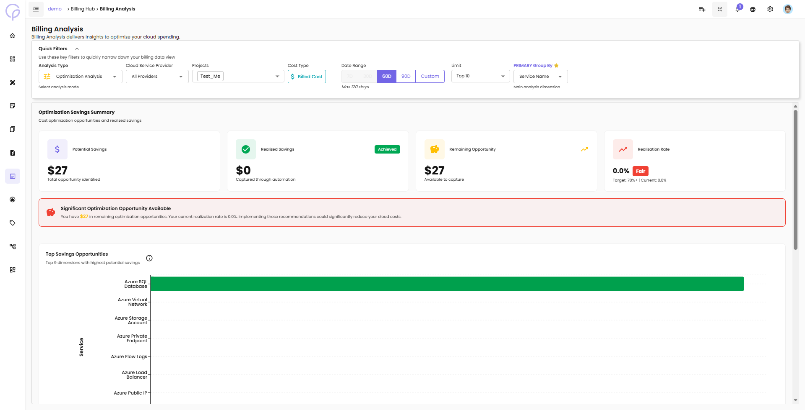

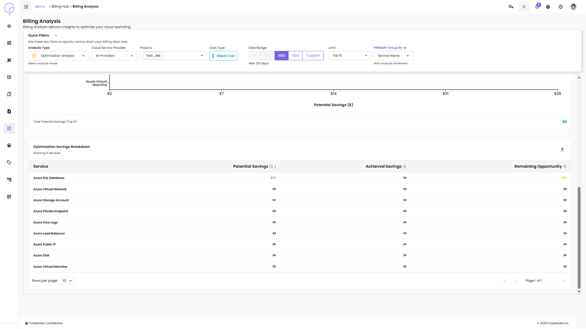

#### 7. Preset Analysis

Preset Analysis lets you open a pre-configured report dashboard rather than starting from scratch. CloudPi ships with several built-in system preset views for common use cases (e.g., "Monthly cost by service", "Top spending accounts last 30 days"), and any custom views you save also appear here.

**What's on the page:**

- A list of available presets — system presets first, then your custom saved views
- Each preset shows the analysis type, primary grouping, and date range it was saved with
- Selecting a preset loads its full configuration (filters, chart, dimensions) instantly

**Notes:**

- System presets are read-only. To customise one, open it and use **Save as New** to create your own copy.
- Custom views you own can be edited or deleted from this list — see [Managing Billing Views](#managing-billing-views) below.

**Use Preset Analysis when** you want to start from a known good configuration without setting filters by hand, or when your team has a standard set of reports you want everyone to use.

### Advanced Filters

Quick Filters cover the most common controls. The **Advanced Filters** sidebar (left side of the page) lets you narrow the analysis further by specific dimension values.

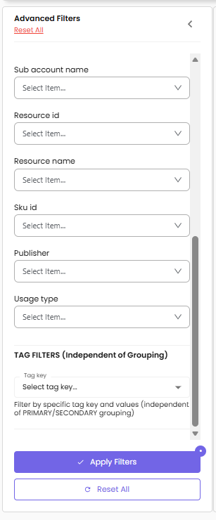

The sidebar header shows the count of available filters (for example, *Specific Filters (12 Available)*). Each filter is a multi-select dropdown — pick one or more values to include only data matching those values.

#### Specific filters

| Filter | Filters by |
|--------|-----------|
| **Service name** | Cloud service (e.g., Virtual Machines, Storage Accounts) |
| **Region** | Cloud region (e.g., westus, us-east-1) |
| **Availability zone** | Specific AZ within a region |
| **Billing account id** | Top-level billing account |
| **Charge category** | Charge classification (Usage, Tax, Refund, etc.) |
| **Service category** | Logical service grouping (Compute, Storage, Networking, etc.) |
| **Sub account id** | Subaccount, subscription, or GCP project ID |
| **Sub account name** | Friendly name of the subaccount |
| **Resource id** | Specific cloud resource identifier |
| **Resource name** | Friendly name of the resource |
| **SKU id** | Cloud provider SKU |
| **Publisher** | Service publisher (relevant on Azure for marketplace items) |
| **Usage type** | Usage type code (e.g., BoxUsage, NodeHours) |

The available filters and their values depend on the **Cloud Service Provider** and **Projects** you selected in Quick Filters — values load dynamically based on what's in scope.

#### Tag filters

Below the specific filters is a **Tag Filters** section. Unlike the dimension filters above, tag filters are **independent of the Primary / Secondary grouping** — selecting tag-based filters narrows the data to resources that match the tag values regardless of how the data is grouped on the chart.

1. Pick a **Tag key** from the dropdown (e.g., `Environment`, `Owner`).
2. Select one or more **values** for that tag.
3. Repeat for additional tag keys if needed.

#### Applying and resetting filters

- **Apply Filters** at the bottom of the sidebar commits all your selections — chart and table refresh.
- **Reset All** at the top or bottom clears every filter back to its default empty state.
- All filter conditions combine with **AND** logic — a resource must match every filter to appear in results.
- Selected filters persist in session storage as you navigate between pages.

### Managing Billing Views

A **billing view** is a saved configuration — analysis type, all Quick and Advanced filters, projects, and grouping — that you can reload in one click. Use views to standardise reporting and avoid reconfiguring the same setup every session.

#### Save As View

1. Configure your desired filters (analysis type, projects, date range, group by, advanced filters).
2. Click **Save As View** in the top right.
3. Enter a name for the view.
4. Click **Save**.

The view is persisted and immediately appears in the **Select a billing view** dropdown. The full filter set is captured: workspace context, projects, analysis type, granularity, group by, and every advanced filter value.

!!! note "Validation"
    A view name is required and must not be empty. At least one project must be selected before saving.

#### Select a Billing View

1. Click the **Select a billing view** dropdown in the top right.
2. Choose a view from the list. System presets appear first, then your custom views.
3. The page reloads with all of the saved filters applied exactly as they were when you saved the view.

#### Update an Existing View

1. Load the view you want to change from **Select a billing view**.
2. Modify any filter — the UI shows an **unsaved changes** indicator next to the view name.
3. Click **Update** to overwrite the view with the new configuration.

The same view is updated in place — no duplicate is created.

#### Save as New (from a System Preset)

System preset views are read-only. If you load a preset and then change anything:

1. The Save button changes to **Save as New** instead of **Update**.
2. Enter a new name for your custom copy.
3. Click **Save**.

This keeps the original system preset intact and creates your own copy that you can update freely.

#### Delete a Custom View

1. Open the view menu next to the view's name in the dropdown.
2. Click **Delete**.
3. Confirm in the dialog.

You can only delete views you own (custom views you created). System presets cannot be deleted.

!!! note "Views with inaccessible projects"
    If a saved view references a project you no longer have access to (e.g., your role was changed), the view loads with only the projects you can still see, and a warning notes which projects were excluded.

### Understanding the Interface

**Chart Interactions:**

**Legend Toggle** - Click on items in the legend to show/hide specific data series

**Hover** - Hover over chart elements to see detailed values

**Pagination** - Use pagination controls in tables (Rows per page, Page navigation)

**Data Export:**

- Click the download icon in the Detailed Data section to export table data

---

## Shared Costs Management

The Shared Costs page allows you to view and manage shared cost allocations between projects. This ensures that expenses related to shared services (e.g., infrastructure, regions) are fairly distributed across relevant projects.

### Create a Shared Cost

Use this flow to create a new shared cost allocation between projects.

**Steps:**

1. Click on **+ Create Shared Cost** - Opens the Add Shared Cost form

2. **Select Billing View** - Choose the billing view you want to apply the shared cost to

3. **Select Time Period** - Choose from available options such as Yearly, Monthly, etc.

4. **Add Target Projects:**
   - Select the Project that will share the cost
   - Specify the Percentage (%) of cost to allocate
   - Click the **+** icon to add multiple projects if needed

5. **Enter Note** - Provide context or reasons for the shared cost (e.g., shared infrastructure, cross-team usage)

6. Click **Save** - Finalize the shared cost entry. The status will be set to **Pending** until accepted

### Key Actions

**Project Filter:**
- Use the **Select Project** dropdown to filter shared costs related to a specific project

**Shared Cost List:**

View the list of shared cost entries with details such as:

**Billing Name** - The service or resource category being shared (e.g., Service name, Regions)

**Shared Projects** - Shows the allocation direction (e.g., NPDDDev → CPDev)

**Note** - Additional information (e.g., "This resource is part of a shared infrastructure and is utilized by multiple teams")

**Status** - Indicates if the shared cost is **Accepted** (green) or **Pending** (yellow)

**Time Period** - The duration the shared cost is active (start and end dates)

**Actions** - Options to view more details or perform actions like edit or delete

### View Shared Cost Details

Allows users to view specific details of an existing shared cost allocation.

**Steps:**

1. In the Shared Costs Page, locate the shared cost entry
2. Click on the **Actions menu** (three dots) next to the entry
3. Select **View** to see detailed information like:
   - Billing View and Service Name
   - Allocated Projects and their share percentages
   - Notes explaining the purpose of sharing
   - Time Period and Status (Accepted / Pending)

**Additional Action for Pending Status:**

If the status is **Pending**, the user will have the option to:
- **Accept** the shared cost
- **Reject** the shared cost

---

## Views and Reports

The Views and Reports page allows you to create and manage billing view reports based on your configured billing views. Generate reports for specific time periods to analyze costs across projects and services.

**Key Features:**

**Report Generation** - Create reports for specific billing views and time periods

**Report Management** - View, edit, download, and share billing view reports

**Project Filtering** - Filter billing views by project for easier navigation

---

### Navigating the Views and Reports Page

The Views and Reports page displays all your billing views and provides tools to create and manage reports.

**Page Components:**

**Page Header** - "Views and Billing View Reports" with description "Create and manage billing view reports for billing views."

**Project Filter** - Dropdown in the top right to filter billing views by project (e.g., HRApplication)

**Billing View Table** - Main table displaying:

- **Billing View name** - Name of the billing view
- **Project Name** - Associated project(s), with badge showing multiple projects (e.g., "3 projects")
- **Status** - Current status (Active shown in green badge)
- **Actions** - Icons for viewing reports, creating reports, and deleting billing views

---

### Billing View Reports

View all reports that have been generated for a specific billing view.

**Steps to View Reports:**

1. Locate the billing view in the table
2. Click the **Eye icon** in the Actions column
3. The **Billing View Reports** panel opens showing all reports for that billing view
4. Click the **View Report icon** (eye icon) next to the report you want to view
5. The report details page opens with full billing information

**Billing View Reports Panel:**

The panel displays a table with the following information for each report:

- **Report Number** (e.g., BR-00008)
- **Reporting Period** (date range, e.g., 2025-11-30 - 2025-12-30)
- **Created By** (username, e.g., CloudPi Admin)
- **Date Created** (timestamp)
- **Status** (Active in green badge)
- **Actions** (View Report, Edit Notes icons)

**Panel Actions:**

- **Download** - Download icon in top right to export reports
- **Share** - Share icon in top right to share reports with others
- **Plus (+)** - Create a new report from within the panel
- **Close** - Close the Billing View Reports panel

---

### Create Billing View Report

Generate a new report for a billing view by specifying the reporting period.

**Steps to Create Report:**

1. Locate the billing view in the table
2. Click the **Plus (+) icon** in the Actions column
3. The **Create Billing View Report** dialog opens showing:
   - **Billing View** - Name and associated projects
   - **Reporting Period** - Date range selector with Start date and End date fields
4. Select the start date and end date for your report
5. Click **Continue** to generate the report, or **Cancel** to abort

The system generates a report containing all billing data for the selected billing view within the specified time period.

---

### View Report Details

Access the full details of a generated report including costs, notes, and export options.

**Steps to View Report:**

1. Open the Billing View Reports panel (Eye icon)
2. Click the **Eye icon** next to the report you want to view
3. The report details page opens with:

**Report Header:**

- Report number (e.g., BR-00008)
- Status badge (Active in green)
- Billing View name and associated projects

**Reporting Period Card:**

- Start Date
- End Date

**Report Details Card:**

- Created At (timestamp)
- Created By (username)

**Billing View Summary Table:**

- **Project Name** - Project associated with the costs
- **Service Name** - Cloud services used (e.g., Virtual Machines, Storage Accounts)
- **Billed Cost** - Cost for each service
- **Sub Total** - Sum of all line items
- **Grand Total** - Final total cost

**Additional Options:**

- **Notes** - Text field to add context or comments (max 500 characters)
- **Set Currency** - Dropdown to select currency (e.g., United States Dollar)
- **Preview & Download** - Blue button to preview and download the report
- **Cancel** - Return to previous view

**Report Actions (Top Right):**

- **Download** - Export the report
- **Share** - Share the report with others
- **Plus (+)** - Create a new report

---

### Edit Report Notes

Add or modify notes on a report to provide additional context or documentation.

**Steps to Edit Notes:**

1. Open the Billing View Reports panel
2. Click the **Pencil (Edit) icon** next to the report
3. The report details page opens with the Notes field active
4. Enter or update notes (up to 500 characters)
5. Select currency if needed
6. Click **Preview & Download** to save changes

Notes are useful for documenting:

- Reason for the report
- Special circumstances during the reporting period
- Budget allocations or approvals
- Internal tracking information

---

### Delete Billing View

Remove a billing view when it's no longer needed. This action affects the billing view itself, not individual reports.

**Steps to Delete:**

1. Locate the billing view in the table
2. Click the **Trash icon** in the Actions column
3. A confirmation dialog appears
4. Confirm deletion to remove the billing view

**Note:** Deleting a billing view may affect associated reports. Ensure you've downloaded any needed reports before deletion.

---
