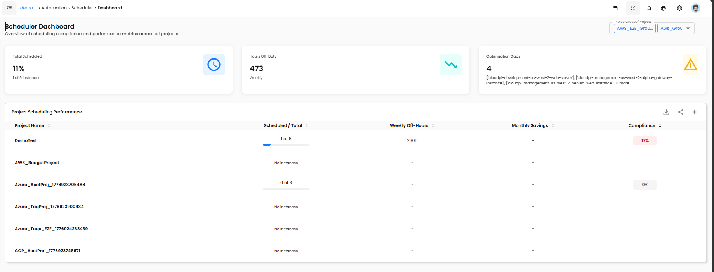
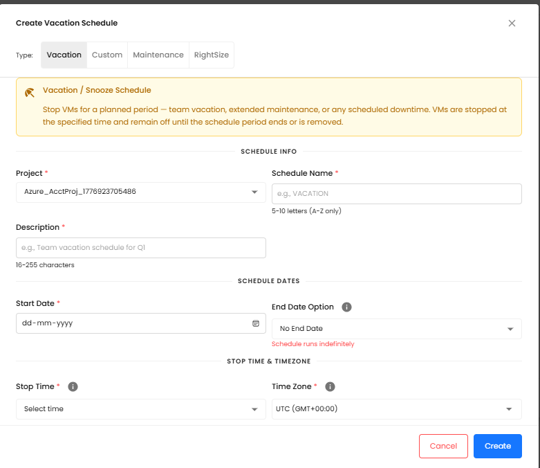
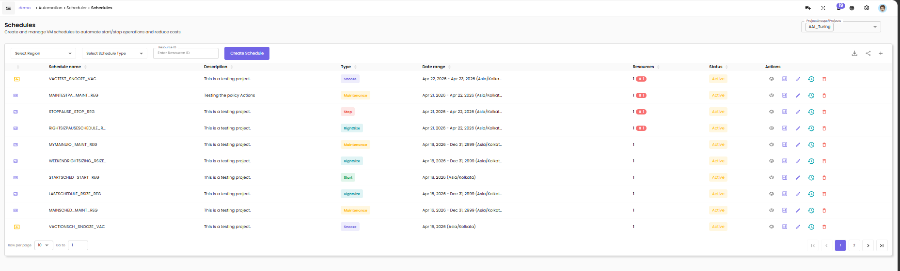
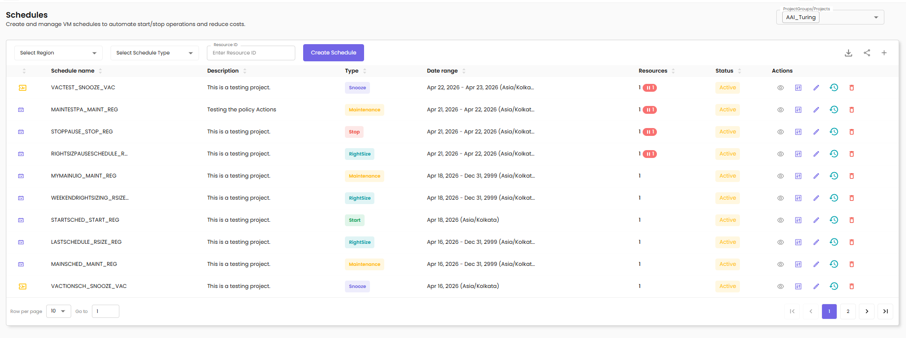

# CloudPi Scheduler — User Guide

## Overview

Running cloud VMs around the clock costs money even when no one is using them. The CloudPi Scheduler lets you define **schedules** that automatically stop and start your virtual machines based on business hours, project teams, or custom patterns — so you pay only for the time you need.

The Scheduler also gives Finance and DevOps leads a live compliance view: which projects have scheduled their VMs, which ones haven't, and how many off-hours each schedule delivers each week.

**Scheduler Policy Frequency** extends the Scheduler into CloudPi's policy engine. Each cost optimization policy (rightsizing, anomaly detection, etc.) can be given its own execution schedule using standard cron expressions, so recommendations are generated exactly as often as your team needs them.

```text
Sidebar → Scheduler
            ├── Dashboard   — compliance KPIs and project ranking
            ├── Schedules   — create and manage schedules
            └── Instances   — view and assign VMs
```


## Who Is This For?

| Role | Primary Use |
|------|-------------|
| **Cloud Administrator** | Create schedules, assign VMs, audit compliance |
| **DevOps Lead** | Monitor team compliance; identify unscheduled resources |
| **Finance Manager** | Track weekly off-hours to report cost avoidance |
| **DevOps Engineer** | View schedule details and execution logs for a VM |
| **IT Manager** | Prioritize which unscheduled resources to tackle first |

**Required permissions:** Access to the Scheduler section. Creating or editing schedules requires project-level write access (minimum Role 4). Viewing the Dashboard and Instances page is available to all project members.

## Before You Begin

- [ ] Your workspace has at least one cloud project connected (AWS, Azure, or GCP)
- [ ] The cloud integration has VM discovery enabled so instances appear on the Instances page
- [ ] You know which project the VMs you want to schedule belong to
- [ ] You have selected the correct project from the **Project selector** (top right of each page)

!!! note "Project selector applies to all three pages"
    The project you choose in the top-right dropdown filters the Dashboard, Schedules, and Instances pages simultaneously. Switch projects to view another team's scheduling status.

## Feature Overview

The Scheduler is organized as three separate pages, each accessible from the main navigation menu.

| Page | What it shows |
|------|---------------|
| **Dashboard** | KPI cards + Project Compliance table |
| **Schedules** | Schedule list + AI Recommendations |
| **Instances** | VM list with schedule status + execution logs |

When a schedule fires, CloudPi sends a start or stop command to the cloud provider for each assigned VM. The result (success or failure) is recorded in the **execution log** visible from the Instances page.

### Schedule Types

| Type | Behavior |
|------|----------|
| **Snooze** | Stops VMs at a set time, restarts them at another time — repeats on selected days |
| **Vacation** | Snooze VMs for a one-time date range (e.g., holiday break) |
| **Start** | Starts VMs at a set time only |
| **Stop** | Stops VMs at a set time only |

!!! note "No manual override"
    Schedules run automatically. There are no pause/resume controls and no ad-hoc start/stop buttons. If you need to intervene, detach the VM from its schedule first.

## Step-by-Step Guides

### Guide 1: Review the Dashboard

**Goal:** Get an at-a-glance view of how well your team is scheduling its VMs.

1. In the left sidebar, expand **Scheduler** and click **Dashboard**.
2. The page loads three summary cards at the top:

   | Card | What it shows |
   |------|---------------|
   | **Scheduled VMs** | Count of VMs with active schedules vs. total VMs |
   | **Weekly Off-Hours** | Total automated off-hours per week across all scheduled VMs |
   | **Compliance %** | Percentage of VMs that are scheduled |

3. Below the cards, the **Project Scheduling Performance** table ranks every project by compliance percentage.

   **Compliance color legend:**
   - 🟢 Green — above 80%
   - 🟡 Yellow — 50–80%
   - 🔴 Red — below 50%

4. Click any project row to jump to the **Instances page** pre-filtered for that project's unscheduled VMs.



### Guide 2: Create a Schedule

**Goal:** Define a new schedule that automatically stops and starts VMs on a regular basis.

1. Navigate to **Scheduler → Schedules**.
2. Click **+ Create Schedule**.
3. In the dialog, select the schedule **Type**:
   - **Snooze** — set a stop time, a start time, and the days of the week
   - **Vacation** — set a start date and end date for a one-time blackout
   - **Start** — set a start time only
   - **Stop** — set a stop time only
4. Fill in the schedule details:

   | Field | Description |
   |-------|-------------|
   | **Name** | A descriptive label (e.g., "Dev Nighttime" or "Weekend Off") |
   | **Stop Time** | Time of day the VMs will be stopped |
   | **Start Time** | Time of day the VMs will be restarted (Snooze type only) |
   | **Days of Week** | Which days the schedule repeats (Snooze/Stop/Start types) |
   | **Timezone** | The timezone in which stop/start times are interpreted |

5. Optionally assign VMs immediately using the **Instances** tab inside the dialog.
6. Click **Save** to create the schedule.

!!! warning "Overlapping windows"
    CloudPi validates for conflicting time windows. If the stop time and start time produce an impossible window (e.g., start before stop on the same day), the dialog displays a validation error and prevents saving.



### Guide 3: Assign VMs to a Schedule

**Goal:** Attach one or more virtual machines to an existing or new schedule from the Instances page.

1. Navigate to **Scheduler → Instances**.
2. Use the **Schedule filter** (dropdown at the top) to show **Unscheduled** VMs only.
3. Select one or more unscheduled VMs using the checkboxes on the left.

   !!! note "Already-scheduled VMs cannot be reassigned"
       Checkboxes are disabled for VMs that already belong to a schedule. To move a VM to a different schedule, detach it first (see Guide 5).

4. Click **Schedule Instances** (enabled only when unscheduled VMs are selected).
5. A popup opens with three options:

   | Option | Use when… |
   |--------|-----------|
   | **Attach** | The VM should join an existing schedule |
   | **Vacation** | The VM needs a one-time date-range blackout |
   | **Custom** | You want to create a brand-new schedule for this VM |

6. Complete the dialog for your chosen option and click **Save**.
7. The Instances list refreshes; the VM's **Schedule** column now shows the schedule name.



### Guide 4: View VM Execution Logs

**Goal:** Check whether a scheduled VM was stopped and started as expected.

1. Navigate to **Scheduler → Instances**.
2. Locate the VM you want to inspect. Its **Schedule** column shows the assigned schedule name.
3. Click the row to expand it.
4. The **Execution Logs** panel appears at the bottom of the expanded row.

   | Column | Description |
   |--------|-------------|
   | **Timestamp** | Date and time the action fired |
   | **Action** | Start or Stop |
   | **State** | Transition (e.g., Running → Stopped) |
   | **Status** | ✅ Success or ❌ Failed |

5. Click **View Full Logs** to open the detailed log panel with date-range filtering and export.


### Guide 5: Detach a VM from a Schedule

**Goal:** Remove a VM from its current schedule so it can be reassigned.

1. Navigate to **Scheduler → Schedules**.
2. Locate the schedule the VM currently belongs to and expand it.
3. Click the **Assigned Instances** tab.
4. Find the VM in the list and use the detach action (the unlink icon).
5. Confirm the detachment in the dialog.

The VM now appears as **Unscheduled** on the Instances page and can be assigned to a different schedule.

### Guide 6: Apply a Recommendation

**Goal:** Use CloudPi's recommendation engine to discover a cost-saving schedule for a resource.

1. Navigate to **Scheduler → Schedules**.
2. Scroll down to the **Recommendations** section.
3. Each recommendation row shows:

   | Column | Description |
   |--------|-------------|
   | **Resource** | The VM name |
   | **Recommendation** | Suggested schedule (e.g., "Snooze 22:00–06:00") |
   | **Est. Savings** | Weekly cost avoidance estimate |
   | **Confidence** | High / Medium — AI confidence score |

4. Click **Apply →** on any recommendation.
5. The existing **Create Schedule** or **Attach Schedule** dialog opens pre-populated with the suggested settings.
6. Review the details and click **Save**.



## Behavior Reference

### VM States

| State | Meaning |
|-------|---------|
| Running | VM is powered on |
| Stopped | VM is powered off |
| Starting | VM is transitioning from stopped to running |
| Stopping | VM is transitioning from running to stopped |

### Schedule Status

| Status | Meaning |
|--------|---------|
| Active | Schedule is armed and will fire at its next scheduled time |
| Running | A schedule action is currently executing |
| Pending | Schedule is created but not yet reached its first execution window |

### Execution Log Status

| Status | Meaning |
|--------|---------|
| ✅ Success | The cloud provider confirmed the start/stop action completed |
| ❌ Failed | The cloud provider returned an error; see the expanded log row for details |

### Schedule Execution & Cloud Providers

CloudPi sends stop/start commands directly to the cloud provider API (AWS EC2, Azure VM, GCP Compute Engine). The system:

- Validates that your project has authorization to act on the target resource before sending the command
- Logs all execution outcomes (success and failure) with timestamp and state transition
- Records all failed authorization attempts to the security audit log (user, project, resource, action, timestamp)

## Troubleshooting & FAQs

### The "Schedule Instances" button is grayed out

**Cause:** No VMs are selected, or all selected VMs are already scheduled.

**Fix:** Filter the Instances page by **Unscheduled** and confirm your selection includes at least one unscheduled VM. Checkboxes for already-scheduled VMs are intentionally disabled — detach the VM from its current schedule first (Guide 5), then reassign it.

### A VM remains Unscheduled after I tried to assign it

**Cause:** The VM was already assigned to another schedule. VMs cannot be directly reassigned.

**Fix:** Navigate to **Scheduler → Schedules**, find the VM in the schedule's Assigned Instances tab, detach it, then assign it to the new schedule.

### An execution log shows ❌ Failed

**Common causes:**

- The VM was already in the target state when the command was sent
- The cloud integration credentials do not have permission to start/stop VMs
- A transient cloud provider API error occurred

**Fix:** Expand the failed log row for the provider's error detail. If credentials are the issue, contact your Cloud Administrator to review integration permissions.

### A schedule fired but the VM state did not change

**Cause:** The schedule timezone may differ from your local time, placing the effective trigger time later than expected.

**Fix:** Open the schedule in **Scheduler → Schedules** and confirm the **Timezone** field matches the timezone your stop/start times were intended for. Execution logs on the Instances page show whether the job was dispatched.

## Release & Security Notes

**Authorization enforcement:** Every schedule execution validates that the target VM belongs to a project the execution context is authorized for. Unauthorized attempts are blocked and written to the security audit log with full context (user, project, resource, action, timestamp).

**Credential protection:** Schedule processing never includes cloud credentials (access keys, client secrets, service account JSON) in log output at any log level. All sensitive fields are masked automatically.

**Deterministic execution:** Schedule operations do not use random delays. If cloud activity-detection APIs are unavailable, the system applies a configurable default behavior (proceed, delay, or fail) rather than a random outcome.

**Cron validation consistency:** Cron field validation rules are identical across the React frontend, the Node.js API layer, and the Python processing layer. An expression that passes validation in the UI will not be rejected during YAML policy sync.

**Audit logging:** All policy frequency changes are recorded in the existing SOC2 audit log trail.

## Glossary

| Term | Definition |
|------|------------|
| **Schedule** | A named rule that defines when VMs are stopped and/or started |
| **Instance / VM** | A virtual machine managed by your cloud provider |
| **Compliance %** | Percentage of a project's VMs that have an active schedule assigned |
| **Weekly Off-Hours** | Total hours per week that VMs are powered off due to schedules |
| **Cron expression** | A 5-field string that defines a recurring execution pattern (e.g., `0 0 * * 1` = every Monday) |
| **Policy** | A cost optimization workflow that generates recommendations (e.g., rightsizing, anomaly detection) |
| **Policy Frequency** | How often a policy's recommendation engine runs, configured as a cron expression |
| **Snooze** | A schedule type that both stops and starts VMs on a regular cycle |
| **Vacation** | A one-time date-range schedule that stops VMs for a defined period |

## Related Documentation

- [Cost Assignment](CostAssignment.md) — Assign cloud costs to projects and teams
- [VM Scheduler](AutomationVMScheduler.md) — Detailed VM lifecycle controls
- [Automation Overview](AutomationOverview.md) — Overview of CloudPi automation features
