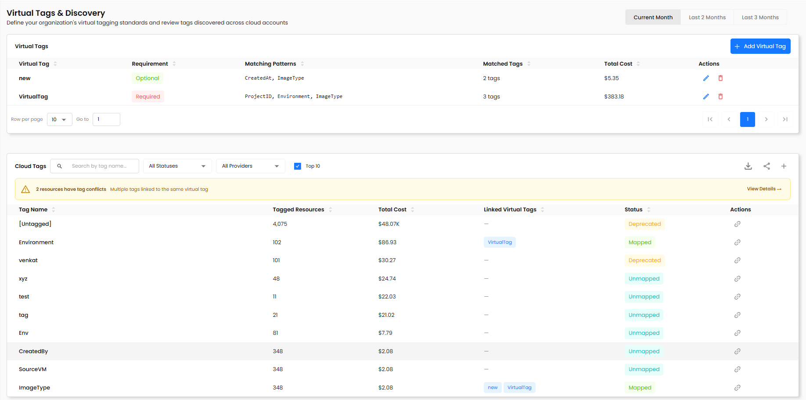
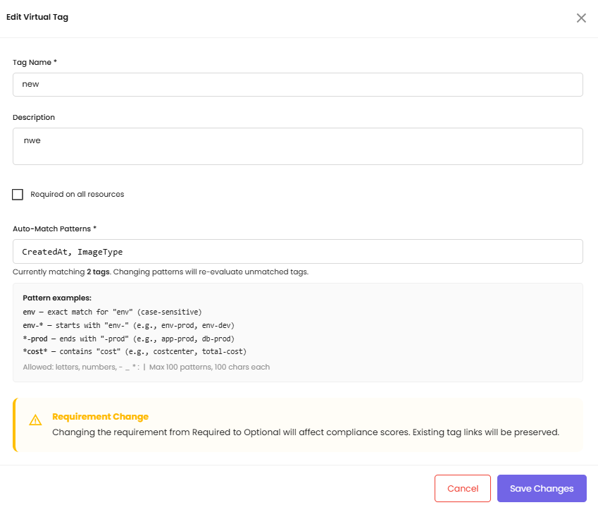
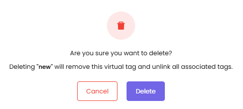
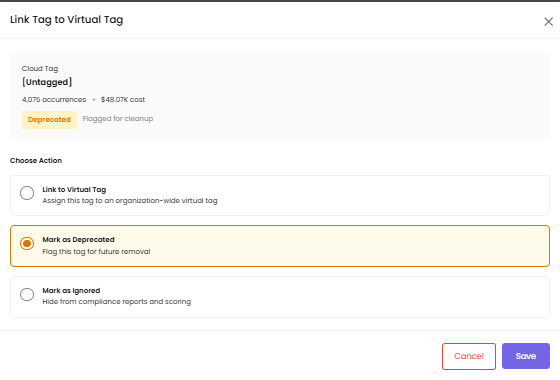
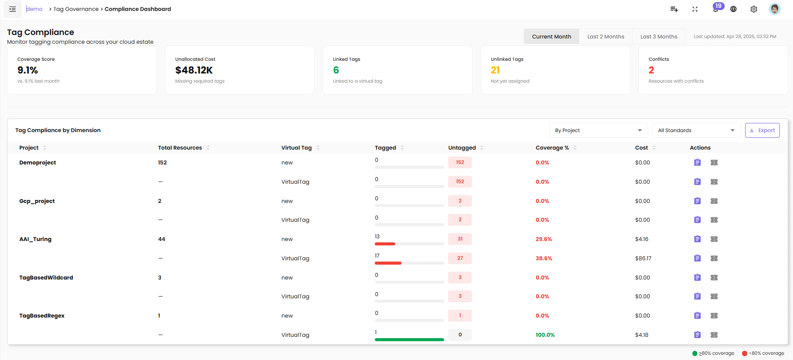

# Tag Governance

## Overview

Cloud resources accumulate tags differently across every team, every provider, and every account — "environment", "env", "ENV", and "Env" all mean the same thing but count as four separate tags. Without a unified standard, cost attribution becomes guesswork and compliance is invisible.

CloudPi Tag Governance solves this with two capabilities working together:

- **Virtual Tags & Discovery** — define org-wide standard tag keys (virtual tags), automatically discover every tag that exists across your cloud estate, and link real cloud tags to your standards
- **Compliance Dashboard** — see at a glance how well each project follows those standards, with KPI cards, trend indicators, and a per-project breakdown you can export or action directly

**Tag Governance today is read-only:** you define standards, link tags, and measure compliance. Automatically rewriting or pushing tags back to cloud providers is on our roadmap and not part of the current release.

```text
Sidebar → Tag Governance
              ├── Virtual Tags & Discovery   — define standards + link tags
              └── Compliance Dashboard       — measure and report
```



## Who Is This For?

| Role | Access | Primary Use |
|------|--------|-------------|
| **Workspace Admin** (WS Admin) | Full management | Create/edit/delete virtual tags; link tags at org level; view org-wide compliance |
| **Workspace User** (WS User) | Link + view (project group) | Link discovered tags within their project group; view project group compliance |
| **Project Admin** (Proj Admin) | Link + view (project) | Link discovered tags for their projects; view project-level compliance |
| **Project User / Viewer** | View only (project) | View discovered tags and compliance for their assigned projects |

The short forms (WS Admin, WS User, Proj Admin) are used in the rest of this guide.

!!! warning "CP Admin has no access"
    The CP Admin role (platform-level admin) is intentionally excluded from Tag Governance per separation-of-duties policy — CP Admin does not access customer data.

What each user sees is scoped to their access:

- WS Admin sees tags and compliance across the entire organization
- WS User sees tags and compliance for resources in their assigned project group(s)
- Proj Admin, Proj User, and Viewer see tags and compliance only for their assigned project(s)

## Before You Begin

- [ ] Your workspace has at least one cloud project with billing data already syncing into CloudPi
- [ ] Your cloud billing data feeds into CloudPi normally (tag discovery reads from this same data — no separate integration required)
- [ ] You know which tags your organization intends to standardize (e.g., "Environment", "Owner", "CostCenter")
- [ ] You have WS Admin access if you need to create or edit virtual tags

!!! note "Discovery is automatic — no sync button needed"
    Tag discovery reads from your existing billing data when you visit the Virtual Tags & Discovery page. There is no background sync job to configure and no "Sync Now" button to press.

## Feature Overview

Tag Governance works in three stages:

| Stage | Where | Who can act |
|-------|-------|-------------|
| **1. Define** virtual tags (the standard keys) | Virtual Tags & Discovery → Virtual Tags table | WS Admin only |
| **2. Link** cloud tags to virtual tags | Virtual Tags & Discovery → Cloud Tags table | All roles with write access |
| **3. Measure** compliance and act on gaps | Compliance Dashboard | All roles, scoped to their projects |

A time-range toggle in the top-right corner of both pages (**Current Month / Last 2 Months / Last 3 Months**) controls the period that tag occurrence counts and total costs are calculated against.

### How Auto-Matching Works

When you create a virtual tag and give it one or more **Auto-Match Patterns**, CloudPi immediately evaluates all cloud tags and links any that match.

Patterns use a simple wildcard syntax with `*`:

| Pattern | Matches |
|---------|---------|
| `env` | Exact match for "env" (case-sensitive) |
| `env-*` | Anything starting with "env-" (e.g., `env-prod`, `env-dev`) |
| `*-prod` | Anything ending with "-prod" (e.g., `app-prod`, `db-prod`) |
| `*cost*` | Anything containing "cost" (e.g., `costcenter`, `total-cost`) |

You can enter multiple patterns separated by commas. Allowed characters: letters, numbers, `-`, `_`, `*`, `:`, `|`. Maximum 100 patterns per virtual tag, 100 characters each.

You can always override an auto-link or manually link tags that don't match any pattern.

### How Coverage Is Calculated

In plain English: **the percentage of your resources that have all your required virtual tags filled in.**

A resource counts as **tagged** for a virtual tag if it has *any* cloud tag linked to that virtual tag. The coverage score only considers **required** virtual tags:

```text
Coverage Score = (tagged resources across all required virtual tags)
                 ───────────────────────────────────────────────────── × 100
                 (total resources × count of required virtual tags)
```

Optional virtual tags are tracked but do not affect the coverage score.

## Step-by-Step Guides

### Guide 1: Define a Virtual Tag (Standard Key)

**Goal:** Create an org-wide standard tag key that cloud tags can be linked to.

*Requires: WS Admin*

1. Navigate to **Tag Governance → Virtual Tags & Discovery**.
2. In the **Virtual Tags** section at the top of the page, click **+ Add Virtual Tag**.
3. Fill in the form:

   | Field | Description | Example |
   |-------|-------------|---------|
   | **Tag Name** | The standard name for this tag — unique within your org (case-insensitive) | `Environment` |
   | **Description** | Plain-language purpose of this tag | `Deployment environment (prod, dev, staging)` |
   | **Required on all resources** | Check if missing this tag should reduce the compliance score; uncheck for an optional tag | Checked (Required) |
   | **Auto-Match Patterns** | One or more wildcard patterns; tags that match are automatically linked | `env, environment, ENV` |

4. Click **Save**.

   The system immediately evaluates all existing cloud tags against the new patterns and links any matches. The **Matched Tags** count and **Total Cost** in the virtual tags table reflect the number of cloud tags linked and their billed cost.

!!! note "No patterns? No auto-linking."
    If you leave Auto-Match Patterns blank, no auto-linking occurs. Tags must be linked manually via the Cloud Tags table (Guide 3).

<!-- SCREENSHOT: tag-governance-add-tag.png — Add Virtual Tag dialog showing Tag Name, Description, Required on all resources checkbox, and Auto-Match Patterns fields -->

**What you see after saving:**

- The virtual tag appears in the **Virtual Tags** table with its Requirement (Required / Optional), Matching Patterns, Matched Tags count, and Total Cost
- Use the row-per-page selector at the bottom of the table to control how many virtual tags are shown at once

### Guide 2: Edit or Delete a Virtual Tag

**Goal:** Update a virtual tag's definition, or remove one that is no longer needed.

*Requires: WS Admin*

**To edit:**

1. In the Virtual Tags table, click the edit icon on the row you want to change.
2. Update any fields (name, description, **Required on all resources** checkbox, or Auto-Match Patterns).
3. Click **Save Changes**.

   - Existing tag links remain intact after editing
   - If you update the patterns, CloudPi immediately re-evaluates all unlinked tags and auto-links any new matches
   - Toggling "Required on all resources" on or off changes the tag from Required to Optional (or vice versa) and updates compliance calculations on the next dashboard load
   - Renaming a virtual tag updates the "Linked Virtual Tags" column everywhere the old name appeared

   The dialog shows a **Currently matching N tags** line that updates as you adjust the patterns, and a Requirement Change warning if you toggle the requirement off.



**To delete:**

1. Click the delete icon on the virtual tag row.
2. A confirmation dialog appears explaining that deleting the tag will unlink all associated cloud tags.
3. Click **Delete** to confirm. All linked cloud tags revert to **Unmapped** status.



!!! warning "Deletion cannot be undone"
    Deleting a virtual tag removes all associated tag links. You will need to re-link the affected cloud tags to another virtual tag.

### Guide 3: Discover and Link Cloud Tags

**Goal:** View all tags that exist across your cloud resources and link them to your virtual tags.

1. Navigate to **Tag Governance → Virtual Tags & Discovery**.
2. Scroll down to the **Cloud Tags** section.
3. The table shows every tag key discovered in your cloud billing data:

   | Column | Description |
   |--------|-------------|
   | **Tag Name** | The actual tag key found in cloud resources |
   | **Tagged Resources** | Number of resources using this tag key |
   | **Total Cost** | Billed cost attributed to resources with this tag |
   | **Linked Virtual Tags** | The virtual tag(s) this tag is linked to (if any) |
   | **Status** | Mapped / Unmapped / Deprecated / Ignored (see Behavior Reference below) |
   | **Actions** | Link icon to open the Link Tag to Virtual Tag modal |

4. Use the **search bar** to filter by tag name, the **All Statuses** dropdown to filter by status, the **All Providers** dropdown to filter by cloud (AWS / Azure / GCP), or the **Top 10** toggle to focus on the highest-occurrence tags.

   !!! note "Top 10 is applied after other filters"
       If you search for "env" and then toggle Top 10, you see the 10 highest-occurrence tags that contain "env" — not the top 10 across all tags.

**To link a cloud tag:**

1. Click the **Link icon** in the **Actions** column for the tag you want to link.
2. The **Link Tag to Virtual Tag** modal opens, showing the cloud tag's name, occurrence count, total cost, and current status.
3. Choose an action:
   - **Link to Virtual Tag** — assign this tag to an organization-wide virtual tag; status becomes **Mapped** and the "Linked Virtual Tags" column shows the virtual tag name
   - **Mark as Deprecated** — flag this tag for future removal; status becomes **Deprecated**
   - **Mark as Ignored** — hide from compliance reports and scoring; status becomes **Ignored**
4. Click **Save**.



!!! note "Manual links take precedence over auto-matching"
    If a tag was auto-linked to "Environment" but you manually link it to a different virtual tag, your manual assignment overrides the auto-match and will not be changed by future auto-match runs.

**System tags** (e.g., `aws:createdBy`, `microsoft.*`) appear in the table like any other tag. You can link or ignore them like any other tag. Marking them **Ignored** excludes them from compliance calculations.

**Empty state:** If no virtual tags have been defined yet, the "Linked Virtual Tags" column shows "—" with a link to create your first virtual tag. The Cloud Tags table is still fully functional without virtual tags defined.

### Guide 4: Resolve a Tag Conflict

**Goal:** Identify and address resources that have multiple cloud tags linked to the same virtual tag.

A conflict occurs when a single resource has both "env" and "environment" tags — and both are linked to the "Environment" virtual tag. CloudPi counts the resource as tagged, but redundant tags can cause reporting confusion.

1. Navigate to **Tag Governance → Virtual Tags & Discovery**.
2. If conflicts exist, a yellow **warning panel** appears above the Cloud Tags table showing the number of affected resources, e.g., *"2 resources have tag conflicts — Multiple tags linked to the same virtual tag"*.
3. Click **View Details →** on the warning panel to expand the conflict detail.
4. Decide how to resolve each conflict:
   - Re-link one of the conflicting cloud tags to a different virtual tag
   - Mark one of the tags as **Deprecated** to flag it for future cleanup
   - Leave both linked — the resource still counts as tagged; the conflict is informational only in Phase 1

!!! note "No conflicts? No warning panel."
    The conflict warning panel is hidden when there are no detected conflicts.

### Guide 5: Review the Compliance Dashboard

**Goal:** See high-level tagging compliance KPIs and identify which projects need attention.

1. Navigate to **Tag Governance → Compliance Dashboard**.
2. The page loads five **KPI cards** at the top:

   | Card | What it shows |
   |------|---------------|
   | **Coverage Score** | Percentage of resources fully tagged against all required virtual tags, with month-over-month comparison (e.g., *vs. 9.1% last month*) |
   | **Unallocated Cost** | Total billed cost this month for resources missing at least one required tag |
   | **Linked Tags** | Count of cloud tags currently linked to a virtual tag |
   | **Unlinked Tags** | Count of cloud tags not yet assigned to any virtual tag |
   | **Conflicts** | Count of resources that have multiple tags linked to the same virtual tag |

3. A **"Last updated"** timestamp in the top-right shows when compliance data was last calculated. The time-range toggle (**Current Month / Last 2 Months / Last 3 Months**) changes the period the metrics are calculated against.



### Guide 6: Analyze Compliance by Project

**Goal:** See per-project, per-tag compliance detail and create tasks or tickets for non-compliant projects.

1. On the Compliance Dashboard, scroll to the **Tag Compliance by Dimension** table.
2. Use the **By Project** dropdown (top right of the table) to switch the grouping. The default groups by project; you can also filter by **All Standards** to narrow to specific virtual tags.
3. Each row in the grouped table shows:

   | Column | Description |
   |--------|-------------|
   | **Project** | Bold for the first row of a project; subsequent virtual tag rows for the same project show "—" in this column |
   | **Total Resources** | Resource count in the project (shown only on the first row of each project) |
   | **Virtual Tag** | The required virtual tag being measured for this row |
   | **Tagged** | Tagged resource count with a progress bar |
   | **Untagged** | Untagged resource count badge |
   | **Coverage %** | Compliance percentage for this virtual tag within this project |
   | **Cost** | Billed cost for this dimension |
   | **Actions** | Create Task / Raise Ticket icons |

4. Coverage indicators on each row:
   - 🟢 Green **≥80%** coverage
   - 🔴 Red **<80%** coverage

5. Click **Export** (top right of the table) to download the current view as a CSV.

**To create a task for a non-compliant project:**

1. Click the **Create Task** icon (clipboard) on the project row.
2. The Create Task drawer opens pre-filled with: project name, project owner, and a description listing which required tags are missing and their coverage percentages.
3. Review and submit.

**To raise a support ticket:**

1. Click the **Raise Ticket** icon (ticket) on the project row.
2. The Raise Ticket drawer opens with the same pre-filled compliance context.

!!! note "Action icons are role-restricted"
    Create Task and Raise Ticket icons appear only for roles with write access (WS Admin, WS User, Proj Admin). Proj User and Viewer see read-only rows.

### Guide 7: Export Compliance Data to CSV

**Goal:** Download a copy of the compliance dimension table for offline analysis or reporting.

1. Navigate to **Tag Governance → Compliance Dashboard**.
2. Adjust the dimension grouping and any filters you need — the export reflects your current view.
3. Click **Export** (top right of the Tag Compliance by Dimension table).
4. The server generates the file and downloads it to your browser. All columns visible in the table are included.

!!! note "Export limit: 10,000 rows"
    If your dataset exceeds 10,000 rows, apply filters before exporting to narrow the scope. All CSV export actions are recorded in the audit log (timestamp, user identity, filter criteria, row count).

## Behavior Reference

### Tag Status Values

| Status | Meaning |
|--------|---------|
| **Mapped** | The cloud tag is linked to a virtual tag (either via auto-match or manual assignment) |
| **Unmapped** | The cloud tag exists in your billing data but is not yet linked to any virtual tag |
| **Deprecated** | The cloud tag is flagged as a legacy key for future cleanup; informational only in Phase 1 |
| **Ignored** | The cloud tag is intentionally excluded from compliance calculations |

### Permission Quick Reference

| Action | WS Admin | WS User | Proj Admin | Proj User | Viewer |
|--------|:--------:|:-------:|:----------:|:---------:|:------:|
| Create / Edit / Delete virtual tags | ✓ | ✗ | ✗ | ✗ | ✗ |
| View virtual tags | ✓ | ✓ | ✓ | ✓ | ✓ |
| Link tags (org-wide) | ✓ | ✗ | ✗ | ✗ | ✗ |
| Link tags (project group scope) | ✓ | ✓ | ✗ | ✗ | ✗ |
| Link tags (project scope) | ✓ | ✓ | ✓ | ✗ | ✗ |
| Mark Deprecated / Ignored | ✓ | ✓ (group) | ✓ (project) | ✗ | ✗ |
| View compliance | ✓ (org) | ✓ (group) | ✓ (project) | ✓ (project) | ✓ (project) |
| Export compliance CSV | ✓ | ✓ | ✓ | ✗ | ✗ |

*"(group)" and "(project)" mean the user has permission, but only within their assigned project group or project. They do not see other groups or projects.*

### Auto-Match Trigger Rules

| Event | What happens |
|-------|-------------|
| Virtual tag created with patterns | Immediately evaluates all unmapped cloud tags; auto-links any matches |
| Virtual tag patterns edited | Re-evaluates all unmapped cloud tags; auto-links any new matches; existing manual links unchanged |
| Virtual tag deleted | All cloud tags linked to that virtual tag revert to Unmapped |
| Tag manually linked | The user assignment persists; future auto-matching does not override it |
| Two patterns overlap on the same tag | The cloud tag links to the virtual tag created **first** (earliest creation date); a user can manually override |

### Coverage Score Formula

In plain English: the percentage of your resources that have all required virtual tags filled in.

```text
Coverage Score = (sum of tagged resources across all required virtual tags)
                 ───────────────────────────────────────────────────────── × 100
                 (total resources × number of required virtual tags)
```

- A resource is **tagged** for a virtual tag if it has any cloud tag with **Mapped** status linked to it
- Resources with no resource ID (e.g., AWS support charges) are excluded from resource counts but included in cost totals
- Optional virtual tags have no effect on the coverage score

## Troubleshooting & FAQs

### My virtual tag is not auto-linking any cloud tags

**Cause:** No cloud tags currently match any of the patterns, or there are no Unmapped tags in your scope.

**Fix:**

1. Test your patterns against your known tag keys. Patterns are case-sensitive — `env` does not match "Env" or "ENV". Use a comma-separated list to cover variations: `env, ENV, Env`.
2. In the Cloud Tags table, filter by **Status: Unmapped** to confirm there are tags available to be linked. If all tags are already Mapped to other virtual tags, auto-matching will not override them.
3. If tags are present in your cloud accounts but not appearing in the Cloud Tags table, ask your CloudPi administrator to confirm that billing data is currently syncing for the affected accounts.

### A tag is Mapped when I expected it to be Unmapped

**Cause:** A previously created virtual tag has a pattern that matched this tag key.

**Fix:** Click the link icon on the cloud tag row and either re-link it to the correct virtual tag or mark it as Deprecated/Ignored. Your manual assignment takes permanent precedence and will not be overridden by future auto-match runs.

### A tag I know exists is not in the Cloud Tags table

**Cause:** The Cloud Tags table reads from billing data. Tags attached to resources that have not appeared in a billing line item yet will not be discovered.

**Fix:** Wait for the next billing data refresh. If the tag is critical, ask your CloudPi administrator to confirm that billing data is currently syncing for the affected account.

### The Coverage Score seems lower than expected

**Cause:** Coverage only counts resources that have a Mapped cloud tag linked to a required virtual tag. Tags with Unmapped, Deprecated, or Ignored status do not count toward coverage.

**Fix:**

1. Check the **Unlinked Tags** KPI card — a high count means many cloud tags are not yet linked.
2. Navigate to **Virtual Tags & Discovery** and link Unmapped tags to the appropriate virtual tag.
3. Compliance metrics are refreshed on the next calculation cycle (typically within 24 hours of billing data changes).

### A Deprecated tag is still showing in the table

**Cause:** Deprecated status means the tag is flagged for cleanup but remains visible in the table. It is not deleted.

**Fix:** If you want to fully exclude the tag from compliance calculations, change its status to **Ignored** via the Link Tag to Virtual Tag modal. The tag will remain visible in the Cloud Tags table but will no longer affect compliance scores.

### Two admins linked the same tag at the same time

**Cause:** Concurrent edits are handled with last-write-wins — the most recent save overwrites the earlier one.

**Fix:** Refresh the page to see the current state. If the wrong link is now active, re-link the tag to the correct virtual tag. Both operations are recorded in the audit log so you can trace what happened and when.

### Action icons are missing on the compliance table

**Cause:** Action icons only appear for roles with write access (WS Admin, WS User, Proj Admin). Proj User and Viewer roles do not have write access.

**Fix:** If your role should have write access, contact your workspace administrator to request a role elevation.

## Release & Security Notes

**Organization isolation:** All tag governance data — virtual tags, links, and compliance snapshots — is scoped to your organization. Other organizations using CloudPi cannot see your tags, links, or compliance metrics.

**Role-based data scoping:** Discovery and compliance data are scoped by role (org / project group / project). A Proj User cannot see discovery data outside their assigned projects, even if they know the tag key names.

**Tag links are org-wide:** When a WS User or Proj Admin links a cloud tag to a virtual tag, that link applies across the entire organization — not just their project scope. Role scoping controls which tags you can *see* and *initiate* linking for, but the resulting link is global once saved.

**Audit trail (SOC 2):** Every write operation on virtual tags and tag links is logged with timestamp, user identity, action type, entity, and before/after values. Audit logs are append-only and retained for a minimum of 1 year. CSV export actions are also logged with filter criteria and row count.

**Input validation:** Virtual tag names and Auto-Match Patterns are validated server-side before saving. Invalid characters are rejected with a clear error message before any data is stored.

## Glossary

| Term | Definition |
|------|------------|
| **Virtual Tag** | An org-wide standard tag key defined in CloudPi (e.g., "Environment", "Owner", "CostCenter") |
| **Cloud Tag** | A tag key found in actual cloud resource billing data (AWS, Azure, or GCP) |
| **Auto-Match Pattern** | A wildcard pattern on a virtual tag that auto-links cloud tag keys matching the pattern |
| **Mapped** | A cloud tag is currently linked to a virtual tag (either via auto-match or manual assignment) |
| **Unmapped** | A cloud tag is discovered but not yet linked to any virtual tag |
| **Deprecated** | A cloud tag flagged as a legacy key — visible but informational only |
| **Ignored** | A cloud tag intentionally excluded from compliance calculations |
| **Coverage Score** | `(tagged resources across all required virtual tags) / (total resources × required tag count) × 100` |
| **Unallocated Cost** | Billed cost this month from resources missing at least one required tag |
| **Conflict** | A resource with two or more cloud tags both linked to the same virtual tag |
| **Required** | A virtual tag flagged as required; missing it reduces the coverage score |
| **Optional** | A virtual tag that is tracked but does not affect the coverage score |

## Related Documentation

- [Cost Assignment](CostAssignment.md) — Assign cloud costs to projects using rules
- [VM Scheduler](AutomationVMScheduler.md) — Automate VM power management with schedules
- [Tag Management](TagManagement.md) — Apply, edit, and review tags on individual resources
