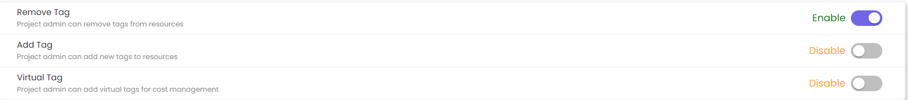

# Tag Management

Tag Management is one of the features offered by CloudPi. It allows you to add labels to your cloud resources/services data, making it easier to organize and manage them effectively.

---

## Why Tagging is Important?

Tagging is an important activity as it brings integrity and dimension to your cloud resources/services data. It helps you:

**Organize** - Group similar resources together for easy identification and management

**Track Costs** - Monitor expenses associated with specific projects or departments

**Control Access** - Set permissions and access levels based on resource tags

**Optimize Usage** - Identify underutilized or unused resources for potential cost savings

---

## Tag Management Key Features

The Tag Management module in CloudPi allows users to select tags and view how many resources are tagged or untagged with the selected tags. This helps identify resources that are missing required tags across multiple projects. If there are untagged resources, you can create a ticket or task to resolve the tagging issues.

---

## Steps to Use Tag Management

### 1. Select Projects

At the top-right corner, choose one or more projects from the dropdown list. This determines the resources for which tag rules will be applied.

---

### 2. Add Tag Rules

You can create and manage different types of tags by selecting the **Add** button under each category:

**Mandatory Tags** - Tags that must be applied to every resource

**Conditional Tags** - Tags applied only when certain conditions are met

**Optional Tags** - Tags that are not required but help in better categorization

**Automation Tags** - Tags used for automating workflows and actions within CloudPi

---

### 3. Apply Tag Rules

After adding the desired tag rules, click **Apply** to view a list of resources that do not comply with the selected tagging policy.

---

### 4. View Tag Violations

The Tag Violations panel displays all resources missing the required tags. This helps identify non-compliant resources across the selected projects.

---

### 5. Take Action on Violations

From the Tag Violations section, you can choose to **Raise a Ticket** or **Create a Task** to resolve missing or incorrect tags.

---

## Tag Types

### 1. Auto Tag

Project Name will be automatically displayed. Enter details for tags such as "Department". System suggests tags based on predefined rules or previous tagging patterns.

**Benefits of Auto Tagging:**

**Consistency** - Ensures consistency across resources

**Error Reduction** - Reduces manual errors

**Speed** - Speeds up the tagging process

**Inheritance** - Automatically inherits project-level tags

---

### 2. Conditional Tags

Conditional tags are applied based on specific conditions. These tags help maintain logical relationships between tag values.

For example, if one tag has a particular value, another related tag must also be present.

**Use Cases:**

**Compliance Enforcement** - If Environment=Production, then Backup=Enabled must be present

**Cost Allocation** - If Department=Engineering, then CostCenter must be specified

**Security Policy** - If DataClassification=Sensitive, then Encryption=Required must be applied

---

### 3. Optional Tags

Optional tags are recommended but not strictly enforced. These tags are useful for improving resource traceability, cost management, and reporting accuracy. While missing optional tags do not cause compliance violations, adding them helps in better organizing cloud resources.

**Common Optional Tags:**

**Owner** - Resource owner or responsible team

**Application** - Application name or identifier

**Version** - Software or configuration version

**CreatedBy** - User or system that created the resource

**LastModified** - Timestamp of last modification

---

### 4. Automation Tags

Automation tags are used to identify and manage resources that are controlled or monitored by automation tools. These tags help in tracking, scheduling, and managing automated workflows across cloud environments.

**Automation Tag Examples:**

**AutoShutdown** - Indicates resources eligible for automated shutdown (e.g., AutoShutdown=Weekends)

**BackupSchedule** - Defines backup frequency (e.g., BackupSchedule=Daily)

**ScalingPolicy** - Specifies auto-scaling behavior (e.g., ScalingPolicy=Enabled)

**MonitoringLevel** - Sets monitoring granularity (e.g., MonitoringLevel=Detailed)

**PatchGroup** - Groups resources for patching schedules (e.g., PatchGroup=WeekendPatch)

---

## Managing Tag Violations

### Identifying Non-Compliant Resources

**Tag Violations Dashboard:**

**Total Violations** - Count of resources missing required tags

**Violation Type** - Mandatory, Conditional, or Automation tag violations

**Resource Details** - Resource ID, Type, Provider, Project

**Missing Tags** - List of tags that need to be applied

### Resolving Violations

**Option 1: Raise a Ticket**

1. Select the non-compliant resources
2. Click **Raise a Ticket**
3. Ticket is created in integrated workflow tool (Azure DevOps)
4. Assign to resource owner for resolution

**Option 2: Create a Task**

1. Select the non-compliant resources
2. Click **Create a Task**
3. Assign task to team member
4. Track resolution progress

**Option 3: Apply Tags Directly**

1. Select the non-compliant resources
2. Click **Apply Tag**
3. Add the missing tags
4. Violations are automatically resolved

---

