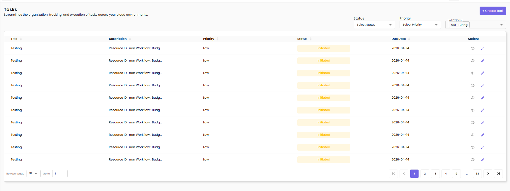

# Task Management

Streamlines the organization, tracking, and execution of tasks across your cloud environments.

---

## Overview

The Task Management feature provides a centralized platform for:

- Creating and assigning tasks to team members
- Tracking task progress and status
- Setting priorities and due dates
- Collaborating through task discussions
- Monitoring task completion metrics

---

## Accessing Task Management

1. Navigate to **Tasks** from the main menu
2. View the list of all tasks with their current status

---

## Task List View

The task list displays all tasks with the following details:

- **Title** – Name/description of the task
- **Description** – Brief summary of what needs to be done
- **Priority** – Urgency level (High, Medium, Low)
- **Status** – Current state (Initiated, In Progress, Completed, Closed)
- **Actions** – View, Edit, Delete options

---

## Task Filtering

Use filters at the top of the page to find specific tasks:

- **Select Status** – Filter by task status (Initiated, In Progress, Completed)
- **Select Priority** – Filter by priority level (High, Medium, Low)
- **Project Filter** – Filter tasks by associated project

---

## Creating a New Task

To create a new task, click the **+ Create Task** button.

- **Title** – Enter a clear, concise task name
- **Description** – Provide detailed task description
- **Project** – Select the associated project from dropdown
- **Assign to** – Choose the team member responsible for the task
- **Priority** – Select urgency level (Low, Medium, High)
- **Due date** – Set the target completion date (MM/DD/YYYY format)

Click **Save** to create the task.

---

## Viewing Task Details

Click on a task row to expand and view comprehensive information:

**Task Details Tab:**

- **Title** – The task name
- **Status** – Current task status
- **Description** – Full task description
- **Due Date** – Deadline for completion

**Discussion Details Tab:**

View comments, updates, and collaboration history for the task.

---

## Editing a Task

Click the edit icon or select a task to modify:

- **Title** – Update the task name
- **Description** – Modify task details
- **Priority** – Change priority level (Low, Medium, High)
- **Due date** – Adjust the deadline
- **Update discussion** – Add notes about changes or progress
- **Status** – Update task status (Initiated, In Progress, Completed)

Click **Update** to save changes or **Cancel** to discard.

---

## Task Status Workflow

Tasks progress through the following statuses:

- **Initiated** – Newly created task, not yet started
- **In Progress** – Task is actively being worked on
- **Completed** – Task finished and ready for review
- **Closed** – Task archived after completion

---

## Task Priorities

- **High Priority** – Urgent tasks requiring immediate attention
- **Medium Priority** – Important tasks with reasonable deadlines
- **Low Priority** – Tasks that can be completed when time allows

---

## Task Discussions and Comments

**Adding Comments:**

1. Open the task details panel
2. Navigate to the **Discussion Details** tab
3. Type your comments or updates
4. Use **@mentions** to notify specific team members
5. Click **Post** to add the comment

**Discussion Features:**

- Collaborate with team members through comments
- Track updates and progress notes
- View complete conversation history
- Timestamp for each comment

---

## Task Notifications

Users receive notifications for:

- **Task Assignment** – When assigned a new task
- **Status Changes** – When task status is updated
- **@Mentions** – When mentioned in task comments
- **Due Date Reminders** – 24 hours before due date
- **Overdue Alerts** – When tasks pass their due date
- **Task Updates** – When task details are modified

Notifications are sent via:
- In-app notifications (bell icon)
- Email notifications (if enabled)

---

