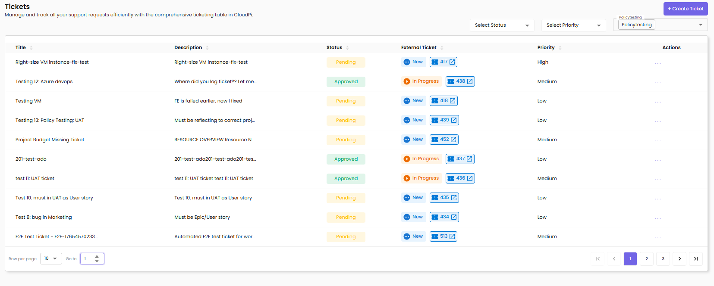
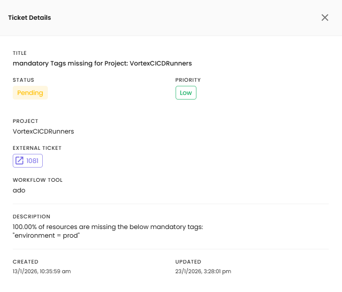

# Ticketing

Manage and track all your support requests efficiently with the comprehensive ticketing table in CloudPi.

---

## Overview

The Ticketing feature allows teams to:

- Create tickets for cost optimization activities
- Track incidents and service requests
- Integrate with Azure DevOps for work item management
- Monitor ticket resolution progress
- Analyze ticket metrics and trends

---

## Accessing Ticketing

1. Navigate to **Tickets** from the main menu
2. View the list of all tickets with their current status

---

## Ticket List View

The ticket list displays all tickets with the following details:

- **Title** – Brief description of the issue or request
- **Description** – Detailed ticket information
- **Status** – Current state (Pending, Approved, New, In Progress)
- **External Ticket** – Link to the external work item (with Azure DevOps icon and ticket number)
- **Priority** – Urgency level (High, Medium, Low)
- **Actions** – View, Edit, Delete options

---

## Ticket Filtering

Use filters at the top of the page to find specific tickets:

- **Select Status** – Filter by ticket status (Pending, Approved, New, In Progress)
- **Select Priority** – Filter by priority level (High, Medium, Low)
- **Project Filter** – Filter tickets by associated project (e.g., Policytesting)

---

## Creating a New Ticket

To create a new ticket, click the **+ Create Ticket** button.

- **Provider** – The integrated workflow tool (e.g., Azure DevOps)
- **Title** – Enter a clear, concise issue summary
- **Description** – Provide detailed issue description
- **Priority** – Select urgency level (Low, Medium, High)
- **Project** – Select the associated project from dropdown

Click **Create Ticket** to submit.

---

## Viewing Ticket Details

Click the view icon in the Actions column to see comprehensive ticket information:

**Ticket Details Panel includes:**

- **Title** – The ticket subject
- **Status** – Current ticket status (e.g., Pending)
- **Priority** – Urgency level badge (e.g., High in red badge)
- **Project** – Associated project name
- **External Ticket** – Link to external work item with ticket number
- **Workflow Tool** – The integrated system (e.g., ado for Azure DevOps)
- **Description** – Full ticket description
- **Created** – Timestamp when ticket was created (e.g., 12/2/2025, 4:44:32 PM)
- **Updated** – Timestamp of last update (e.g., 1/6/2026, 3:58:04 PM)

---

## Ticket Status

- **New** – Freshly created ticket (blue badge with "New" label)
- **Pending** – Awaiting action or review (yellow badge)
- **Approved** – Ticket has been approved (green badge)
- **In Progress** – Actively being worked on (orange badge)

---

## Ticket Priority Levels

- **High Priority** – Critical issues requiring immediate attention (red badge)
- **Medium Priority** – Important issues with reasonable timelines
- **Low Priority** – Non-urgent issues that can be addressed later

---

## Azure DevOps Integration

When a ticket is created in CloudPi:

1. CloudPi creates a corresponding work item in Azure DevOps
2. The External Ticket column displays the Azure DevOps icon with the work item number (e.g., 417, 438, 418)
3. Click the external ticket link to open the work item in Azure DevOps
4. Status updates are synchronized between CloudPi and Azure DevOps

**Required Setup:**
- Azure DevOps integration configured in Admin Settings
- Project mapping established
- API credentials configured

For detailed integration setup, see [Integration](Integrations.md).

---

## Editing Tickets

Click the edit icon in the Actions column to modify ticket details:

**Editable Fields:**
- Title
- Description
- Priority
- Status

**Non-Editable Fields:**
- Provider (set during creation)
- Project (set during creation)
- External Ticket (managed by integration)

Click **Update** to save changes.

---

## Deleting Tickets

Click the delete icon in the Actions column to remove a ticket:

1. A confirmation dialog will appear
2. Confirm the deletion to permanently remove the ticket
3. Note: Deleting a ticket in CloudPi does not delete the external work item in Azure DevOps

---

