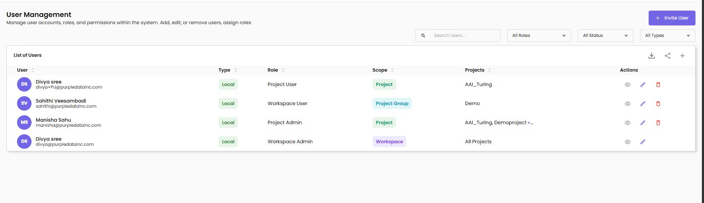
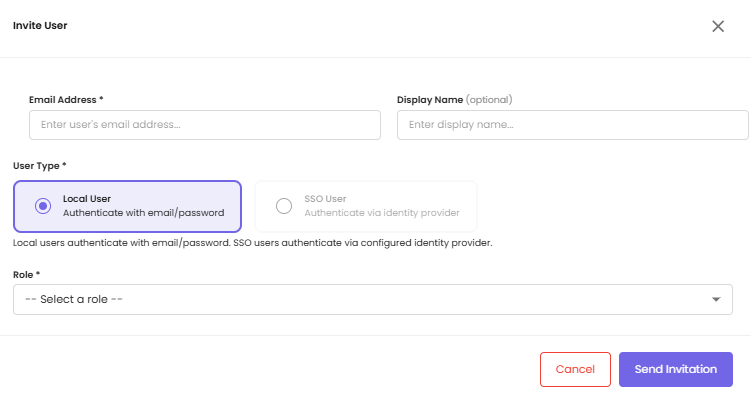
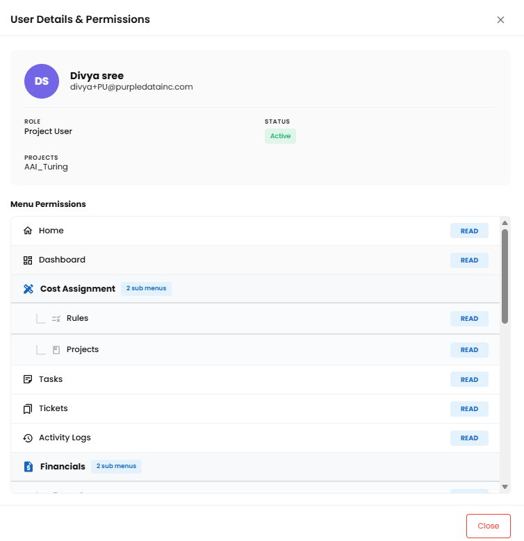
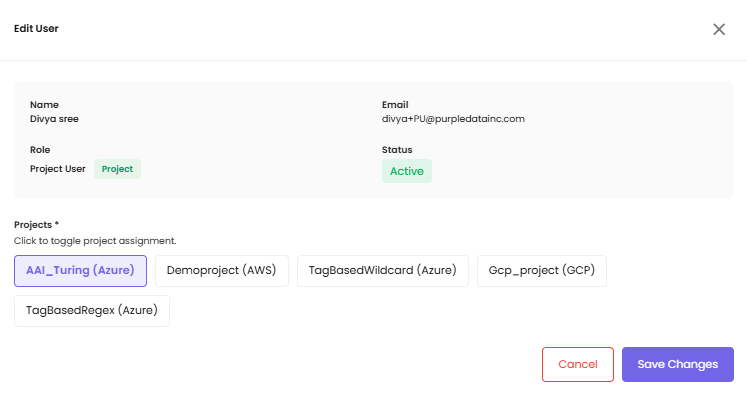
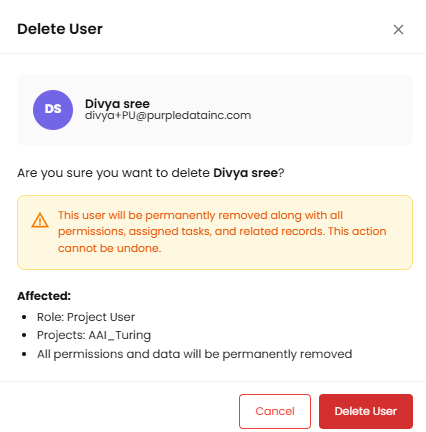

# User Management

The User Management page is where administrators handle the **lifecycle of users** in CloudPi: inviting them, activating their accounts, adjusting their access, and removing them when they no longer need access. This page focuses on the user lifecycle. For the definitions of each role and what each role can do, see [Role-Based Access Control (RBAC)](rbac.md).

## Accessing User Management

1. Navigate to **Admin Settings → User Management**.
2. The User Management page lists every user you have permission to see.

The list shows the following columns:

| Column | Description |
|--------|-------------|
| **User** | Display name and email |
| **Type** | Authentication type — Local or SSO |
| **Role** | The user's CloudPi role |
| **Scope** | Workspace, Project Group, or Project — based on the role |
| **Projects** | Specific projects (or *All Projects* for workspace-scoped users) |
| **Actions** | View, Edit, and Delete icons (visible based on your own role and the target user — see [Editing User Permissions](#editing-user-permissions)) |

!!! note "What you see depends on your role"
    Workspace Administrators see every user in the workspace. Project Administrators only see users with access to their assigned projects, so the list is shorter. The product applies role-based filtering automatically — see [What Each Role Sees](rbac.md#what-each-role-sees) in the RBAC documentation for examples.

### Search and filter

- Use the **Search Users** field to find a user by name or email
- Use the **All Roles** dropdown to filter by role
- Use the **All Status** dropdown to filter by user status (Active, Pending, Deactivated)
- Use the **All Types** dropdown to filter by authentication type (Local or SSO)

## User Lifecycle

A user moves through four stages from invitation to removal:

**Invite** → **Activate** → **Edit** → **Remove**

| # | Stage | Status code | Triggered by |
|---|-------|-------------|--------------|
| 1 | **Invite** — user has been invited but has not yet accepted | PEND (Pending) | Workspace Administrator clicks **+ Invite User** |
| 2 | **Activate** — user has accepted the invitation and can sign in | APRV (Active) | User clicks the validation link in the invitation email |
| 3 | **Edit** — an authorized user adjusts the user's project or project group access (without changing their role) | APRV (Active) | An authorized user edits the assignments and clicks **Update** |
| 4 | **Remove** — user is removed and access is revoked | DACT (Deactivated) | An authorized user clicks the delete icon and confirms |

## Inviting Users

Inviting a user creates a Pending account and sends an invitation email containing a validation link. The user remains Pending until they click the link.

!!! note "Who can invite users"
    Only **CloudPi Administrators** and **Workspace Administrators** can invite users. Workspace Users, Project Administrators, Project Users, and Viewers do not see the **+ Invite User** button.

To invite a user:

1. On the User Management page, click **+ Invite User** (top-right).
2. Fill in the Invite User dialog:

    | Field | Description |
    |-------|-------------|
    | **Email Address** *(required)* | The user's email address |
    | **Display Name** *(optional)* | A friendly name for the user |
    | **User Type** *(required)* | **Local User** — authenticates with email and password. **SSO User** — authenticates via your configured identity provider (see [SSO Setup](SSOSetup.md)) |
    | **Role** *(required)* | The role to assign — see [Role-Based Access Control](rbac.md) for what each role can do |

3. After you pick a Role, an additional field appears for the role's scope:

    | Role selected | Additional field |
    |---------------|------------------|
    | **Workspace Administrator** | None — full workspace access |
    | **Workspace User** | **Project Groups** — multi-select; the user can access every project in the chosen groups |
    | **Project Administrator** | **Projects** — multi-select; the user can administer the chosen projects |
    | **Project User** | **Projects** — multi-select; the user has user-level access to the chosen projects |

4. Click **Send Invitation**.

You can change a user's project group or project assignments later from the [Edit](#editing-user-permissions) action — the role itself cannot be changed without re-inviting.

### Activation (the user's side)

The invited user receives an email titled *"You've been invited to CloudPi"* (or similar). The email contains a validation link. When the user clicks the link:

- Their user status changes from **PEND** to **APRV** (Active)
- Their permission records change from **PEND** to **APRV**
- They can now sign in and access the resources scoped to their role

If the validation link expires or is lost, the inviter can resend the invitation from the User Management page.

## Viewing a User's Details

Click the **View** icon (eye) in the Actions column of any user row to open a read-only details panel for that user. The panel shows the user's email, role, scope, and the projects or project groups they currently have access to.

The View action is available to anyone who can see the user in the list. It does not modify anything — use it to confirm a user's current access before deciding whether to edit or remove them.

## Editing User Permissions

You can change which project groups or projects a user has access to *without* deleting and re-inviting them.

!!! warning "Roles cannot be changed by editing"
    The Edit form does **not** allow changing a user's role. Email and Role are shown as **read-only**. To change a user's role, remove the user and re-invite them with the new role. See [Changing a User's Role](#changing-a-users-role) below.

### Who can edit whom

Edit access is governed by both the editor's role and the target user's role:

| Target user's role | Allowed editors |
|--------------------|-----------------|
| CloudPi Administrator | **None** — non-editable |
| Workspace Administrator | **None** — non-editable |
| Workspace User | CloudPi Administrator, Workspace Administrator |
| Project Administrator | CloudPi Administrator, Workspace Administrator, Workspace User |
| Project User | CloudPi Administrator, Workspace Administrator, Workspace User |

The Edit icon (pencil) is hidden in the Actions column for any combination not allowed above. CloudPi Administrators and Workspace Administrators are intentionally non-editable because they already have full access.

### How to edit

1. In the User Management list, find the user and click the **Edit** icon (pencil) in the Actions column.
2. The Edit form expands inline below the user's row, showing:
   - **Email** — read-only
   - **Role** — read-only (e.g., *Project Administrator*)
   - For a **Workspace User**: **Project Groups** multi-select dropdown (editable)
   - For a **Project Administrator** or **Project User**: **Projects** multi-select dropdown (editable)
3. Add or remove project groups / projects as needed. Currently assigned items are pre-selected.
4. Click **Update** to save, or **Cancel** to discard changes.

!!! note "At least one assignment is required"
    A user must have at least one project group (Workspace User) or one project (Project Administrator / Project User) at all times. The form rejects an attempt to remove all assignments and shows a validation error.

## Authentication Types

CloudPi supports two authentication methods. The type is set at invitation time and determines how the user signs in.

| Type | Sign-in flow |
|------|--------------|
| **Local User** | Authenticates with email and password. Receives a verification email at invitation time and sets their password before first sign-in |
| **SSO User** | Authenticates through your organization's identity provider (e.g., Okta, Azure AD, Google Workspace). Requires SSO to be configured for your workspace — see [SSO Setup](SSOSetup.md) |

## User Status

| Status | Meaning |
|--------|---------|
| **Active (APRV)** | The user has accepted the invitation and can sign in and use CloudPi |
| **Pending (PEND)** | The user has been invited but has not yet clicked the validation link |
| **Deactivated (DACT)** | The user has been removed; access is revoked |

## Removing Users

Removing a user revokes all of their access to CloudPi immediately.

To remove a user:

1. In the User Management list, find the user.
2. Click the **Delete** icon (trash) in the Actions column.
3. Confirm the deletion in the dialog that appears.

The user's status changes to **Deactivated (DACT)**. Their permission records remain in the system for audit purposes but no longer grant any access. Active sessions continue until the user's authentication token expires (within minutes), after which the user is signed out automatically.

To restore access for a previously removed user, send them a new invitation from the **+ Invite User** flow. The new invitation creates a fresh user record.

## Changing a User's Role

CloudPi does not support changing a user's role on an existing account. To move a user from one role to another:

1. **Remove** the user via the Delete action.
2. **Re-invite** the user from **+ Invite User** with the new role and the appropriate scope.

This is intentional — re-invitation forces a clean record of the role change and ensures audit logs capture both the removal and the new assignment with explicit timestamps and approvals.

## Best Practices

- **Plan invitations in advance.** Decide on the role and scope before sending an invitation rather than inviting first and editing afterwards.
- **Prefer project-scoped invitations** for users who only need access to specific projects. They are clearer and align with the principle of least privilege.
- **Review pending invitations weekly.** If an invitation has been Pending for more than a few days, the user may not have received the email — resend it.
- **Audit user access quarterly.** Filter the user list by role and confirm each user still needs the access they have. Remove users who have left the team.
- **Use Edit Permissions for routine changes.** It is faster than remove/re-invite, and it keeps the user's authentication history intact.
- **Use remove + re-invite only for role changes.** That is the only path to change a user's role.
- **Document SSO mappings.** If you use SSO, keep a record of which identity provider users belong to and how their groups map to CloudPi roles.

## Related Documentation

- [Role-Based Access Control (RBAC)](rbac.md) — what each role can do and how access is scoped
- [SSO Setup](SSOSetup.md) — configure Single Sign-On for your workspace
- [Service Accounts](ServiceAccounts.md) — for non-human (API / automation) access to CloudPi
