## Getting Started 

Signing In:

   - Navigate to the CloudPi login page provided by PurpleData Inc. 
   - Enter your credentials (provided by your system administrator). 

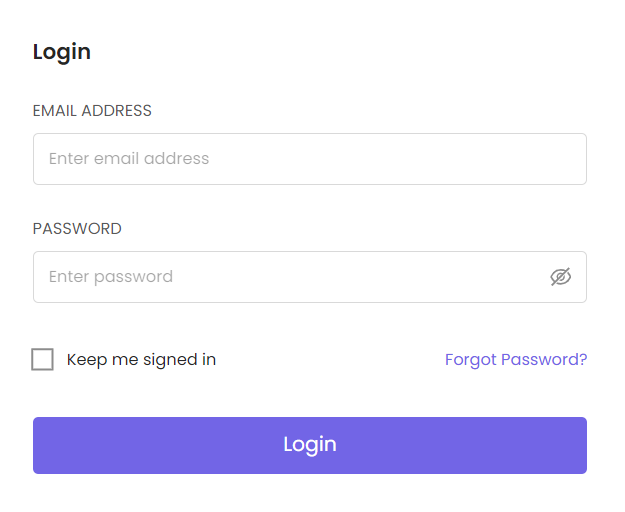{: width="400"}

## Landing Page 
Welcome to AWS Workspace! This guide will help you navigate and utilize the various 
features and functionalities of the AWS Workspace dashboard. The main sections of the 
dashboard include "My Projects," "My Reports," "Admin Settings," "User Guide," "Videos," 
and "Blogs."

## Home Page

The home page of each CloudPi workspace is designed to give you a comprehensive overview at a glance, facilitating efficient management and monitoring of your cloud environment. It serves as a central dashboard that highlights crucial information, tasks, and project health to streamline your workflow.

## Navigating Home Page

The CloudPi home page serves as a one-stop-shop for essential workspace information. Here's what you'll find:

### Workspace Settings

- **Project List:** Displays a detailed table listing all the authorized projects with essential project information. This includes project status, recent activities, assigned team members, and other relevant data to help you manage these projects efficiently.

- **Task Widget:** Lists all high-priority tasks across different projects. This widget helps you stay on top of urgent matters needing immediate attention.

- **Highlights Widget:** Offers important notices or updates that require user awareness or action. This could include updates on billing anomalies, savings opportunities, or system updates.

- **Health Status Widget:** Provides a health overview of authorized projects based on real-time data. It helps in quickly assessing the status and performance of each project, alerting you to any issues that may need resolution.

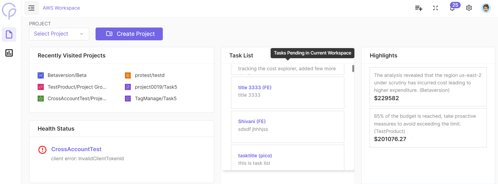

As a logged-in user, depending on your role, you have the ability to:

- **Create New Projects:** Simply click the "Create Project" button to start a new project.

- **Manage Existing Projects:** View and edit information of previously set up projects.

- **Navigate Project Pages:** Select any project from the project list and navigate to its dedicated page. Here, manage cloud resources related to that specific project.

- **Modify Project Settings:** Admin users can modify project settings.

## Creating a Project

Initiate a project by detailing specifics like choosing an icon, stating the Project Name, Description, and Project Group (which is optional), selecting a Cloud Provider, then click next to establish the project.

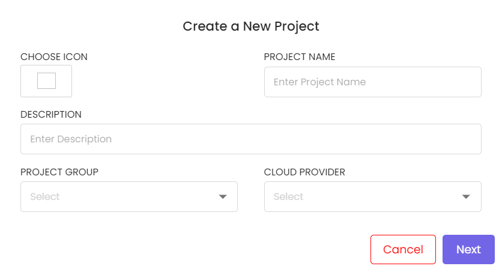{: width="500"}

Project setup can be done as follows: 

- ***Step 1: Cloud Setup***

    Configure Cloud Resources and Settings

    To create a project, you need to configure certain cloud resources and settings. Here's what you need to do:

  1. Specify the following details:
     - Account ID
     - Region
     - Service Groups

  2. Choose your role based on the following parameters:
     - Cross account role
     - Standard account role
     - External account role

  3. Validate the following information:
     - Access key and Secret key
     - Cross account role ARN and External ID

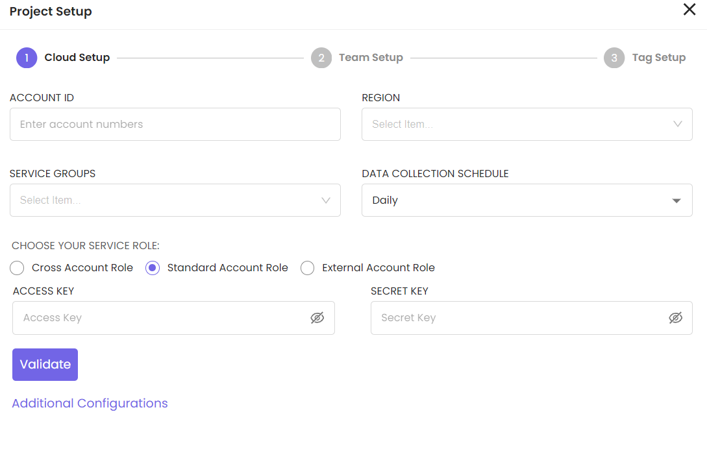{: width="500"}

- ***Step 2: Team Setup***

Invite team members by entering email id and their roles within the project. 

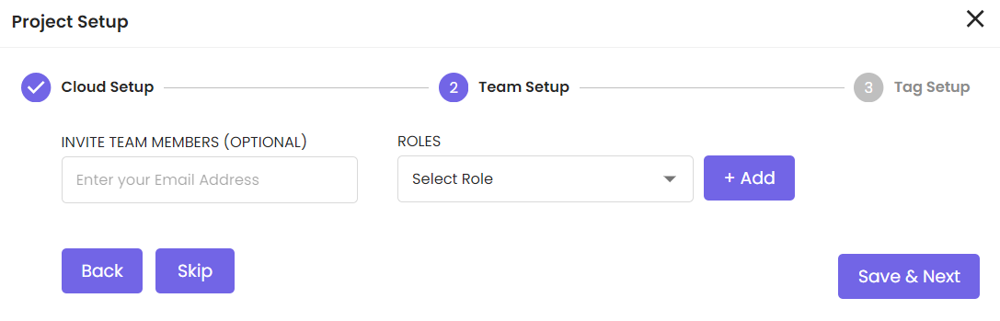{: width="500"}

- ***Step 3: Tag Setup*** 

Add project tags by giving tag key and tag value. 

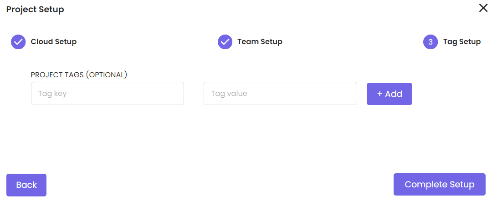{: width="500"}

## Project User Management

1. Go to project "Settings" and select "Users."
2. To add a user, click "Add User," fill out their details, assign roles, and set permissions.
3. To modify user details or permissions, click on an existing user and select "Edit."

## Project Settings

1. Click on "Project Settings" from the landing page to configure specific settings for each project.
2. Here, you can adjust project-level permissions, enable/disable certain features, and manage project users, viewers.

### Project Groups

1. Under "Projects," select "Project Groups."
2. Click "Create New Group," name it, and define its attributes.
3. Assign users and projects to the group as needed.

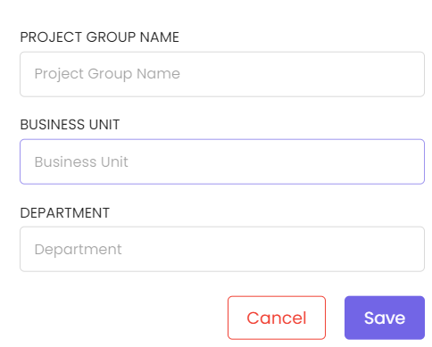{: width="400"}

## Navigating the Project Settings

Project can be edited by clicking on edit icon in the list of projects table. Project settings 
allow users to configure and manage various aspects of their projects, including details 
specific to the project, cloud settings, user settings, and other settings. The project settings 
interface allows users to manage specific project details, including project name, 
description, associated group, cloud provider information, and more. Users can also manage 
account IDs, regions, service groups, and the data collection schedule.

###  Editing Project Information

- **Project Name:** You can update the name of the project. It's crucial for organizational 
clarity and should be descriptive enough to be easily recognized by team members.
- **Description:** Provide a detailed description of what the project entails, which could 
include its purpose, resources involved, and any other relevant details.
- **Project Group:**  Assign the project to a specific group if your organization uses this for 
categorization. It’s optional but helps in managing multiple projects under a single 
umbrella.

- **Cloud Service Provider:** Choose between the cloud service provider available such as 
AWS, Azure and GCP.

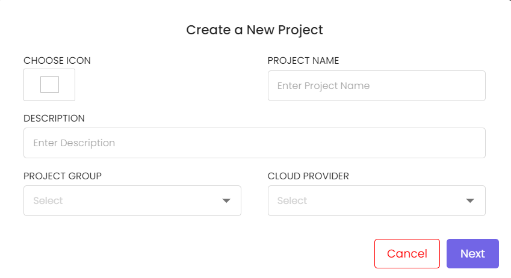{: width="500"}

###  Cloud Settings

- **Account ID:** Enter one or more AWS account IDs associated with this project to fetch and manage cost and usage data specific to these accounts.

- **Service Groups:** Define the types of cloud services included in the cost tracking for this project, such as Storage Instances, Networking Instances, etc.

- **Region:** Specify the cloud regions that this project will operate in for effective resource and cost management.

- **Data Collection Schedule:** Set the frequency at which the tool should collect data from the cloud provider, such as daily or weekly.

- **Choose Your Role:** Select your role based on parameters like Cross account role, Standard account role, External account role. Validate the following information: Access key and Secret key, Cross account role ARN, and External ID.

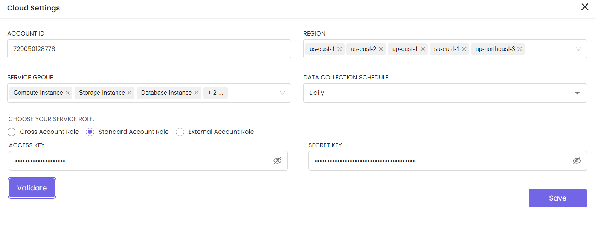

###  User Settings

- **Assign Roles to Users:** Manage which team members have access to this project and define their permissions. This includes user and roles management.

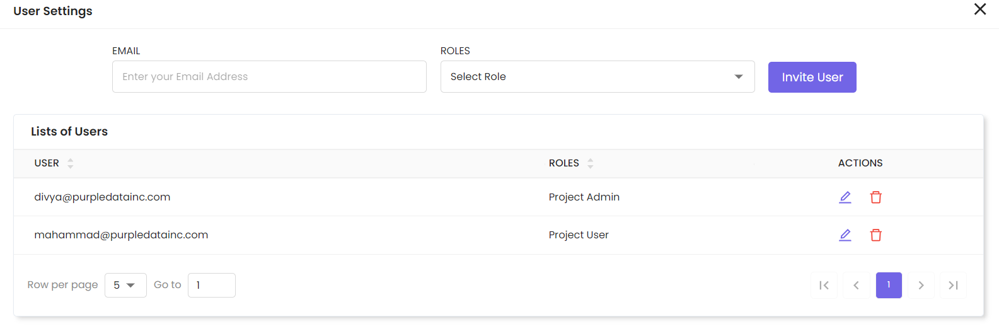{: width="600"}

###  Other Settings

- **Project Tags (Optional):** Add tags to the project for easier categorization and searchability within your tools. Tags may include attributes like department names, cost centers, or any other relevant identifiers.

- **List of Tags:** View the list of tags with Tag ID, Key, and Value. Tags can also be edited or deleted.

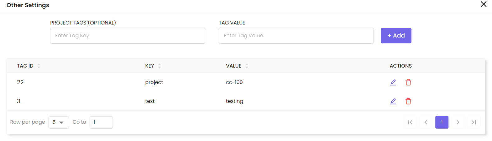{: width="500"}

## Project Settings

### Tag Settings

Navigate to the tag settings from project settings in the main navigation menu bar. Tag settings allow users to manage permissions related to adding, removing, and managing tags within the project. Toggle switches enable users to enable or disable permissions for the following actions:

- **Add Tag:** Enable this option to allow users to add new tags to resources within the project.
- **Remove Tag:** Toggle this option to permit users to remove existing tags from resources within the project.
- **Virtual Tag:** Enable virtual tags to assign temporary or dynamic tags to resources for specific purposes, such as cost allocation or resource grouping.

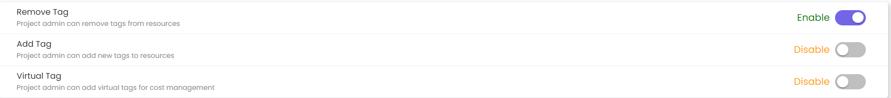{: width="800"}

