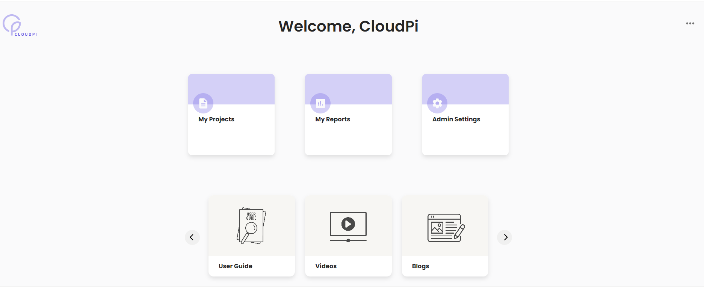
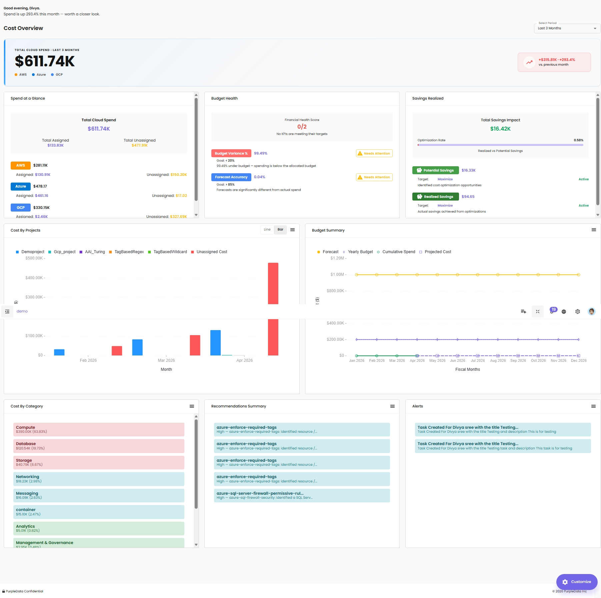
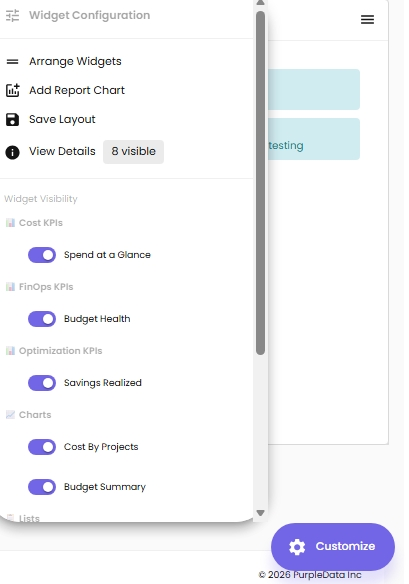

# Landing Page

The landing page is your starting point after you sign in — a workspace launcher that lets you jump into the CloudPi areas you use most. From anywhere in CloudPi, click the logo in the upper-left (or use **Workspace Selector → Landing Page**) to return to this screen.

## Tiles

The landing page presents tiles that open the corresponding CloudPi area:

| Tile | Opens |
|------|-------|
| **Home Page** | The [Workspace Home Page](#workspace-home-page) dashboard |
| **My Reports** | Reporting dashboards and saved views — see [Dashboards](Dashboards.md) |
| **Onboarding** | Cloud onboarding and data-collection setup — see [Cloud Onboarding](CloudOnboarding.md) |
| **Cost Assignment** | Cost allocation rules and project setup — see [Cost Assignment](CostAssignment.md) |
| **Admin Settings** | Workspace administration — see [Admin Settings](AdminSetting.md) |
| **User Guide** | This documentation |
| **Videos / Blogs** | Learning resources |

!!! note "Tiles vary by role"
    The exact set of tiles you see is determined by your CloudPi role. For example, CloudPi Administrators see only platform tiles (Onboarding, Admin Settings) since they have no access to customer billing data, and Project Administrators do not see Onboarding because they do not manage cloud account connections.

    For a full breakdown of what each role sees, including screenshots of the landing page logged in as each role, refer to [What Each Role Sees](rbac.md#what-each-role-sees) in the RBAC documentation.

## Workspace Home Page
The workspace Home Page provides an executive-style overview of cloud cost, FinOps, and optimization signals. It is designed for quick review and continuous monitoring.

### What You Can Do on the Home Page
- Monitor high-level KPIs for spend, variance, and optimization impact
- Change the analysis period using the date filter (for example, `Last 3 Months`)
- Identify items that need attention (for example, budget variance or forecast accuracy)
- Navigate to deeper dashboards or modules using the left navigation

### Home Page Sections
The exact layout may vary by role and configuration, but commonly includes:

#### Cloud Cost KPIs
Shows a quick snapshot of cloud spend and allocation status:
- Total cloud spend
- Assigned vs unassigned costs
- Provider breakdown (for example, AWS, Azure, GCP)

#### FinOps KPIs
Summarizes FinOps performance against goals, often including:
- Budget variance status
- Forecast accuracy status

#### Optimization KPIs
Highlights optimization performance and impact, often including:
- Total savings impact
- Optimization rate
- Potential savings and realized savings

#### Trends and Summaries
Common charts and widgets include:

- **Cost by Project** trend chart
- **Budget Summary** chart
- **Cost by Category** breakdown
- **Recommendations Summary** list to review optimization opportunities
- **Health Status** indicators (for example, infrastructure health and compliance)

### Customizing the Home Page

The Home Page is fully customizable per user. Click **Customize** at the bottom-right corner of the page to open the **Widget Configuration** panel, where you decide which widgets appear on your Home Page, change their order, and pull charts in from other dashboards.

**What you can do from the Widget Configuration panel:**

- **Arrange Widgets** — drag widgets to change their position on the page
- **Add Report Chart** — pull a chart from a different dashboard so it shows up on your Home Page
- **Save Layout** — store your customized arrangement so it persists across sessions
- **View Details** — see how many widgets are currently visible (e.g., *8 visible*)

**Widget Visibility toggles** — turn individual widgets on or off. Toggles are grouped by category:

| Category | Widgets in this group |
|----------|----------------------|
| **Cost KPIs** | Spend at a Glance |
| **FinOps KPIs** | Budget Health |
| **Optimization KPIs** | Savings Realized |
| **Charts** | Cost By Projects, Budget Summary |
| **Lists** | Cost By Category, Recommendations Summary, Alerts |
| **Report Charts** | FinOps Metrics Trend |

To revert all customizations, click **Reset to Default** at the bottom of the panel.

### Recommendations and Health Signals
When reviewing recommendations and health widgets:

- Select a recommendation to open details and next steps.
- Use the widget menu (three-line/ellipsis menu) for available actions such as filtering or viewing more detail.
