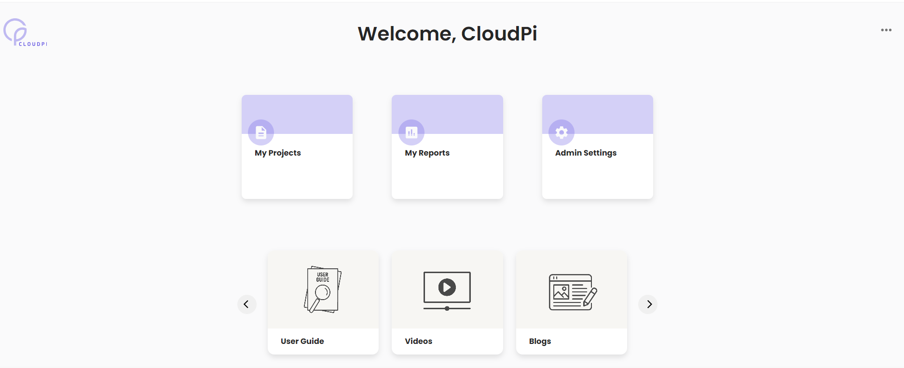

# Landing Page
The landing page is your starting point after you sign in. It acts as a workspace launcher and a quick way to jump into the CloudPi areas you use most. From anywhere in CloudPi you can click the logo in the upper-left (or use **Workspace Selector > Landing Page**) to return to this screen instantly.

## Landing Page User Stories
Use the landing page to:
- Open the **workspace Home Page** for an at-a-glance view of KPIs, trends, and alerts
- Jump directly to **My Reports**, **Onboarding**, **Cost Assignment**, or **Admin Settings**
- Access help content such as the **User Guide**, **Videos**, and **Blogs**

!!! note
    Tiles and navigation options are role-based. For example, `Admin Settings` is typically available only to users with admin permissions.

## Landing Page Tiles
The landing page presents tiles that open the corresponding CloudPi area:

- **Home Page**: Opens the workspace Home Page dashboard (see [Workspace Home Page](#workspace-home-page)).
- **My Reports**: Opens reporting dashboards and saved views (see [Dashboards](Dashboards.md)).
- **Onboarding**: Starts cloud onboarding and data collection setup (see [Cloud Onboarding](CloudOnboarding.md)).
- **Cost Assignment**: Configures cost allocation and assignment rules (see [Cost Assignment](CostAssignment.md)).
- **Admin Settings**: Opens workspace and tenant-level configuration (admins only, see [Admin Settings](AdminSetting.md)).
- **User Guide**: Opens this documentation.
- **Videos / Blogs**: Opens learning resources.

## Workspace Home Page
The workspace Home Page provides an executive-style overview of cloud cost, FinOps, and optimization signals. It is designed for quick review and continuous monitoring.

### What You Can Do on the Home Page
- Monitor high-level KPIs for spend, variance, and optimization impact
- Change the analysis period using the date filter (for example, `Last 3 Months`)
- Identify items that need attention (for example, budget variance or forecast accuracy)
- Navigate to deeper dashboards or modules using the left navigation

### Home Page Sections
The exact layout may vary by role and configuration, but commonly includes:

#### Cloud Cost KPIs
Shows a quick snapshot of cloud spend and allocation status:
- Total cloud spend
- Assigned vs unassigned costs
- Provider breakdown (for example, AWS, Azure, GCP)

#### FinOps KPIs
Summarizes FinOps performance against goals, often including:
- Budget variance status
- Forecast accuracy status

#### Optimization KPIs
Highlights optimization performance and impact, often including:
- Total savings impact
- Optimization rate
- Potential savings and realized savings

#### Trends and Summaries
Common charts and widgets include:

- **Cost by Project** trend chart
- **Budget Summary** chart
- **Cost by Category** breakdown
- **Recommendations Summary** list to review optimization opportunities
- **Health Status** indicators (for example, infrastructure health and compliance)

### Recommendations and Health Signals
When reviewing recommendations and health widgets:
- Select a recommendation to open details and next steps.
- Use the widget menu (three-line/ellipsis menu) for available actions such as filtering or viewing more detail.
