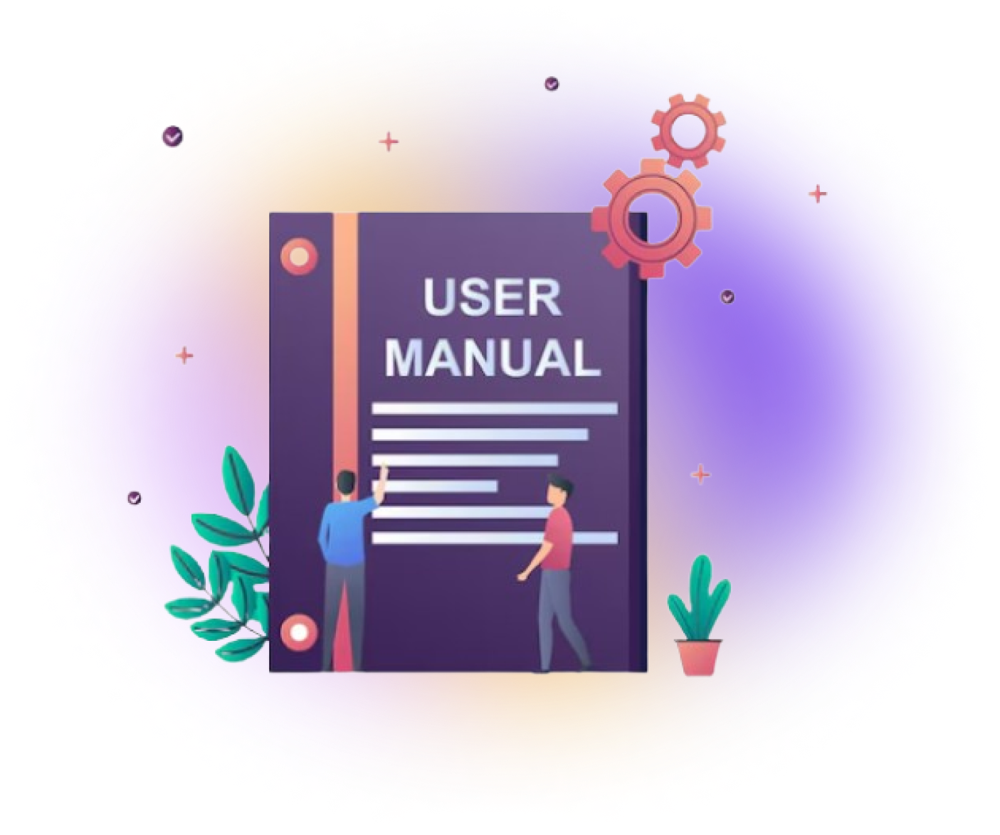



# Introduction
CloudPi Ai is a multi-cloud cost management and governance platform by PurpleData Inc DBA Cloudpi. This user guide introduces the core concepts, explains how to navigate the product, and links to detailed instructions for key workflows.

## Who This Guide Is For
This guide is written for:

- **Cloud architects** designing and evolving cloud environments with cost and governance in mind
- **FinOps analysts** tracking spend, allocation, optimization opportunities, and reporting
- **Cloud and platform managers** overseeing operations, access, and organizational standards

## What You Will Learn
Use this guide to:
- Understand CloudPi's organizational model (workspaces, projects, and project groups)
- Navigate the product (landing page, dashboards, and common workflows)
- Manage access using role-based access control (RBAC)
- Configure workspace and admin settings

## Quick Start
1. Sign in to CloudPi and select the appropriate workspace (if you have access to more than one).
2. Start from the landing page to open the Home Page dashboard and confirm your scope.
3. Review RBAC and security guidance before onboarding cloud accounts.

Related pages:

- Landing page and Home Page: [Landing Page](homepage.md) – learn how to navigate tiles, shortcuts, and workspace dashboards.
- Access model overview: [RBAC](rbac.md) – understand roles and permissions before inviting new users.
- Security posture and access requirements: [Security](security.md) – review compliance, MFA, and credential expectations.
- Workspace administration: [Workspace Settings](workspace.md) – manage alerts, integrations, and workspace-level governance.
- Admin configuration: [Admin Settings](AdminSetting.md) – configure tenant-level policies, integrations, and audit controls.

## Key Concepts
### Workspaces
Workspaces separate data and access for an organization, business unit, or client. Use them to structure teams, enforce governance, and provide organization-wide views. For details (roles, user management, workflow integrations, and alerts), see [Workspace Settings](workspace.md).

### Projects
A project is a logical grouping of cloud resources based on a cloud provider account and/or tags. Projects are the primary unit for analyzing costs, usage, inventory, utilization, and optimization recommendations.

Use projects when you want to:
- Make a team accountable for cloud spend and optimization for a specific scope
- Combine reporting across multiple subscriptions/accounts/resource groups under one initiative
- Separate reporting by environment (for example, `dev`, `test`, `prod`) or by product/customer

### Project Groups
Project groups organize multiple projects to reflect your business structure (department, line of business, or customer). Use them for roll-up reporting and governance aligned to how your organization operates.
