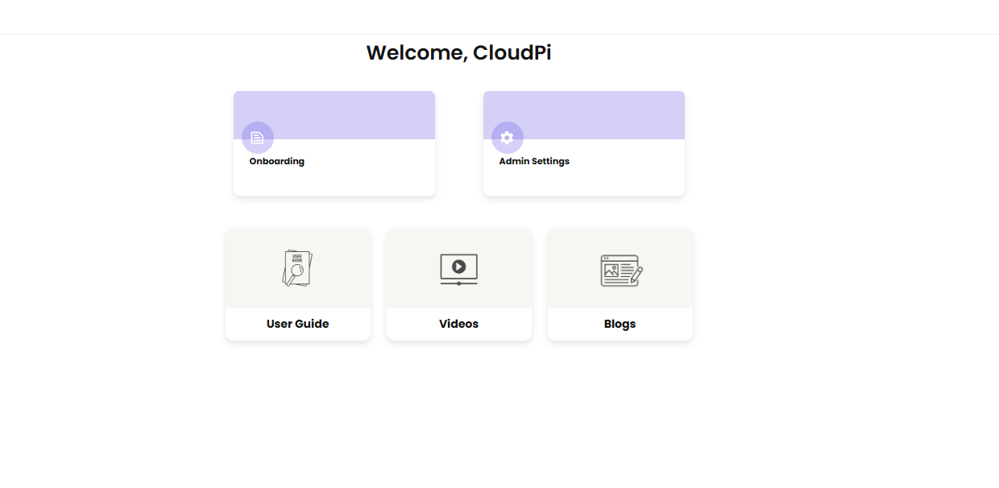
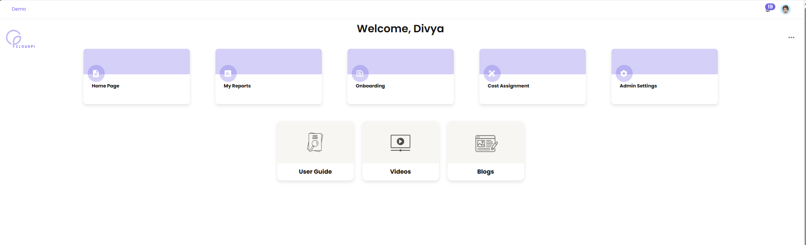
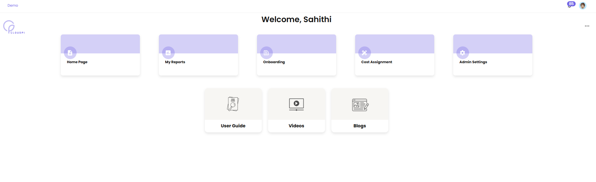
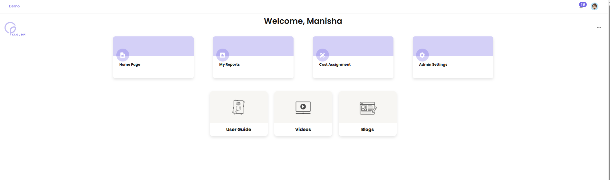
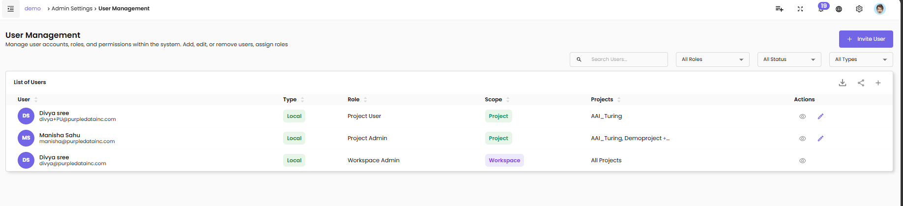
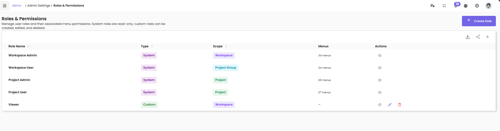
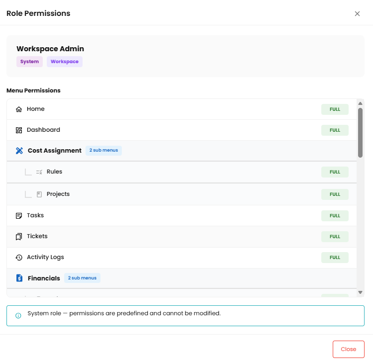
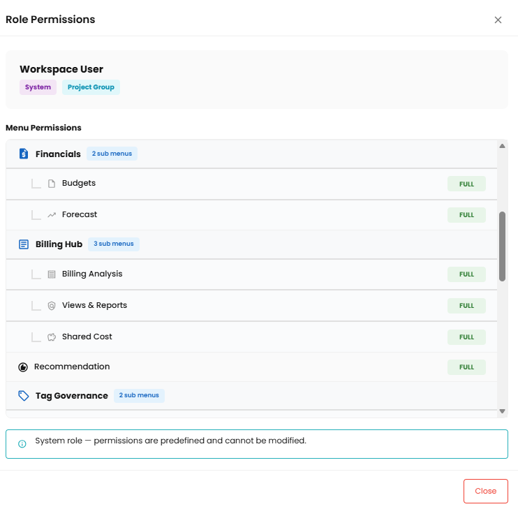

# Role-Based Access Control (RBAC)

CloudPi uses role-based access control (RBAC) to determine what each user can see and do. Roles are predefined and ordered by privilege level — a more privileged role inherits a broader set of capabilities than the roles below it. Access is also scoped by **workspace**, **project group**, and **project**, so two users with the same role can see different data depending on what they have been assigned.

This page describes the six CloudPi roles, what each role can do, how access is scoped, and how to manage user roles in the product.

## The Six Roles

| Role | Display Name | Privilege Level | Primary Scope |
|------|--------------|-----------------|---------------|
| 1 | **CloudPi Administrator** | Highest | Platform-wide (configuration only — no access to customer data) |
| 2 | **Workspace Administrator** | High | Full workspace access |
| 3 | **Workspace User** | Medium-High | Workspace + assigned project groups |
| 4 | **Project Administrator** | Medium | Assigned projects only |
| 5 | **Project User** | Low | Assigned projects, billing read-only |
| 6 | **Viewer** | Lowest | Read-only across all assigned resources |

Lower role number = more privileged. Roles are predefined; new roles cannot be created.

### CloudPi Administrator (Role 1)

CloudPi Administrators are platform operators (CloudPi staff) responsible for provisioning workspaces, managing platform-level users, and configuring system-wide settings.

**Important — CloudPi Administrators do NOT have access to customer data.** Authorization rules explicitly block this role from billing, cost, project, budget, credential, report, and recommendation data. This separation is enforced at the authorization service level so that platform operations and customer data remain segregated.

**Key capabilities:**

- Provision and configure workspaces
- Manage platform-level users
- Access system configuration and platform-wide admin settings

**Cannot:**

- View any customer billing, cost, or budget data
- Access customer projects, recommendations, or credentials

**Typical users:** CloudPi platform engineers and support staff (not customer team members).

### Workspace Administrator (Role 2)

Workspace Administrator is the highest customer-facing role. They have full Create / Read / Update / Delete access across all projects within the workspace, and they manage everything else in that workspace — users, integrations, budgets, workflows, and settings.

**Key capabilities:**

- Full access to every project, project group, and resource in the workspace
- Invite users and assign roles (Workspace Admin or Workspace User)
- Configure integrations, workflows, alerts, and billing reports
- Create, edit, and delete projects and project groups
- Access Admin Settings (workspace level)

**Typical users:** Cloud platform managers, FinOps leads.

### Workspace User (Role 3)

Workspace User has CRUD access limited to the project groups they are assigned to. They can manage resources and settings within those projects but have no visibility into project groups they were not assigned to.

**Key capabilities:**

- View and manage assigned project groups
- Edit workflows and configurations within their scope
- Create billing reports for their assigned projects

**Cannot:**

- See projects or project groups outside their assignment
- Manage users
- Access workspace-wide admin settings (e.g., User Management)

**Typical users:** Team leads and department managers responsible for a specific cost center or product area.

### Project Administrator (Role 4)

Project Administrator has create and update access for the projects assigned to them. They handle project-level configuration — budgets, tags, optimization settings, and workflows — but do not have delete permissions.

**Key capabilities:**

- Create and update project settings
- Manage budgets, tags, and optimization rules at the project level
- Edit workflows for assigned projects
- Create billing reports for assigned projects

**Cannot:**

- Delete projects or project resources
- Access projects outside their assignment
- Manage users

**Typical users:** Cloud architects and project managers responsible for individual workloads.

### Project User (Role 5)

Project User has read-only access to billing data for the projects assigned to them. They can view dashboards, recommendations, and cost data but cannot modify configurations.

**Key capabilities:**

- View dashboards and reports for assigned projects
- View recommendations and cost data
- View their projects' workflow status

**Cannot:**

- Create or share billing reports
- Edit any settings, workflows, or resources
- Access admin settings

**Typical users:** Developers, analysts, and stakeholders who need cost visibility for their workload but do not configure it.

### Viewer (Role 6)

Viewer is the most restricted role. Viewers have read-only access to every resource within their assigned scope. All write operations are blocked.

**Key capabilities:**

- View dashboards, reports, and any data within their assigned scope

**Cannot:**

- Create, edit, or delete anything
- Share reports
- Manage users or settings

**Typical users:** Auditors, executives, or external stakeholders who need visibility without any modification rights.

## Role Capability Matrix

| Capability | CloudPi Admin | Workspace Admin | Workspace User | Project Admin | Project User | Viewer |
|------------|:----:|:----:|:----:|:----:|:----:|:----:|
| Platform provisioning | ✓ | ✗ | ✗ | ✗ | ✗ | ✗ |
| Manage users | ✓ | ✓ | ✗ | ✗ | ✗ | ✗ |
| Edit workflows | ✓ | ✓ | ✓ | ✓ | ✗ | ✗ |
| Access admin settings (scoped) | ✓ | ✓ | ✓ | ✓ | ✗ | ✗ |
| Create billing reports | ✗ | ✓ | ✓ | ✓ | ✗ | ✗ |
| Share billing reports | ✗ | ✓ | ✓ | ✓ | ✗ | ✗ |
| View billing data | ✗ | ✓ | ✓ | ✓ | ✓ | ✓ |
| Access customer data (billing, costs, credentials, recommendations) | ✗ | ✓ | ✓ | ✓ | ✓ | ✓ |
| Write operations | ✓ | ✓ | ✓ | ✓ | ✓ | ✗ |

!!! note "Admin settings are scoped to the role"
    "Access admin settings" means access to settings the role is responsible for. Workspace Admin sees workspace-wide admin settings (including User Management); Workspace User and Project Admin see admin settings scoped to their project group or project. Only Workspace Admin can manage users.

## How Access Is Scoped

Roles only describe *what* a user can do; their **scope** describes *where* they can do it. Scope is layered:

| Scope Level | Set when… | Effect |
|-------------|-----------|--------|
| **Workspace** | Role 2 (Workspace Admin) is assigned during invitation | Full access to everything in the workspace |
| **Project Group** | Role 3 (Workspace User) is assigned to specific project groups | Access limited to projects inside those groups |
| **Project** | Role 4, 5, or 6 is assigned to specific projects | Access limited to those individual projects |

Two users with the same role can therefore see different data — for example, two Project Admins can be scoped to different projects, and each will only see their own.

## What Each Role Sees

CloudPi filters the navigation menu, the landing page tiles, and the User Management list according to the signed-in user's role. The screenshots in this section show the differences for the four customer-facing roles.

### Landing page — CloudPi Administrator

CloudPi Administrators see only platform-administration tiles. There is no Home Page or My Reports tile because this role has no access to customer billing or cost data.

### Landing page — Workspace Administrator

Workspace Administrators see the full set of tiles, including Home Page, My Reports, Onboarding, Cost Assignment, and Admin Settings.

### Landing page — Workspace User

Workspace Users see most of the same tiles as Workspace Administrators. The differences are in *what* each tile reveals — Workspace Users only see project groups they have been assigned to, and Admin Settings shows only project-group-level options (not workspace-wide settings like User Management).

### Landing page — Project Administrator

Project Administrators see fewer tiles — Onboarding is hidden because they are not responsible for connecting cloud accounts. They have access to Home Page, My Reports, Cost Assignment, and Admin Settings (scoped to their assigned projects).

!!! note "Project User and Viewer landing pages"
    Project User and Viewer landing pages follow the same pattern with progressively fewer tiles available — the Viewer view is read-only, and the Project User view is scoped to billing visibility for their assigned projects.

### User Management visibility differs by role

User Management itself is filtered by role. A Workspace Administrator sees every user in the workspace. A Project Administrator only sees users with access to their projects.

**Workspace Administrator view of User Management** — all users in the workspace are visible:

**Project Administrator view of User Management** — only users with access to the project administrator's assigned projects are visible:

Notice that the Workspace User row visible to the Workspace Administrator does not appear in the Project Administrator's view, because that user is scoped to a different project group.

## Managing Roles and Permissions

To view roles and permissions:

1. Navigate to **Admin Settings → Roles & Permissions** (Workspace Administrator only).
2. The Roles & Permissions page lists all six roles and their associated menu permissions.

The page shows each role with:

- **Role Name** — the display name of the role
- **Type** — System (predefined, read-only) or Custom (created by your workspace, editable)
- **Scope** — Workspace, Project Group, or Project — determines what the role can be applied to
- **Menus** — the count of menus this role has access to (e.g., *34 menus*)
- **Actions** — view details, edit, or delete (Custom roles only)

System roles are predefined and cannot be edited or removed. To change what a user can do, change their role assignment or their project / project group scope rather than editing the role itself. Custom roles can be created, edited, and deleted via the **+ Create Role** button.

### Viewing a Role's Permissions

Click the **View** icon (eye) on any role row to open the role detail panel. The panel shows the role's display name, scope, and the complete list of menus the role has access to. Use this to confirm what a role can see before assigning it to a user.

**Workspace Administrator role detail:**

**Workspace User role detail:**

The same View action is available for every role on the Roles & Permissions page. Permissions are presented in the same format regardless of which role you select.

## Role Delegation

When inviting a user or changing a user's role, the role being granted cannot be more privileged than the role of the person making the change. For example, a Workspace User cannot promote another user to Workspace Administrator, because Workspace Admin is a higher-privilege role.

If you attempt this, the system rejects the request with a privilege escalation error and records the event in the audit log.

## Best Practices

- **Use the least-privileged role** that lets a user do their job. Start with Viewer or Project User and elevate only when needed.
- **Assign Workspace Administrator sparingly.** This role can affect every project in the workspace, including deletion.
- **Use project group scoping for Workspace Users.** Group projects by team or business unit so a single role assignment grants access to a logical bundle.
- **Use Viewer for stakeholders and auditors.** They get full read access without any risk of accidental changes.
- **Review user assignments regularly** — at least quarterly — to make sure scope still matches each user's responsibilities.
- **Remember CloudPi Administrators cannot see your data.** This is by design and helps satisfy data segregation requirements for compliance.
